# Post #100DaysOfCode Log - Dashiell Bark-Huss

I did a "365 days of code challenge" in 2019. I logged my progress everyday: [Day 1-100](https://github.com/DashBarkHuss/100-days-of-code/blob/master/r1-log.md), [Day 101-200](https://github.com/DashBarkHuss/100-days-of-code/blob/master/r2-log.md), [Day 201-365](https://github.com/DashBarkHuss/100-days-of-code/blob/master/r3-log.md). After I completed the challenge, I continued to log in my [2020 coding log](https://github.com/DashBarkHuss/100-days-of-code/blob/master/post-log.md). This is my 2021 coding log.

<hr>

<h3 id="update-3-20-21"></h3>

## Building [WishTender](https://github.com/DashBarkHuss/100-days-of-code/blob/master/post-log.md#update-9-16-20) Update

#### Saturday 3/20/21

<hr>

Today I'm feeling insecure and unsure. I thought I should post my thoughts to share the reality of my process. The following is the ramblings of highly confused person who just had a talk with a fiverr seller:

I just had gut wrenching meeting with a freelancer who suggested we start from scratch on Wishtender. He said there is going to be so many problems when I deploy Wishtender with react that it's better to just use django and html and css and start from scratch. And that django is more scalable. But I've been working on WishTender for like 7 months! So the idea of starting from scratch hurts my soul. I thought I could build a more complete app in order to learn about development while also aiming to launch a business.

Part of me thinks he's right. It's what everyone's been telling me all along. Go faster. Make an MVP. But I'm so confused, why does react even exist if it's neither good for mvp's nor scalable?

I can't even imagine that all that work I did with figuring out how to integrate with Stripe and calculating the fees and conversions, integrating with the exchange rate api, etc- that it will be easier from scratch. That's not part of the expertise of a Django developer.

I think I'm so stuck on the sunk costs though. This guy says it would take a month to complete from scratch in django. That's still faster than it might take to complete in MERN. But it feels like I would lose those 7 months of work. What was it all for. That's a sunk cost though. That's a bad reason to avoid switching. But there are other good reasons not to switch. 1. He doesn't know the whole picture of what I've done so far or what the project entails. 2. It's easy to create a react native app from react. 3. If I switched to django I feel I would need to rely fully on him then, since I don't know django. Am I just clenching on to the identity of a developer? I want to own a business. I don't even care about being a developer.

I don't know if I'm looking for reassurance that my way is right or looking for proof that I should change paths and go with the django mvp. But I should just be looking for truth. And the truth is probably gray.

Is this guy leading me astray or am I way off? Is it flawed to go with MERN? Am I overvaluing what I've done or is he underestimating what I've done? Is it worth making an MVP for an app that is almost finished? Is it worth putting $100-$1000 into an MVP for an idea that hasn't been validated?

My fear is that this suggestion to start from scratch- it maybe comes from a misunderstanding of what I've already done. And what goes into this project. My fear is that it will be a detour that will take longer. He didn't look at the entire app. He didn't even think I had an api. He had little information. But is it true that it will be difficult to deploy? Is it true that it will be difficult to work on with other people?

He said that it will be difficult to continue this project since I may have implemented things differently than him. But that confuses me. Isn't that just part of being a developer, you have to work with the code you're handed?

Maybe I'm seeking out the wrong person. Maybe he isn't an expert in taking over an existing project. He is an expert is starting projects from scratch, so he suggested starting the project from scratch. I need to calm down. Not over value one person's opinion. But don't under value it as well.

What is his expertise? He probably isn't used to taking over a project, pair programing. People come to him with blank canvases. So he wants a blank canvas. Where can I find people who work on canvases that have already been painted? Maybe if they suggested to start over I would feel more reassured.

What does a $1 MVP look like?

Is it possible to make an MVP for very cheap and continue working on Wishtender code?

Do I have to do a $1000 MVP? Is that worth it if I haven't validated?

Is a month + $1000 worth it? Is that really an MVP?

Is it still possible to move faster on WishTender with react?

I feel like my WishTender code is neither an MVP nor a perfect app. It's in a weird in between and it's causing me confusion.

I just need more clarity. This is just one guy. But is his point valid? Is it valid at all? It's true he doesn't have the full picture. But is there some truth to what he is saying? How can I find that truth?

I think I need to talk to some people and find out. Especially my mentor, because he's seen my code. I believe there may be truth to what he is saying. But I'm not sure the best route.

The more I think about it thought the more I think his advice was short sighted. He didn't look at my code. He didn't hear my requirements. I remember my mentor looked at my code, and was surprised that it was as good as it was. So maybe the fiverr guy doesn't know that my code is more complete than he would expect.

The fiverr guy also called me "sir" at one point in our chat before I went on video- which shows a pattern of miscalculation! If he thought I was a man, what other false assumptions is he making?

I'll have to think a bit more.

This whole thing is a distraction from what I was trying to do- just outsource a portion of the app. Should I scratch that idea? Should I continue regardless?

<hr>

<h3 id="update-3-18-21"></h3>

## Building [WishTender](https://github.com/DashBarkHuss/100-days-of-code/blob/master/post-log.md#update-9-16-20) Update

#### Wed/Thurs 3/17-3/18/21

<hr>

## Todays Post:

- Hiring Freelancers
  - My questions about assigning tasks:
    - isolating?
    - creative licence?
    - communication?
- Simulating Working With A Freelancer
- Mistakes I Discovered when Assigning Tasks
- Resources & Notes
- Takeaways
<hr>

## Hiring Freelancers

I want to experiment with outsourcing parts of WishTender. But I have no clue what it looks like to work on a team.

I'm wondering:

- **How do I isolate tasks** for freelancers or team members into manageable tasks?
- **How much creative licence** do I give freelancers? Do I give them a highly specific tasks that define not only _what_ should be done but _how_? Or do I give them general goals where they can take some creative licence in UI, UX, and code design?
- **How do I communicate the task** to them effectively? What do I need to provide them with in order to accomplish that task?

## Simulating Working With A Freelancer

To prepare for outsourcing I've been practicing working as my own employee using gitflow and github.

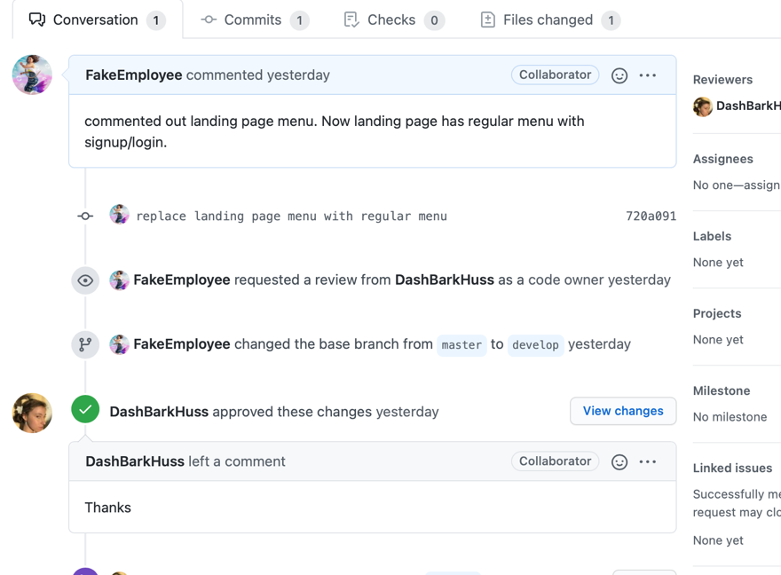

This gave me some insight on **how assigning tasks can go wrong**.

## Mistakes I Discovered when Assigning Tasks

#### **1. Assign the task to the wrong person.**

I had a bug in my app. I thought it orginated in the frontend. So I assigned it to **FakeEmployee**, my alter ego. **FakeEmployee** is a frontend dev. But **FakeEmployee** realized the bug was in the backend. So fake employee had to go back to me and tell me to fix the bug. **How do I outsource a bug if I don't know where it originated and who is capable of fixing it?**

#### **2. Misunderstand the effort of the task**

I assigned **FakeEmployee** a simple task; create tabs in my menu with material UI that underline when on the respective page.

I created a design on Photoshop to give to **FakeEmployee**.

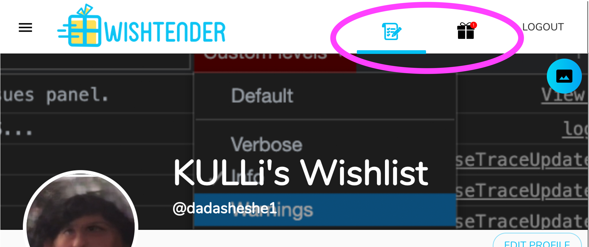

I thought this would be an easy task for **FakeEmployee**. But it was more complex and involving restructuring a my app. FakeEmployee had to [post on stackoverflow](https://stackoverflow.com/questions/66540381/how-to-set-a-navlink-to-active-conditionally-on-dynamic-links) for help. And the issue was even too complex for anyone there to solve. So while FakeEmployee got help from stackoverflow, ultimately FakeEmployee had to post the correct solution herself.

If I was working with a real freelancer, I might have underestimated the time and effort of the task. So I might have offered too little money.

In addition to paying my freelancer appropriately, if I knew the complexity of the task, maybe I would have decided against the highlighting tabs. Perhaps the highlighting of the tabs is a diminishing return for the effort needed to implement them at this stage. I might have gone with a simpler task, like tabs that don't highlight.

## Research on working with a team

I wanted to get a better idea of how to manage freelancers and a team. Here's some of the resources I consumed.

### [DevOps: article with video](https://www.altexsoft.com/blog/engineering/devops-principles-practices-and-devops-engineer-role/)

This video explained what a DevOps team is, what problem it solves, and what building software in devops looks like.

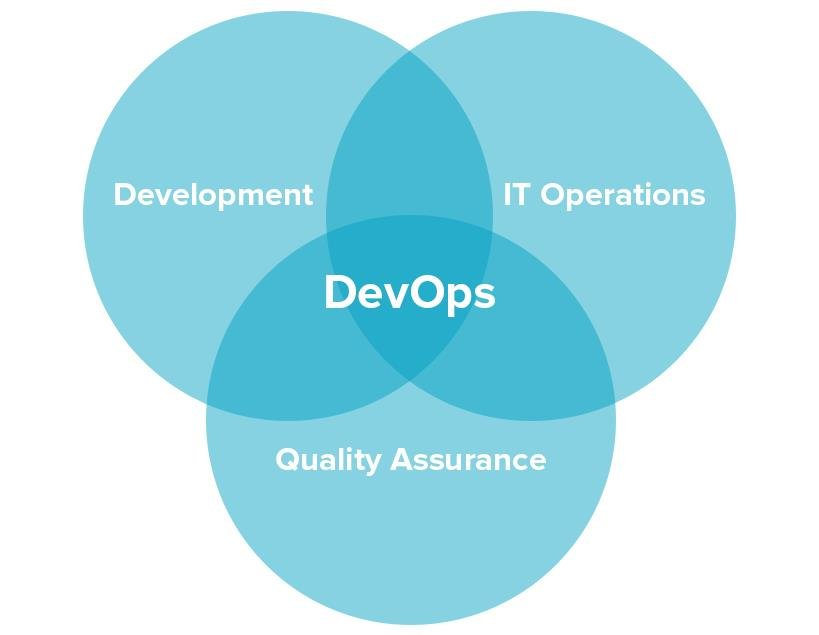

#### [Video: A Project Manager's Guide to DevOps](https://www.youtube.com/watch?v=XSoQptH8HCA) by [@beyond20](www.twitter.com/@beyond20)

### I know what development is. What is operations?

- [video: What DOES an IT OPERATIONS MANAGER do??](https://www.youtube.com/watch?v=J_yY-fn6sKM)
- [video: Developer vs Operations](https://www.youtube.com/watch?v=OJW409Dkpvg)

### [video: What is an API Contract?](https://www.youtube.com/watch?v=-qM__ozdHCU)

- Open API

#### [video: How Web Developers work together in a Company](https://www.youtube.com/watch?v=fIo10_MthQ4)

### [Video: What do front end developers _actually_ do?](https://www.youtube.com/watch?v=MCy5zXmlrfc)

This really helped me understand what teamwork looks like working with a product manager, designer, and frontend dev. Only I didn't see how the backend developers fit in.

### [Video: How software engineers work in teams](https://www.youtube.com/watch?v=DYLSkySSF0I)

This video by TechLead [@techleadhd](https://twitter.com/techleadhd) showed how workflows between team members can flow multiple ways. For example, instead of always following the product manager's lead, programmers can consult the pm on the best approach. He also spoke about consistency in design and holistic design. Something I _half_ implemented with Material UI themes. Sometimes I use Material UI theming, sometimes I when did not. I may need to work on keeping my UI consistent. When I make a Photoshop mockups, I may need to refer to Material UI docs to make sure I'm making something that can be implemented using the theme. I can also design a mockup and ask for feedback from the developer. Maybe they will notice that the design unnecessarily veers off from the theme and can make suggestions to improve the mockups.

#### [How To Build A Software Development Team](https://www.youtube.com/watch?v=0MZLO-B-q7E)

#### [Video: 10 Tips for Working on a Dev Team](https://www.youtube.com/watch?v=yVXwFairWKs)

#### [Video: Guide to Working with Outsourced Developers](https://www.youtube.com/watch?v=RMCiG_waZ1U)

### Forum Post

[How does a front-end developer work with a back-end developer?](https://www.quora.com/How-does-a-front-end-developer-work-with-a-back-end-developer)

Answer:

> For me, the best approach is to:
>
> 1.  Have the front-end developers provide a “wish list” of APIs they want - and provide documentation of the desired behaviors.
>
> 2.  Have the back-end developer review the desired APIs. If some appear to be difficult to implement or are likely to be slow, the back-end dev should see if other alternatives are acceptable to the front-end dev.
>
> 3.  Both teams implement their code to the agreed APIs. (Note: I sometimes have the back-end team implement “stub” versions of the APIs, that return test data to allow the the actual interaction to be tested before the full implementation is complete.
>
> 4.  ** ITERATE AS REQUIRED TO MAKE IT BETTER** - this is the most important step. Occasionally, the teams will be happy with the initial designs and implementations. Most often, one or both of the sides of the APIs will want changes - plan on a few revisions after the initial implementation is finished.
>
> Note: this approach means that developers will be asked to change code that works and meets the (original) requirements. This is something that developers need to learn to accept. I generally assume that people requesting a change to requirements have a good reason for the request. Much of this arises from the fact that in implementing and/or using an API, developers learn a lot they didn’t know when coming up with the initial requirements.

[Video: How To Create Your First Wireframe ](https://www.youtube.com/watch?v=KdfO_e0yK-g)

### [Video: Contract First API Design with OpenAPI V3 - Darrel Miller](https://www.youtube.com/watch?v=GtTiIY51kK0) [@darrel_miller](www.twitter.com/darren_miller)

> We use API description langauges in order to define a contract.

> **Contract before code** ...but scenarios, use cases and other API design work still come first.

In Open API and JSON schema the contract is an open world system.

**Open World System:** You define what is possible but we don't tell you everything that is potential possible.

Example your API description could leave out 500 responses.

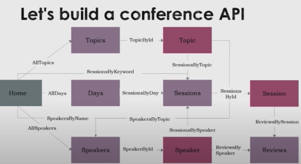
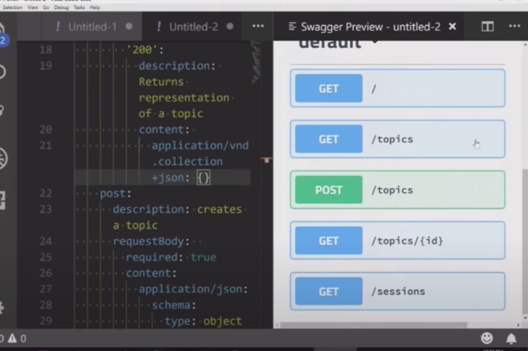
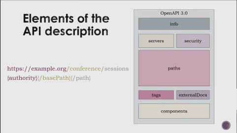

Resources can be grouped by tags.

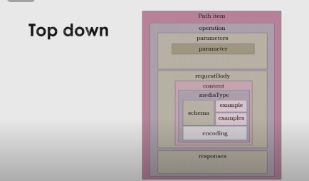

You don't need to include everything in your contract descriptions. You have other places to document. Changing stuff in your contract can create breaking changes.

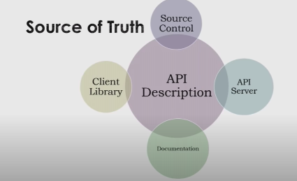

There are tools that allow you to use mock servers with your API contract so client developers don't have to wait for a server implementation to complete.

My question: Is there a way to generate React routes from a contract?

## Takeaways From Resources

**Documenting**. Documenting the API, tasks that are complete or need to be completed, using git to document changes. All of this helps with communication.

**Cross-collaboration and bi-directional workflow**: Different roles (designers, developers, operations) can communicate constraints within the system to help everything come together. There can be a lot of back and forth between these roles instead of just a top down flow.

<hr>
<h3 id="update-3-16-21"></h3>

## Building [WishTender](https://github.com/DashBarkHuss/100-days-of-code/blob/master/post-log.md#update-9-16-20) Update - Tuesday 3/16/21

<hr>

## Setting up git configurations and Github credentials in the terminal.

### Configurations

To set your email and username as the author.

```bash
$ git config --global user.email "secondaccount@gmail.com"
$ git config --global user.name "SecondAccount"
```

To show the config lists

```bash
# global settings
$ git config --list --global

# local settings
$ git config --list
```

To delete some property from the config. There is no such configuration as `user.username` so I deleted it after accidentally adding it.

```bash
# delete user.username from global settings
$ git config --unset --global user.username
```

### Credentials

If you change the configurations, the **author** will be set to the new account. But you will still be **pushing** to github through the first github account. So if your want to also switch git hub accounts:

    $ git credential-osxkeychain erase
    host=github.com
    protocol=https
    [Press Return]

The terminal is going to ask for new credentials when you push.

If that doesn't work also try:

```
git config credential.username 'SecondAccount'
```

<hr>
<h3 id="update-3-13-21"></h3>

## Building [WishTender](https://github.com/DashBarkHuss/100-days-of-code/blob/master/post-log.md#update-9-16-20) Update - Saturday 3/13/21

<hr>

## Todays Post:

- Why I'm making my repo public
- [Security by obscurity](#secbyob-3-13-21)
  - Build In Public
- [What About Competition?](#quora-3-13-21)
- [Loss Aversion & Conclusion](#con-3-13-21)

<hr>

Features on Github that make collaboration easy are limited to paid accounts. You can get around paying, if you keep your repository public.

WishTender is a private repo. Now that I'm looking to work with other devs, I need access to these colab features. So I decided to revisit opening the repo.

<h4 id = "secbyob-3-13-21">

## Security by obscurity

I originally made my WishTender repository private because I was afraid of insecurity. _"The more people know about your project's backend, the easier people can hack into it."_ I struggled with.

It's really important for me to participate in **#BuildInPublic**. Both selfishly and altruistically. **#BuildInPublic** is my way of giving value to the community at every point of my journey. Sometimes it can feel like you have nothing to give, but you can always share you're journey and what you're building. That is the altruistic side of **#BuildInPublic**. Selfishly, it's also given me many opportunities I wouldn't have had if I built and learned in private.

I posted my dilemma back in September. Something Brennan Hitchcock [@k0ode](https://twitter.com/k0ode) said always stuck with me:

> Security by obscurity should never be your primary line of defense.

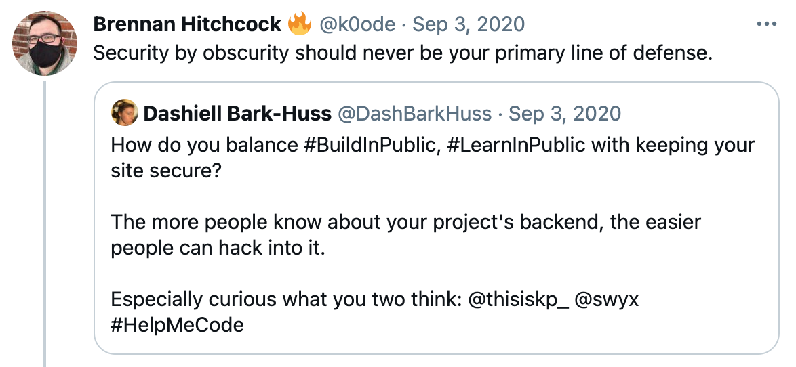

Brennan continued:

> Furthermore by having security by obscurity included in your cyber-defense plan it becomes a crutch and a blind spot.

Brennan encouraged me to "Build in public!"

Even though he made a good point, I figured I was too novice to rely on anything but security by obscurity. So I continued to keep my repo private. I've learned a lot since September and now have a fuller understanding of what security involves. I feel more confident that I can post my code and build strong security before I launch.

<h4 id = "quora-3-13-21">

## What About Competition?

I also found this question and answer on Quora useful:

### **Is it a bad idea to use Open GitHub as your startup's repo?**

[**Quora** Answer by Aravind Ravi-Sulekha:](https://www.quora.com/Is-it-a-bad-idea-to-use-Open-GitHub-as-your-startups-repo)

> Generally, no.
>
> The only exception to this rule is if a large part of the value of your startup comes from some proprietary or otherwise non-obvious algorithm expressed in your source code. For the vast majority of technology products, this is not the case — value usually comes from a clever user interface or other features that are straightforward to implement once it’s seen in action.
>
> If a competitor with their own product wants to copy a feature you invented, it is almost certainly easier and cheaper for them to implement it independently than to figure out how to adapt your code to their architecture. Making software components work together when they weren’t designed to is extremely hard.
>
> That leaves competitors willing to build their startup entirely on your code. It isn’t clear why someone would want to do that — they can’t compete with you by doing exactly what you’re doing. You start with an enormous advantage, having the team which wrote the original code and therefore the ability to move much faster. As long as you don’t accept outside contributions to your project, you can stop publishing code changes at any time.
>
> My startup, Scrollback, uses an open GitHub repository for almost all its code. The only exception is a plugin that implements a learning algorithm for organizing threads of discussion — something which is not straightforward to implement even after you’ve seen it work.

<h4 id = "con-3-13-21">

## Loss Aversion & Conclusion

I'm going to take what feels like a more courageous and abundant mindset and make my repo open.

Keeping it closed was based on my fear of loss. Not hope of gain. I was exhibiting loss aversion. Loss aversion is the tendency to prefer avoiding loss to acquiring equivalent gains.

I fear being hacked, I fear someone coming in and copying everything WishTender is doing.

But what if instead I focused on what I gain by making it open? I'll help others who are looking to build. Maybe I'll get more help from experienced onlookers. Maybe it will bring more attention to my work and WishTender, bringing me more opportunities.

Because of this, I will be making my repo public. What do you all think? What are the positives and negatives of making a startup repo public? Is it something that should only be temporary? Am I making a huge mistake? Let me know [@DashBarkHuss](https://twitter.com/DashBarkHuss)

<hr>
<h3 id="update-3-9-21"></h3>

## Building [WishTender](https://github.com/DashBarkHuss/100-days-of-code/blob/master/post-log.md#update-9-16-20) Update - Tuesday 3/3/21

<hr>
Todays Post:

- [Be a quitter: Outsourcing](#quit-3-9-21)
  - [Practice With Outsourcing](#practice-3-9-21)
  - [Securing my repo](#repo-3-9-21)
- [Resources](#res-3-9-21)

<hr>
<h4 id="quit-3-9-21"></h4>

## Be a quitter: Outsourcing

I'm going to take a big leap and outsource some parts of my project. It's very scary and exciting. I've never coded with anyone. But I've always felt like a real entrepreneur should know how to outsource. And reading the book The Entrepreneur Roller Coaster by Darren Hardy is giving me extra inspiration. He highly stresses outsourcing. "Be a quitter"- quit as many parts of your business as you can. Get people better than you to do those tasks.

I want to see what outsourcing some bits of my code will do.

<h4 id="practice-3-9-21"></h4>

### Practice With Outsourcing

To prepare, I created a WishTender Organization on github and created a github account called FakeEmployee. I am acting as my own employee, making commits to my repo under the FakeEmployee account.

I also did som micro outsourcing. I hired a machine learning guy on Fiverr. $5 to talk about the feasibility of a project. The project had nothing to do with WishTender- it was an app for lucid dream research on behalf of Karen Konkoly & Northwestern. I don't know if I will pursue the project, but I wanted to try out Fiverr anyways. It was a useful introduction to outsourcing.

<h4 id="repo-3-9-21"></h4>

### Securing my repo

I'm kind of surprised how much access Github gives this FakeEmployee account. They can just push straight to master if they want. I believe you can prevent this by [creating a branch protection rule](https://docs.github.com/en/github/administering-a-repository/managing-a-branch-protection-rule#creating-a-branch-protection-rule) for the master branch. But it's **not free** unless I make my repo public:

> Protected branches are available in public repositories with GitHub Free and GitHub Free for organizations, and in public and **private repositories with GitHub Pro**..."

So I either pay for github, make my repo public, or trust that freelancers won't push to master.

Does anyone know if I'm correct about this? Do I have to pay or make my repo public? Which would you do?

<h4 id="res-3-9-21"></h4>

## Resources

[article: use github professionally](https://petabridge.com/blog/use-github-professionally/)

[video: use github professionally](https://www.youtube.com/watch?v=8UguQzmswC4/)

[video: GIT Workflow - Georgia Tech - Software Development Process](https://www.youtube.com/watch?v=3a2x1iJFJWc)

[The gitflow workflow - in less than 5 mins.](https://www.youtube.com/watch?v=1SXpE08hvGs)

<hr>
<h3 id="update-3-2-21"></h3>

## Building [WishTender](https://github.com/DashBarkHuss/100-days-of-code/blob/master/post-log.md#update-9-16-20) Update - Tuesday 3/2/21

<hr>

<hr>
Todays Post:

- [Asking for Guidance on Twitter](#gh-3-2-21)
  - [Self Promotion](#c-3-2-21)
- [Notes on Matt's Guidance on **Outsourcing**](#n-3-2-21)
  - [How do you separate out tasks when coding with someone else?](#sot-3-2-21)
  - [Git](#git-3-2-21)
  - [Gitflow](#gitf-3-2-21)
  - [Practicing project management with Omniflow](#pm-3-2-21)
  - [Some more tools](#tools-3-2-21)

<hr>

<h2 id ="gh-3-2-21" ></h2>

I posted on Twitter:

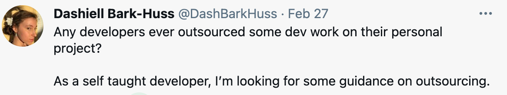</img>

I got a response from "Nomad"

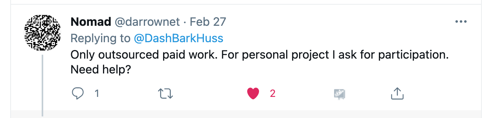</img>

[Nomad @darrownet](https://twitter.com/darrownet)

"Nomad" offered to zoom call with me.

"Nomad" was a really cool. His real name is [Matt Schiffman](https://www.linkedin.com/in/darrownet/https://www.linkedin.com/in/darrownet/). He's a self taught programmer with an impressive resume, an entrepreneur, and a fellow Arduino enthusiast. A great teacher too.

<h2 id ="c-3-2-21" ></h2>

I'm grateful that I'm able to shout "Help me!" into the world and get a response. This is the useful side of social media- real community.

I wondered why he was so eager to help? It turns out he had an interest in my dream phone because one of his friends was paralyzed in childhood. The same technology used for the dream phone, could be used to help paralyzed patients communicate.

I almost didn't post a recent update of my dream phone. Part of me thought, "No one cares- it's not finished!" But because I did share, Matt knew what I was up to and wanted to support my growth. The lesson: don't shy away from self promotion. People want to help you and you can help them. This is how community works.

<h2 id ="n-3-2-21" ></h2>

## Notes on our call:

<h2 id ="sot-3-2-21" ></h2>

## How do you separate out tasks when coding with someone else?

As a self taught solo developer, I work on the frontend and backend at the same time. When I'm working on the frontend, I might realize that it would be helpful if certain data was available to this view. Then I'll go in the API add the data. Then continue working on the front end. I do this a lot!

Clearly, this won't work when working with a team. I can't, at every twist and turn, assign new micro tasks to the front and back end devs.

### Solution: Start with the data

Matt said that you first start with what data you want. What data do you want the API to feed to the front end?

If you think in terms of the data- the meeting point of the front and back end- you can then build outwards the backend and frontend.

### Fixtures

You can create **fixtures** (aka **dumb data**, **contracts**). A fixture is sort of like a stub, or mock, in testing. But it's to mock up what the API will send to the front end. I'm guessing it can also be what your frontend will send to your backend.

<h2 id ="git-3-2-21" ></h2>

## Git

This is what branching might look like when working with people:

**Production**->**Dev**->**feature**->**WB1**(Working Branch)-&-**WB2**

Your contractors/employees will create [pull request](https://docs.github.com/en/github/collaborating-with-issues-and-pull-requests/about-pull-requests). Which you can review and decide to merge or not.

Learn more about this type of flow by checking out Gitflow:

<h2 id ="gitf-3-2-21" ></h2>

## [Gitflow](https://www.atlassian.com/git/tutorials/comparing-workflows/gitflow-workflow#:~:text=Gitflow%20Workflow%20is%20a%20Git,designed%20around%20the%20project%20release.)

> Gitflow Workflow is a Git workflow that helps with continuous software development and implementing DevOps practices. It was first published and made popular by Vincent Driessen at nvie. The Gitflow Workflow defines a strict branching model designed around the project release. This provides a robust framework for managing larger projects.

<h2 id ="pm-3-2-21" ></h2>

## [Omniplan](https://www.omnigroup.com/video/set/omniplan-for-mac-basics/introducing-omniplan-2/)

It's important to learn project management as an entrepreneur. You will eventually progress to less coding and more managing.

> OmniPlan gives you the power to manage complex projects, coordinate teams, and continuously improve your processes.

They have free [tutorials on project planning](https://www.omnigroup.com/video/omniplan/#project-planning-101). You can get a 2-week trial to try out Omniplan. Using Omniplan is a good way to learn about project planning. Afterwards, you can apply what you learned to general project planning, without strictly using Omniplan.

<h2 id ="tools-3-2-21" ></h2>

## MongoDB [Compass](https://www.mongodb.com/products/compass)

Compass is a GUI for working with MongoDB.

## [Atlas](https://www.mongodb.com/cloud/atlas)

> The most innovative cloud database service on the market, with unmatched data distribution and mobility across AWS, Azure, and Google Cloud, built-in automation for resource and workload optimization, and so much more.

## [S3](https://aws.amazon.com/s3/)

For storing user content/images.

> Amazon S3
>
> Object storage built to store and retrieve any amount of data from anywhere

<hr>
<h3 id="update-2-23-21"></h3>

## Building [WishTender](https://github.com/DashBarkHuss/100-days-of-code/blob/master/post-log.md#update-9-16-20) Update - Tuesday/Wednesday 2/24/21

<hr>
Todays Post:

- [Cross-border payouts](#cbp-2-23-21)
- [Questions I Posted Online](#q-2-23-21)
  - [**_Answered:_** Email Confirmation links must be GET, but not safe?](#getsafe-2-23-21)
  - [**_Unanswered:_** Mongoose strange behavior, Able to recreate but not sure why.](#mongo-2-23-21)

<hr>

I'm saving some information here about Stripe cross border payouts and default currencies.

<h2 id="cbp-2-23-21"></h2>

## Cross-border payouts

Cross-border payouts enable platforms in the U.S. to pay out to connected accounts in the following countries [Source](https://stripe.com/docs/connect/cross-border-payouts)

**Note:** In the post below I did a lot of unnecessary work to find what looks more easily available in [Country Specs](https://stripe.com/docs/api/country_specs), a Stripe resource.

Supported Countries (non-US):

```javascript
const supportedPayoutCountries = [
  { name: "Australia", code: "AU" },
  { name: "Austria", code: "AT" },
  { name: "Belgium", code: "BE" },
  { name: "Bulgaria", code: "BG" },
  { name: "Canada", code: "CA" },
  { name: "Cyprus", code: "CY" },
  { name: "Czech Republic", code: "CZ" },
  { name: "Denmark", code: "DK" },
  { name: "Estonia", code: "EE" },
  { name: "Finland", code: "FI" },
  { name: "France", code: "FR" },
  { name: "Germany", code: "DE" },
  { name: "Greece", code: "GR" },
  { name: "Hong Kong", code: "HK" },
  { name: "Ireland", code: "IE" },
  { name: "Italy", code: "IT" },
  { name: "Latvia", code: "LV" },
  { name: "Lithuania", code: "LT" },
  { name: "Luxembourg", code: "LU" },
  { name: "Malta", code: "MT" },
  { name: "Netherlands", code: "NL" },
  { name: "New Zealand", code: "NZ" },
  { name: "Norway", code: "NO" },
  { name: "Poland", code: "PL" },
  { name: "Portugal", code: "PT" },
  { name: "Romania", code: "RO" },
  { name: "Singapore", code: "SG" },
  { name: "Slovakia", code: "SK" },
  { name: "Slovenia", code: "SI" },
  { name: "Spain", code: "ES" },
  { name: "Sweden", code: "SE" },
  { name: "Switzerland", code: "CH" },
  { name: "United Kingdom", code: "GB" },
];
```

To get this list I put the below code in the devtools console of [this](https://stripe.com/docs/connect/cross-border-payouts) stripe page in order to get the countries:

```javascript
arr = [];
for (i = 1; i < 34; i++) {
  arr.push(
    document.querySelector(
      "#content > section.availability > ul > li:nth-child(" +
        i +
        ") > span:nth-child(2)"
    ).innerText
  );
}
```

Then to get the country codes (of non-US countries) from the names, I had to use the `country-data` library;

```javascript
const countryData = require("country-data");

const countries = [
  "Australia",
  "Austria",
  "Belgium",
  "Bulgaria",
  "Canada",
  "Cyprus",
  "Czech Republic",
  "Denmark",
  "Estonia",
  "Finland",
  "France",
  "Germany",
  "Greece",
  "Hong Kong",
  "Ireland",
  "Italy",
  "Latvia",
  "Lithuania",
  "Luxembourg",
  "Malta",
  "Netherlands",
  "New Zealand",
  "Norway",
  "Poland",
  "Portugal",
  "Romania",
  "Singapore",
  "Slovakia",
  "Slovenia",
  "Spain",
  "Sweden",
  "Switzerland",
  "United Kingdom",
];

countries.forEach((coun) => {
  const code = countryData.countries.all.find((c) => c.name == coun).alpha2;
  const obj = { name: coun, code: code };
  console.log(obj);
});
```

### Script to get default currencies

I ran a script to get the default currencies (of the supported non-US countries).

I later found out about a stripe resource that may have helped me: [Country Specs](https://stripe.com/docs/api/country_specs). Since I didn't no about country specs, I did extra work to get the default currency- creating stripe accounts for each country and logging the default currency.

Here is that script I used to get the default currencies. Using [Country Specs](https://stripe.com/docs/api/country_specs) would have been more efficient:

```javascript
const stripe = require("stripe")(process.env.STRIPE_SECRET_TEST_KEY);

const createAccountInfo = (country) => {
  const info = {
    country,
    type: "express",

    //
    capabilities: {
      transfers: {
        requested: true,
      },
    },
  };

  if (country !== "US") {
    info.tos_acceptance = {
      service_agreement: "recipient",
    };
  }
  return info;
};

const delay = (millis) =>
  new Promise((resolve, reject) => {
    setTimeout(() => resolve(), millis);
  });

const createAccount = async (country) => {
  const info = createAccountInfo(country);
  try {
    const account = await stripe.accounts.create(info);

    const object = {};
    object[country] = account.default_currency;
    console.log(object);
    await stripe.accounts.del(account.id);
  } catch (error) {
    console.log(error.message, " ", country);
  }
};

const supportedPayoutCountries = [
  "AU",
  "AT",
  "BE",
  "BG",
  "CA",
  "CY",
  "CZ",
  "DK",
  "EE",
  "FI",
  "FR",
  "DE",
  "GR",
  "HK",
  "IE",
  "IT",
  "LV",
  "LT",
  "LU",
  "MT",
  "NL",
  "NZ",
  "NO",
  "PL",
  "PT",
  "RO",
  "SG",
  "SK",
  "SI",
  "ES",
  "SE",
  "CH",
  "GB",
];

supportedPayoutCountries.forEach((country, i) => {
  setTimeout(() => {
    createAccount(country);
  }, i * 1000);
});
```

```javascript
//results of the script turned into an array for convenience. Non-US countries, remember to add US
const defaultCurrencies = [
  {
    AU: "aud",
  },
  {
    AT: "eur",
  },
  {
    BE: "eur",
  },
  {
    BG: "bgn",
  },
  {
    CA: "cad",
  },
  {
    CY: "eur",
  },
  {
    CZ: "eur",
  },
  {
    DK: "dkk",
  },
  {
    EE: "eur",
  },
  {
    FI: "eur",
  },
  {
    FR: "eur",
  },
  {
    DE: "eur",
  },
  {
    GR: "eur",
  },
  {
    HK: "hkd",
  },
  {
    IE: "eur",
  },
  {
    IT: "eur",
  },
  {
    LV: "eur",
  },
  {
    LT: "eur",
  },
  {
    LU: "eur",
  },
  {
    MT: "eur",
  },
  {
    NL: "eur",
  },
  {
    NZ: "nzd",
  },
  {
    NO: "nok",
  },
  {
    PL: "pln",
  },
  {
    PT: "eur",
  },
  {
    RO: "ron",
  },
  {
    SG: "sgd",
  },
  {
    SK: "eur",
  },
  {
    SI: "eur",
  },
  {
    ES: "eur",
  },
  {
    SE: "sek",
  },
  {
    CH: "eur",
  },
  {
    GB: "gbp",
  },
  // US
  // {
  //   US: "usd",
  // },
];
```

<hr>
<h2 id="q-2-23-21"></h2>

## Questions I Posted Online:

<h2 id="getsafe-2-23-21"></h2>

## **_Answered:_** Email Confirmation links must be GET, but not safe?

I asked on StackExchange:

_[Email Confirmation links must be GET, but not safe](https://softwareengineering.stackexchange.com/questions/422507/email-confirmation-links-must-be-get-but-not-safe)_:

> When a user signs up to a web app, they often get a confirmation email. This email will contain a link. Once the user clicks the link, the app confirms the user's account as correctly associated with said email, perhaps by changing a `confirmed` field on the `user` document from `false` to `true`.
>
> My question:
>
> 1. The endpoint changes data (ei: `user.confirmed` from `false` to `true`) so this action isn't [safe](https://developer.mozilla.org/en-US/docs/Glossary/safe)\*.
> 2. The link is a GET request.
>
> **Don't these two facts violate HTTP standards?** GET requests are [supposed to be safe](https://developer.mozilla.org/en-US/docs/Web/HTTP/Methods/GET). So `PATCH` seems more appropriate for changing the `confirmed` field. However, there is no way to make a link in an email a `PATCH` request.
>
> How do software engineers handle this inconsistency? Is it just a violation that's accepted? Or is there a correct way to implement this so that we don't violate HTTP standards.
>
> \*An HTTP method is safe if it doesn't alter the state of the server. [source](https://developer.mozilla.org/en-US/docs/Glossary/safe)

From the comments it seemed like a lot of people never considered this issue.

Some people disagreed on whether is should be considered safe or not to change the confirmed field. They said it's safe if the user isn't knowingly making this change.

These arguments all seemed "lawyer-y"- not getting to heart of the problem. People just focused on the semantics in question, and disregarded why these standard exist. You can change the definitions of words all you want but the software doesn't care. I'm not against breaking rules, but it seemed many lacked understanding of the purpose of the rule. You should understand the rule before you consciously decide to go against it.

The answer I selected focused on the why- why it's recommended to only use safe actions with GET. And then gave a solution that addressed these concerns.

<h2 id="mongo-2-23-21"></h2>

## **_Unanswered:_** Mongoose strange behavior, Able to recreate but not sure why.

This next question I asked on Stackoverflow. There were no answers. I isolated the problem into a small bit of code and put it in a repo so you can easily recreate the problem.

[Mongoose expiration not setting- expiration not showing in getIndexes](https://stackoverflow.com/questions/66326780/mongoose-expiration-not-setting-expiration-not-showing-in-getindexes):

> I have a document that has an expiration set for 2 minutes.
>
> ```javascript
> const docSchema = new mongoose.Schema({
>   createdAt: { type: Date, default: Date.now },
>   expireAt: { type: Date, default: Date.now, index: { expires: "2m" } },
> });
>
> const Doc = mongoose.model("Doc", docSchema);
> ```
>
> When a `Doc` is created (ie. `const doc = await Doc.create({});`), I would expect it to have the expiration set. However, sometimes it's setting- but sometimes it's not.
>
> I check if there's an expiration on the `Doc` by running `db.docs.getIndexes()` in a Mongo shell. The result will either show the expiration information:
>
> ```json
> [
>        ...{// some other object},
>
>        // expiration info--->
>        {
>                "v" : 2,
>                "key" : {
>                        "expireAt" : 1
>                },
>                "name" : "expireAt_1",
>                "ns" : "expireDocument.docs",
>                "expireAfterSeconds" : 120,
>                "background" : true
>        }
> ]
> ```
>
> Or it will leave it out. I'm guessing it leaves it out when it didn't apply the expiration to the documents.
>
> It seems sort of random when it gets set and when it doesn't. However, I was able to figure out a consistent situation where it is set and where it isn't so the problem can be recreated. Though, I have no clue what separates these situations besides the order they are in.
>
> # To recreate:
>
> 1. Download the small repo [here](https://gist.github.com/DashBarkHuss/9cb761248e1f6141aa6089f3fb84007d). You can also see the `server.js` code below.
> 2. Open the folder in VScode.
> 3. **CTR**+**\`** to open terminal. Run `npm i`
> 4. Click the debugger icon. At the top left play `Expire Document` debugger.
> 5. After the script creates a `Doc` the debugger pauses on `line 15`. While paused, open a new terminal.
> 6. Run `mongo` and then `use expireDocument` to navigate to the correct database.
>
> 7. Run `db.docs.getIndexes()` to see the indexes. You will see the second object contains info about the expire information for `docs as expected.
>
> ```json
> [
>   {
>     "v": 2,
>     "key": {
>       "_id": 1
>     },
>     "name": "_id_",
>     "ns": "expireDocument.docs"
>   },
>   // second object-->
>   {
>     "v": 2,
>     "key": {
>       "expireAt": 1
>     },
>     "name": "expireAt_1",
>     "ns": "expireDocument.docs",
>     "expireAfterSeconds": 120,
>     "background": true
>   }
> ]
> ```
>
> 8. run `db.docs.drop()` to drop the collection
> 9. Unpause the debugger.
> 10. Again, after the script creates another `Doc`, the debugger will pause on `line 22`. While it's paused run `db.docs.getIndexes()` again. For some reason, this time there won't be any second object that indicates there is expireAt information.
>
> ```json
> [
>   {
>     "v": 2,
>     "key": {
>       "_id": 1
>     },
>     "name": "_id_",
>     "ns": "expireDocument.docs"
>   }
> ]
> ```
>
> ## Why?
>
> Why am I not getting consistent expirations set?
>
> ## `server.js` Code
>
> ```javascript
> const mongoose = require("mongoose");
>
> const docSchema = new mongoose.Schema({
>   createdAt: { type: Date, default: Date.now },
>   expireAt: { type: Date, default: Date.now, index: { expires: "2m" } },
> });
>
> const Doc = mongoose.model("Doc", docSchema);
>
> const run = async function () {
>   // make document
>   const doc1 = await Doc.create({});
>
>   debugger;
>   // While paused:
>   // 1. run db.docs.getIndexes() in mongo shell and there will be a second object with "key":{ "expireAt":1}
>   // 2. then run db.docs.drop() to drop the documents
>   // 3. unpause script
>
>   // make 2nd document
>   const doc2 = await Doc.create({});
>   debugger; // run db.docs.getIndexes() in mongo shell and if you dropped in step #2 when script was pause at line 14, there will be no second object with "key":{ "expireAt":1}
> };
> mongoose
>   .connect("mongodb://localhost/expireDocument", {
>     useNewUrlParser: true,
>     useUnifiedTopology: true,
>     useFindAndModify: true,
>   })
>   .then(() => console.log("Successfully connect to MongoDB.\n"))
>   .catch((err) => console.error("Connection error", err));
>
> run();
> ```

<hr>

Notes:

From: [How to remove TTL form MongoDB collection?](https://stackoverflow.com/questions/28356610/how-to-remove-ttl-form-mongodb-collection):

> Use `db.adInfos.getIndexes()` to see the indexes on the collection.

<hr>
<h3 id="update-2-21-21"></h3>

## Dream Phone/Electronics- Sunday 2/21/21

<hr>

I mostly have been posting about [WishTender](https://github.com/DashBarkHuss/100-days-of-code/blob/master/post-log.md#update-9-16-20) on here. But, in addition to WishTender, I've also been spending my time brushing up on my electronics in order to finish my [dream lab](https://github.com/DashBarkHuss/100-days-of-code/blob/master/post-log.md#lab-explanation).

<h3 id="#dream-phone-2-21-21"></h3>

## What is the Dream Lab/Dream Phone?

_From Log Entry on 04/05/20_

> I'm currently building a lucid dream lab the[that] will induce lucid dreams and enable a user to communicate from a lucid dream to the outside world. I started this project in 2012. But it's been an on and off adventure.
>
> After participating in a [lucid dream study at Northwestern](https://www.vice.com/stories/real-time-communication-with-lucid-dreamers/), I was inspired to revisit the project and add some features that Northwestern had.

My goal is to Tweet from a dream by connecting the dream phone to the Twitter API.

Here's [more explanation on how the device works](https://github.com/DashBarkHuss/100-days-of-code/blob/master/post-log.md#050420), and how I got it to send a text (while awake but can theoretically also work while asleep).

  

  

## Latest Road Block In the Dream Phone

The latest problem I had with the dream phone was that the device has some electronic noise from the wall plug that interfered with the electrode signals. [Forum post here](https://forum.allaboutcircuits.com/threads/electrical-noise-when-using-wall-outlet.175975/)

**Since adding a wall plug adapter,**
<br>
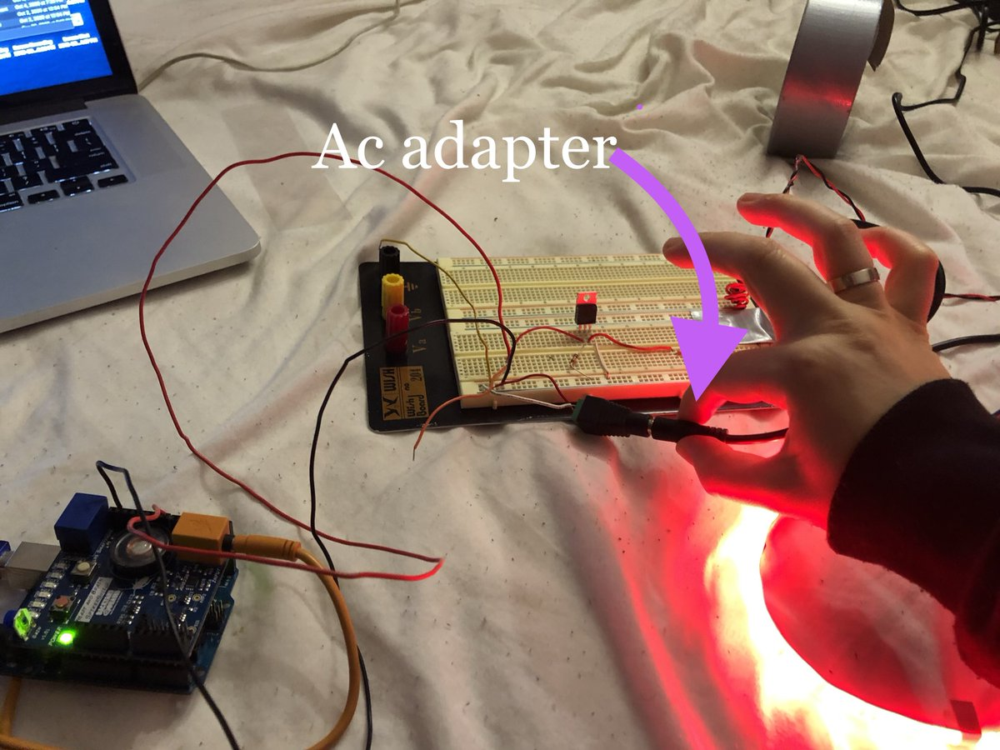

**I now get a fuzzy eye movement signals from the electrodes**
<br>
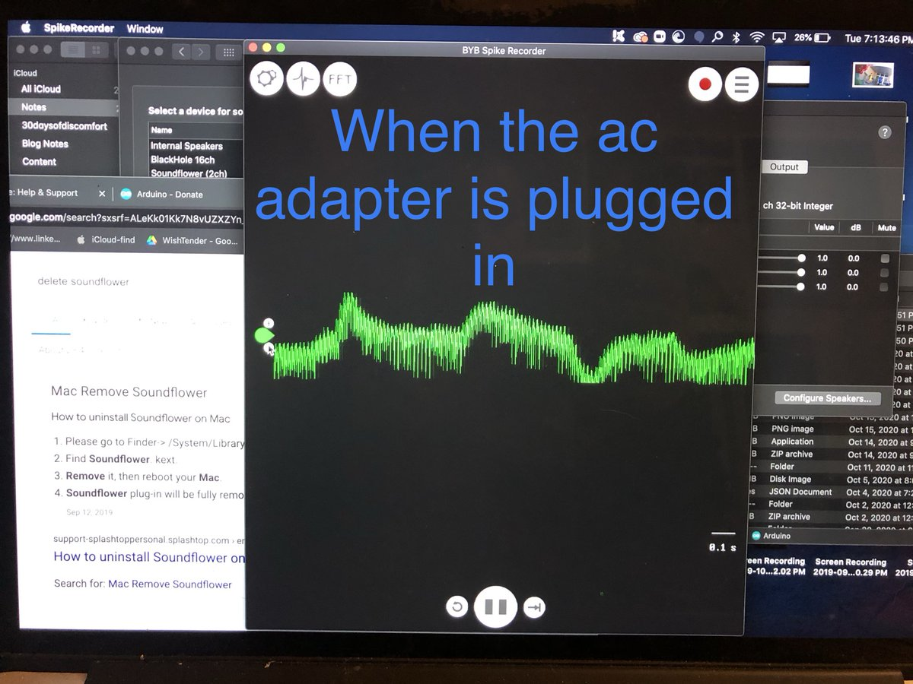

**instead of a clear readable eye movement signals.**
<br>
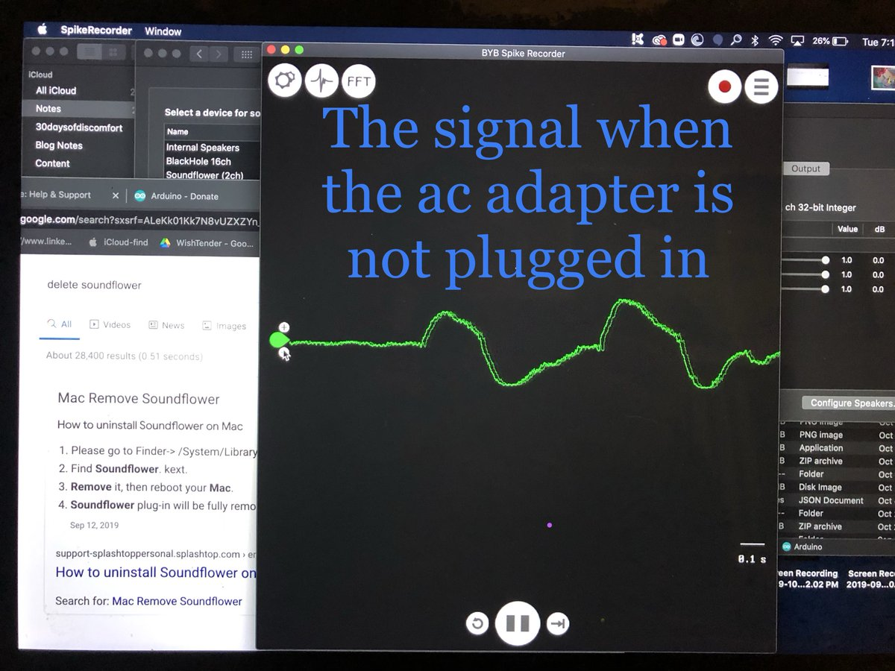

The reason I added the AC power adapter was in order to power the red led strip. The led strip provides the light needed to induce lucid dreams.

## Solutions

I think the best solution is to switch from a 12V AC adapter to a battery pack to both reduce 1. the noise and 2. the danger of physically being hooked up to AC power.

But I'm not totally sure. So I've been brushing up on electronics basics- current, volts, resistance, Ohms law, Kerckhoff's voltage and current laws, working with components, etc.

## Notes and Resources

Now that I've filled you in, I just wanted to use this space to save some notes and resources.

### Resources

- [**Video:** LEDs in Series and Parallel](https://www.youtube.com/watch?v=mKCAxwjfs0I)

- [How Led strips are wired](https://www.waveformlighting.com/home-residential/connecting-led-strips-in-series-vs-parallel)- go to last section.

- [Calculations for Parellel vs Series LED's](https://www.circuitspecialists.com/blog/how-to-determine-resistor-value-for-led-lighting/)

- [Engineering Circuit Analysis](https://www.youtube.com/watch?v=OGa_b26eK2c&list=PLnVYEpTNGNtUSjEEYf01D-q4ExTO960sG)- I bought the series but the first few videos are available on Youtube. Those first few videos were actually my favorite videos in the series. Most of the later videos I paid for just went over problems and solutions.

- Tinkercad

  [Tinkercad](https://www.tinkercad.com/) has a virtual circuit maker. It allows you to create virtual circuits. You can use virtual power supplies, virtual components, and even test it all with a virtual multimeter. Great for practicing basic electronics without expensive components.

   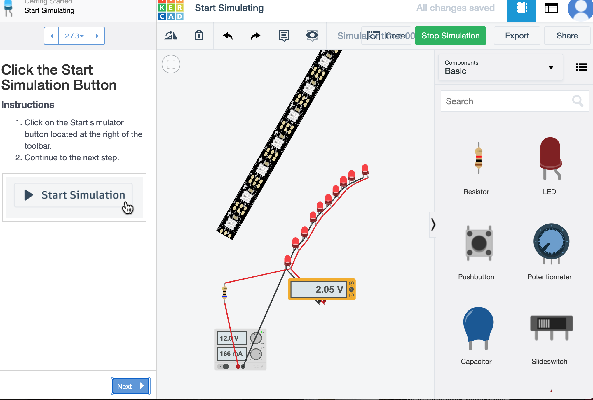

<hr>
<h3 id="update-2-11-21"></h3>

## Building [WishTender](https://github.com/DashBarkHuss/100-days-of-code/blob/master/post-log.md#update-9-16-20) Update - Thursday 2/11/21

<hr>

## Outsourcing Development Work

It's been 213 days since I started coding [WishTender](https://github.com/DashBarkHuss/100-days-of-code/blob/master/post-log.md#update-9-16-20), my unfinished bootstrapped product. I've learned a lot about building an application.

Now, I'm starting to consider something both intimidating and exciting: coding with other people.

I've always envisioned myself transitioning out of coding WishTender, as lots of founders do. It would be powerful to learn how to delegate tasks and manage people.

First, I would like to start small. I'd like to get experience delegating some of the coding to other developers.

But, as a newly self taught developer who has never worked with other developers, I have a lot of questions and gaps in my knowledge.

1. **Logistics:** What does working with other people look like?

   - **How do I go about using git?**

     I've only ever used git as a single person. If I could see what it looks like for people to collaborate on github that would be helpful.

   - **How do I separate out tasks?**

     As a single developer I can work on the front and back end at the same time. I often approach tasks without separating these out. For example, if I work on the checkout front end, I will also be messing with the checkout backend at the same time; making tweaks to the API as I figure out what I need from the backend. I would imagine that I would need to separate tasks up when I work with others. Collaboration probably requires more planning, like having the backend already figured out, knowing which API calls will take place on each page, and knowing what data will need to come in and out of the API before telling someone to build a front end page.

   [Kenneth Wade](https://www.linkedin.com/in/kenneth-wade/), DevOps manger and founder of Kenjyco, suggested a good first step: try coding my app on two different computers. It will help me get an idea of how to use git as a collaborator.

2. **Security:** How do I keep from exposing too much information about the app with freelancers/new employees who I know little about?

   - I wouldn't want just anyone to have access to api keys, customers info, or passwords to relavent accounts- like my stripe platform account. Yet it feels like sometimes I will need to give collaborators access to these.

3. **Money**: How do I afford to work with others as a bootstrapped business?
   - I probably won't be taking on employees right away. But what about freelancers or interns? Or starting out by finding a friend or mentor to pair program on my app? When do I transition to hiring fulltime employees and what does that transition look like?

If you have any suggestions about how I can learn more about outsourcing, managing, collaborating let me know on Twitter or Linked in!

## Bootstrapping as Developer

Here's a video about [bootstrapping as a developer](https://tekin.co.uk/2013/10/bootstrapping-as-a-developer) by Tekin Süleyman [@tekin](https://twitter.com/tekin).

It's rare to find developers who are bootstrapping a product. More commonly, founders are non-devs raising funds or trying to find a technical co-founder. Sometimes in combination with using no-code tools to prototype. But being a developer gives me both unique advantages and disadvantages to consider. And certainly different goals from vc raisers.

Even in Tekin's talk, one of the first things he mentions is that bootstrappers should have one goal: to turn a profit. While conversely, funded ventures are going to aim for growth. A bootstrapped app would not want 100k users on launch day. They wouldn't have the means to support this traffic. Bootstrappers want steady growth that their profit can support. So my goal is profit. But funded businesses have or will try to get money to support growth, so their goal is growth. Growth shows investors that the business is viable. This is just one of the many ways these two frameworks might think differently.

It was also nice to see Tekin talk about his slow and steady growth. His first commit was June 2009. He launched in May 2012. A month later he had his first paying customer. VC funded projects might move a lot faster. I thought I was moving at a snails pace compared to what I saw. For example and speaking of fast, I think I saw the founder of Fast talk about how Fast was just an idea a year ago. I've been working daily on WishTender since June\*. I am no where near the pace that Fast moved. But my journey is going to look different than a funded venture.

Exposing myself to different bootstrappers journeys will be beneficial.

Tekin goes into his journey as a bootstrapper and how and why his business failed and it's a great watch.

\*_Possibly an exaggeration. I believe I took off on Yom Kipper, and maybe some other special occasions or at least decreased the amount of work I did._

<hr>
<h3 id="update-2-7-21"></h3>

## Building [WishTender](https://github.com/DashBarkHuss/100-days-of-code/blob/master/post-log.md#update-9-16-20) Update - Sunday 2/7/21

<hr>

## Most People Can't Get Through The Hardest Part Of A Goal

It's been 7 months and 2 weeks since WishTender was an idea. 6 months and 4 weeks since I made a demo of the app. 6 months and 3 weeks since I started coding the app.

When I started my spouse asked me when I'd be done. I said by the end of October. That was 3 months ago.

I'm not surprised it's taking me longer. I'm building a full app myself for the first time. I have to remind myself, it's only been 768 days since I started my [first day](https://github.com/DashBarkHuss/100-days-of-code/blob/master/r1-log.md#r1d1---1119) of #100DaysOfCode.

So I'm not here to complain about the length of time it's taking me.

I'm at a point though where the excitement of starting the project is wearing off. This is the point I believe where most people struggle. The boring part where you're pretty far from the newness, and pretty far from the home stretch. It's going to take patience and persistance to get though this.

## Do What Most People Don't Do

But I can't just rely on "persistence". I've found that forceful modes like persistence and discipline don't work as well as intrinsic motivation, even for people like me who have seemingly endless amounts of willpower. We can try to "discipline" ourselves to the finish line but we often pay the price- usually our health will suffer from the hormonal effects of extreme discipline.

So I need a tactic- beyond willpower- to get through this hump. What got me excited in the first place? That excitement is what I need back.

Seeing myself as the founder of a profitable company.

Seeing myself making money.

Seeing myself making enough money to fund lucid dream research and technology.

I shouldn't be ashamed to get too grand with it- Why not see myself on the cover of Wired Magazine? _Meet Dashiell Bark-Huss: The Entreprenuer Who Tweets From Her Dreams And Put $1 Billion Into Lucid Dream Research_

These are the grand delusions that I normally try to tone down. After all, it's more important to get to the blood and sweat- the coding the, market research, the work- than get swept away with day dreams. Or so I thought. I'm seeing instead, that we need a balance of the grand delusions and the hard work. Contrary to what "Discipline Dashie" believes, "Delusion Dashie" runs the show. My grand delusions are magic fuel.

## The Magic Fuel

What do I mean these delusions are magic fuel? I've been experimenting. I've found that after I visualize or journal how exciting the future might be, it feels like I instantly gain 15 IQ points and drank a cup of coffee. Much of my very real lethargy and difficulties go away completely after I rejuvenate my excitement for the future.

What are the visualizations I'm doing? Well, I haven't been so prescriptive with it. It's just something I've been dabbling with. For example, I tried the written equivalent of creating a vision board: Journaling why I'm building WishTender, what it will do for my life and other people. I also collected some pictures on instagram of others in similar positions to where I want to be. I updated my linked in with "_Technical Founder at WishTender_" to remind myself this is real and give myself a bit of public accountability.

Now that I'm seeing the necessity and benefits of visualizations, I may be a bit more prescriptive. So many self help book say to do some form of visualizations or goal reciting before work (The One Thing, The Miracle Morning, Think And Grow Rich). When you get far enough into a project this becomes so important. You have to keep that intrinsic motivation going. Other people aren't going to do be your cheerleader. Most probably don't have the patience for their own projects, they certainly won't have the patience for yours. So be unique. Be persistent, be patience, and have grand delusions.

<hr>
<h3 id="update-1-29-21"></h3>

## Building [WishTender](https://github.com/DashBarkHuss/100-days-of-code/blob/master/post-log.md#update-9-16-20) Journey - Friday 1/29/21

<hr>

Resources to save:
[Node Checkout example](https://github.com/pararell/eshop-angular-node/blob/b9b5c7fffaef797f84a7c79d7f658a30e1bed9cc/routes/billingRoutes.ts)

<hr>
<h3 id="update-1-29-21"></h3>

## Building [WishTender](https://github.com/DashBarkHuss/100-days-of-code/blob/master/post-log.md#update-9-16-20) Journey

## Answers to My App Architecture [Question](#update-1-28-21)

### Friday 1/29/21 - Thursday 1-28-21

<hr>

After my [question](#update-1-28-21) yesterday I got a lot of helpful responses.

## [Theo Khayat](https://www.linkedin.com/in/theokhayat/) on LinkedIn

> You're looking for some all-or-nothing processing(checkout AWS step functions - am not recommending specifically AWS, just as an example of chaining multiple backend events) as this allows your frontend to request a single endpoint, and subsequently know if ALL the backend events succeeded or not, in a single status code. Hope that helps and best wishes :)

Theo introduced me to the term **all-or-nothing processing**. I googled **all-or-nothing processing** which lead me additional useful terms like **batch** and **bulk** requests. It lead me to better worded questions than my own like "How do I perform different actions on resources of different types in one request?"

Sometimes when I'm stuck it's because I don't know the correct terms or questions to ask. Reaching out for help can introduced me to terms and well-worded questions that will get me on track.

## [Ryan Lynch @joyofui](https://twitter.com/joyofui) on Twitter

> My answer to your question, which I'd sum up as "What do I do when an endpoint doesn't map to REST", would be : not everything has to be RESTful in your API. REST and is just one way of slicing things up. Maybe think of some endpoints as REST, some as just RPC's like "doCheckout"

Me:

> Yes, you phrased my question better than I did. A lot of my questions lately have surrounded this idea- that you do not alway have to follow REST. As a newbie it's been a bit confusing trying to understand when to break a convention. Thanks for bringing RCP to attention.
>
> I should say when and how to break convention
>
> _[This part was in a DM in a related conversation:]_ When I was more of a newbie there usually was one best way. But it seems as you progress to more advanced things there are less best practices. But it's interesting to see how other developers think through the problem

[Ryan Lynch @joyofui](https://twitter.com/joyofui):

> A rule of thumb is, if you are creating either more work or more mental overhead to build or understand the code, think about changing conventions or breaking them all together. Not all problems are generic and have generic solutions, so don't be bound to generic answers!

This last remark by Ryan hits on a problem I see with myself and other newbies- fear of breaking convention. Often times it isn't even clear to a newbie when something is a flexible convention, and when it is a serious rule that you should never break.

I looked into other forms of API's after Ryan suggested RPC.

Video: [Nate Barbettini – API Throwdown: RPC vs REST vs GraphQL, Iterate 2018](https://www.youtube.com/watch?v=IvsANO0qZEg)

In this video Nate illustrates why you might break a convention for another API convention that fits your use case. It may be more important for one project that the API is highly flexible and documented, REST is great here. But I'm building a private API so I may value low chattiness over flexibility.

## [Helge Drews @helgedrews](https://twitter.com/helgedrews) on Twitter:

> I think what you're searching for is a CheckoutController and not CheckoutService. Simply said, you inject all your Services into it and the Controller orchestrates all the business logic, handles Errors and so on. Put it behind the POST /checkout route. :)

My Response:

> Thanks helge, I had a checkout route (the equivalent of a controller?) but it was getting big and I though it was considered a best practice to leave fat business logic out of the controller and move it to a service, so I also made a service. Not sure if that makes sense

Before I sent that last response, **Helge** sent me a DM to elaborate:

> Here I've got some more infos to the answer in your twitter thread about how to organize your app architecture.
>
> in the root file app.js you can do something like this:
>
> ```javascript
> const checkoutController = new >CheckoutController({
>    emailService,
>    orderRepository,
>    paypalService,
>    productRepository,
>    shopConfigRepository,
>    shoppingCartRepository,
>    stripeService
> });
> // ...
> app.use('/checkout/', >checkoutController.router);
>
> CheckoutController looks like this:
> export default class >CheckoutController {
>    constructor({
>        emailService,
>        orderRepository,
>        paypalService,
>        productRepository,
>        shopConfigRepository,
>        shoppingCartRepository,
>        stripeService
>    }) {
>        // Routes
>        this.router = new Router();
>        http://this.router.post('/prepare', async (req, res, next) => this.prepare(req, res, next));
>        http://this.router.post('/complete', async (req, res, next) => this.complete(req, res, next));
>
>        // Repo
>        this.orderRepository = orderRepository;
>        this.productRepository = productRepository;
>        this.shoppingCartRepository = shoppingCartRepository;
>        this.shopConfigRepository = shopConfigRepository;
>
>        // Service
>        this.emailService = emailService;
>        this.paypalService = paypalService;
>        this.stripeService = stripeService;
>    }
>
> // the implementation of the methods >behind the routes and a lot  of other >helper methods
> ```

Helge used the terms "repository" and "controller" which introduced me to the **Repository-Service pattern**.

## [John Zhao](https://www.linkedin.com/in/john-zhao-3136647b/) on LinkedIn:

> one endpoint can interact with many services and models. that's the entire point of the backend - to glue all the different pieces together.
>
> the vast majority of backend code in the real world is never as simple as one route -> one service -> one model. taking your example of getting a product from a database, in the real world, you'll probably want to call one endpoint to get the product info, product upsells and product reviews that are stored in different models.
>
> just google node ecommerce projects on github and you'll find plenty of examples to guide you

Many tutorials simplify projects so we rarely see these more complex real world backends. Finding more complex examples is important.

It seems obvious, but I hadn't thought to search for the term "ecommerce", I kept searching for "shop". That small suggestion was helpful.

### Thanks to everyone who helped!

<hr>

## Random/Messy Notes and Resources

As I was reading guidance from the helpful people above, I did some googling and note taking:

https://apihandyman.io/api-design-tips-and-tricks-getting-creating-updating-or-deleting-multiple-resources-in-one-api-call/

> What if I want to do DELETE /resources/ID1 and PATCH /another-resources/ID2 at the same time?
>
> This is really nasty and definitely not REST, but it can be useful for backend for frontend or experience API for example.
>
> To do that we’ll need to POST data on a specific endpoint which could something like /batch, /bulk or even / and we will have to add a uri and replace the id value by something provided by the consumer:
> Actions number 1 is DELETE /resources/ID1 and its result will be identified in the 207 response by the id ACTION1.
>
> To see a complete example you should take a look at Facebook’s Graph API batch endpoint documentation. Note that this batch endpoint match request/response based on index and does far more than just processing a bunch of request.

https://www.codementor.io/blog/batch-endpoints-6olbjay1hd

> Google has implemented a complicated but flexible batch endpoint. Instead of having an endpoint that accepts multiple resources, there's an endpoint that accepts multiple requests. These are essentially "meta" HTTP requests, where the main request contains different sub-requests.

[Nate Barbettini – API Throwdown: RPC vs REST vs GraphQL, Iterate 2018](https://www.youtube.com/watch?v=IvsANO0qZEg)

[Best Practices for Building API Integrations](https://blog.bearer.sh/api-integration-best-practices/)

> The difference between an API and an integration is that an API integration is how your application connects to an API.

<hr>
<h3 id="update-1-28-21"></h3>

## Thursday 1-28-21

## [WishTender](https://github.com/DashBarkHuss/100-days-of-code/blob/master/post-log.md#update-9-16-20) Code Notes:

<hr>

I've been confused about app architecture when your app gets complex.

**It's easy when the routes map simply to a resource.**

For example, **adding a product to a shop.**

In this case you might have a

- `Product.Model.js`- a mongoose model. This is your resource.
- `ProductService.js`- a service that interacts with that model.
- `product.js`- a router that directs the express app based on different routes like `GET /product/213`. The routes tells the app which service to use and what the response should be.

Thats simple.

**But what about something not so straight forward?**

**For example, what route, service, and resource do we use when a client checks out?** There isn't one clear resource here. When a client checks out we are interacting with many resources and services.

These might be:

- The `Order.Model.js`, a mongoose model that stores order information such as cart items, time purchased, and currency conversions.
- The shop owner's account `Owner.Model.js` because we might want to track their earnings on their account.
- 3rd party API's, like Stripe for payment processing.
- An email service- `Email.Service.js`- to send a reciept to the buyer and a notification to the shop owner.

and on and on...

In this case should we make a `checkout.js` route that maps `POST /checkout` to a `CheckoutService.js`?

`CheckoutService.js` could then interacts with many services and resources like

- `StripeService.js`
- `OrderService.js`
- `OwnerService.js`
- `EmailService.js`

Is this how it should be done?

**A little more simply, what about when we're just creating a resources on a third party?** For example a Stripe Connect account. Stripe Connect accounts: when you use Stripe as a marketplace, your platform has an account with Stripe and your users- like shop owners- have their own accounts called Connect accounts, connected to your platform account.

Your users need to create these Connect account. What route do you use? What service do you use?

It's not as simple as `blogRoute.js`--> `BlogService.js` -->`Blog.Model.js`. You don't house the resource on your site, the connect account object is housed on Stripe.

You might also create a model, `StripeAccountInfo.Model.js` to house some information about the account that is pertinent to your app- like currency, if the user paid their monthly fees to cover the Stripe Connect fees, and Stripe account number. But now, you have a resource on your site _and_ a resource on stripe that need to be interacted with. How will this look like in your app architecture?

## Help Me!

These are some things I've been confused by. I rarely see any information on these more complex circumstances. **If any one has any resources, answers, is willing to talk it out over the phone, or even clues to what I should google I'd love to hear from you.**

Twitter: [@DashBarkHuss](https://twitter.com/DashBarkHuss)

LinkedIn: [in/dashbh/](https://www.linkedin.com/in/dashbh/)

<hr>
<h3 id="update-1-21-21"></h3>

## Thursday 1-21-21

I reviewed circuit basics [Lesson 1 - Voltage, Current, Resistance (Engineering Circuit Analysis)
](https://www.youtube.com/watch?v=OGa_b26eK2c) - really nice explanation of circuit basics.

<hr>
<h3 id="update-1-15-21"></h3>

## Friday 1-15-21

## [WishTender](https://github.com/DashBarkHuss/100-days-of-code/blob/master/post-log.md#update-9-16-20) Code Notes:

<hr>

## Data Transformation Between Backend and Frontend

Working with the data in your app can be confusing when the data needs to be transformed into different representations.

## Prices

Like prices.

- When you **display** prices they will look like **$5,000.00**. This will change depending on the currency.
- When the user **inputs** a price it might look like **5000**, **5,000**, **5000.00**, **5.000,00** .
- And when you do calculations with prices you usually work in integers so **$5,000.00** would be **5000000** pennies.

Keeping track of all these different formats can be confusing. How should we ultimately store prices in the database? When do these transformations happen from database format to view format and back?

## Front to Back

I [asked](https://stackoverflow.com/questions/65707764/where-should-data-be-transformed-for-the-database) on StackOverflow:

> Where should data be transformed for the database?

The answers showed there isn't one standard way. While sanitization happens on the backend for security reasons, normalization can happen in either place. People gave good ideas for how to decide. Check out the answers by [@nickang](https://twitter.com/nickang), [@helgedrews](https://twitter.com/helgedrews), and [Cosmin Ioniță](https://stackoverflow.com/users/2787364/cosmin-ioni%c8%9b%c4%83) on stackoverflow [here](https://stackoverflow.com/questions/65707764/where-should-data-be-transformed-for-the-database#answers).

My question asked about transformations from the frontend user input to the backend. But I also wonder about transformations happening when data is sent from the backend to the frontend.

## Both Back to Front and Front To Back

This answer suggests that the conversions should happen at the boundaries of the app.
[Unit conversion of data](https://softwareengineering.stackexchange.com/questions/391474/unit-conversion-of-data):

> Keep consistent units within your system, and only convert to the user's preferred format at the boundaries of your system. The “boundary” doesn't necessarily mean front-end or back-end, this is more about how you structure the logic in your application. A classic MVC application would convert incoming data in the controllers, and outgoing data in the views.

I'm not sure if "incoming data" here means to the server or to the client. I'm going to assume incoming means from the frontend to the backend.

## What Format to Store in the database?

The same answerer above suggested:

> Keep consistent units within your system...
>
> Do not store the data in multiple formats in the database. This makes it so much harder to keep the various versions of the data consistent, and will make queries more complicated. Internally, your system should define a single authoritative data model.

I found a lot of ways people store price in the database, but the most common was to store price as an integer- the smallest unit of the currency. Here [@helgedrews](https://twitter.com/helgedrews) points to other API's for inspiration:

> Furthermore, it can be helpful to take a look at some different APIs of well-known providers and how these handle prices.
>
> The Paypal API uses an amount object to transfer prices as decimals together with a currency code.
>
> ```json
> "amount": {
>    "value": "9.87",
>    "currency": "USD"
> }
> ```
>
> It's up to you how to handle it in the frontend. Here is a link with an example request from the docs:
>
> https://developer.paypal.com/docs/api/payments.payouts-batch/v1#payouts_post
> Stripe uses a slightly different model.
>
> ```json
> {
>   "unit_amount": 1600,
>   "currency": "usd"
> }
> ```
>
> It has integer values in the base unit of the currency as the amount and a currency code to describe prices. Here are two examples to make it more clear:
>
> - https://stripe.com/docs/api/prices/create?lang=node
>
> - https://stripe.com/docs/checkout/integration-builder
>
> In both cases, the normalization and sanitization has to be done before making requests. The response will also need formatting before showing it to the user. Of course, most of these requests are done by backend code. But if you look at the prebuilt checkout pages from Stripe or Paypal, these are also using normalized and sanitized values for their frontend integrations: https://developer.paypal.com/docs/business/checkout/configure-payments/single-page-app

## Outgoing example

So an outgoing boundary could be in the callback of a HTTP request. Here we do the transformation there before the client displays the data:

```javascript
useEffect(() => {
  if (!cart) {
    fetchGet("/cart", (crt) => {
      parseCartPrices(crt); // parseCartPrices transforms cart prices. ex: 100000 -> "1000.00"
      setCart(crt);
    });
  }
}, [cart]);
```

You could have this transformation go even further, `100000` -> `"$1,000.00"`, or even `100000` -> `"CA$1,800.10 estimated from $1,000.00"`. But I thought leaving it at `"1000.00"` would be more flexible. There are some calculations I do with the prices on the frontend. If the price was in the format `"$1,000.00"` I would have to parse it into `"1000.00"` before doing the calculations. So instead, I will further transform `"1000.00"` to `"$1,000.00"` only where necessary.

## Incoming example

An incoming boundary could be in the `onSubmit` function of a form.

```javascript
const onSubmit = (data) => {
  data.price = toSmallestUnit(data.price, clientCurrency); // toSmallestUnit turns "100.00" into "10000" if currency is USD
  props.onSubmit(data); // props.onSubmit sends the data to the backend in a POST request.
};
```

Alternatively, you could transform `"100.00"` into `"10000"` just on the other side of the boundary in the backend, for example using an `express-validator` `customSanitizer`.

<hr>
<h3 id="update-1-11-21"></h3>

## Monday 1-11-21

## [WishTender](https://github.com/DashBarkHuss/100-days-of-code/blob/master/post-log.md#update-9-16-20) Code Notes:

<hr>

## Handle Validations before logic:

> You can handle some validations in your user model using Mongoose. For best practices, we want to make sure validation happens before business logic.

- Shailesh Shekhawat in [How to make input validation simple and clean in your Express.js app](https://www.freecodecamp.org/news/how-to-make-input-validation-simple-and-clean-in-your-express-js-app-ea9b5ff5a8a7/)

## Storing Monetary Value in Database

[What is the best way to store monetary value in a relational database system like MySQL?](https://www.quora.com/What-is-the-best-way-to-store-monetary-value-in-a-relational-database-system-like-MySQL)

[Model Monetary Data](https://docs.mongodb.com/manual/tutorial/model-monetary-data/)

[Storing prices in SQLite, what data-type to use?](https://dba.stackexchange.com/questions/15729/storing-prices-in-sqlite-what-data-type-to-use)

## Transforming data on Back or Front end?

Should I be serving price data up as integers, the way it's stored in my database (_ex instead of $100.00, serve it as 10000_)? The the front end has to transfrom it from 10000 to $100.00. Or should I transform it to $100.00 on the back end and serve that?

It gets more complicated when we take price conversion into account. If the client is in EUR and the price is in USD we have to do an estimate in the UI (_ex "€120 estimated from $100"_). That means we have to fetch the exchange rate and to the conversion on the frontend.

[Should data transformation be on the front or on the back end in this scenario?](https://softwareengineering.stackexchange.com/questions/400595/should-data-transformation-be-on-the-front-or-on-the-back-end-in-this-scenario)

Very helpful: [When is it appropriate to do calculations in front-end?](https://softwareengineering.stackexchange.com/questions/252224/when-is-it-appropriate-to-do-calculations-in-front-end?newreg=ae510a8f69a4461db58b9a0c24bb8dad). You could see many people diagreed but people gave reasons as to why you would do calculations on the front, back, or both.

[Unit conversion of data](https://softwareengineering.stackexchange.com/questions/391474/unit-conversion-of-data):

> Keep consistent units within your system, and only convert to the user's preferred format at the boundaries of your system. The “boundary” doesn't necessarily mean front-end or back-end, this is more about how you structure the logic in your application. A classic MVC application would convert incoming data in the controllers, and outgoing data in the views.
>
> Do not store the data in multiple formats in the database. This makes it so much harder to keep the various versions of the data consistent, and will make queries more complicated. Internally, your system should define a single authoritative data model.

<hr>
<h3 id="update-1-3-21"></h3>

## Sunday 1-3-21

## [WishTender](https://github.com/DashBarkHuss/100-days-of-code/blob/master/post-log.md#update-9-16-20) Code Notes:

<hr>

## Sample Localizational/Internationalization project

I finished my sample [currency i18n](https://github.com/DashBarkHuss/currency_localization_react_express) project. It's a sample project that shows how to set the currency for a user depending on their language preference in their browser `accept-language` header.


I wanted to accommodate different currencies because some of my beta users asked me to. But there was little info on the subject. I figured it out and put this sample together so others can understand how it might be done.

## React Wasted Renders

My app was re-rendering too many times. React doesn't have a solution to figuring out what caused a component to update (if you know of a way let me know). There are some notes in my last log entry ([12-29-20](https://github.com/DashBarkHuss/100-days-of-code/blob/master/post-log.md#update-12-29-20)) for some clues on how to do this- profiler, memo, react dev tools. I didn't find that any were very good for seeing why a component rendered. For example, memo only shows what props caused a re-render but not state changes.

So I built my own function to figure out when props or state changed. It doesn't show you when a parent rerender caused a component to rerender but you can figure it out if you use the debugging function in the parent and see that the parent re-renders.

## My own react debugging function

This tells you if a component rendered and if the state or props changed.

It helped me figure out why I had so many re-renders. This function could be more DRY.

### useTraceUpdate

```javascript
import { useEffect, useRef } from "react";
import _ from "lodash";
/**
 * tracks component renders
 * @param {String} component component name ex: App.name
 * @param {Object} props
 * @param {Object} state
 */
export default function useTraceUpdate(component, props, state) {
  const prevP = useRef(props);
  const prevS = useRef(state);
  let render = useRef(0);
  useEffect(() => {
    render.current++;
    console.log(component, "rendered ", render.current, " times");
    if (props) {
      const changedProps = Object.entries(props).reduce((ps, [k, v]) => {
        if (prevP.current[k] !== v) {
          ps[k] = [prevP.current[k], v];
        }
        return ps;
      }, {});
      if (Object.keys(changedProps).length > 0) {
        const displayText = Object.entries(changedProps).map((s) =>
          typeof s[1][0] === "object" && typeof s[1][1] === "object"
            ? `${s[0]} object changed, content of object ${
                _.isEqual(s[1][0], s[1][1]) ? "didn't" : "did"
              }  change ${
                !_.isEqual(s[1][0], s[1][1])
                  ? `from ${s[1][0]} to ${s[1][1]}`
                  : ""
              }`
            : `${s[0]} changed from ${s[1][0]} \nto ${s[1][1]}`
        );
        console.log(
          "r:" + render.current + " info: " + component + " changed props:",
          displayText.join("\n")
        );
      }
    }
    prevP.current = props;
    if (state) {
      const changedState = Object.entries(state).reduce((ps, [k, v]) => {
        if (prevS.current[k] !== v) {
          ps[k] = [prevS.current[k], v];
        }
        return ps;
      }, {});
      if (Object.keys(changedState).length > 0) {
        const displayText = Object.entries(changedState).map((s) =>
          typeof s[1][0] === "object" && typeof s[1][1] === "object"
            ? `${s[0]} object changed, content of object ${
                _.isEqual(s[1][0], s[1][1]) ? "didn't" : "did"
              } change ${
                !_.isEqual(s[1][0], s[1][1])
                  ? `from ${s[1][0]} to ${s[1][1]}`
                  : ""
              }`
            : `${s[0]} changed from ${s[1][0]} \nto ${s[1][1]}`
        );
        console.log(
          "r:" + render.current + " " + component + " changed state:",
          displayText.join("\n")
        );
      }
    }
    if (render.current === 1) {
      console.log("r:" + render.current + ": initial render");
    }
    prevS.current = state;
  });
}
```

How to use `useTraceUpdate`:

```javascript
function WishlistPage(props) {
  const [alias, setAlias] = useState(null);
  const [wishlist, setWishlist] = useState(null);
  const [refreshWishlist, setRefreshWishlist] = useState(null);
  const currentUser = useContext(UserContext);

  const states = {
    alias,
    wishlist,
    refreshWishlist,
    currentUser,
  };

  useTraceUpdate(WishlistPage.name, props, states);

  return <div>... blablabla</div>;
}

export default WishlistPage;
```

### console will look like this

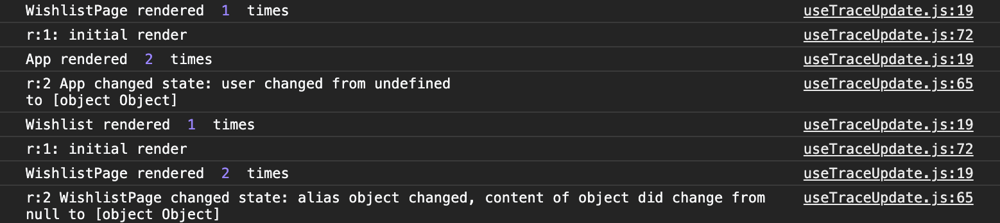

<hr>
