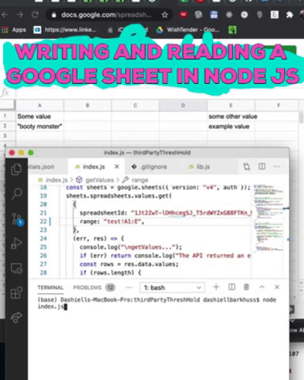
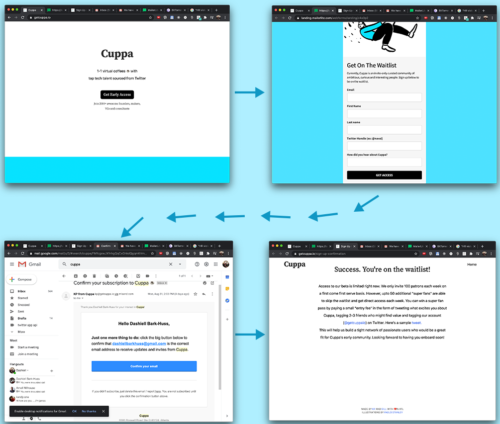
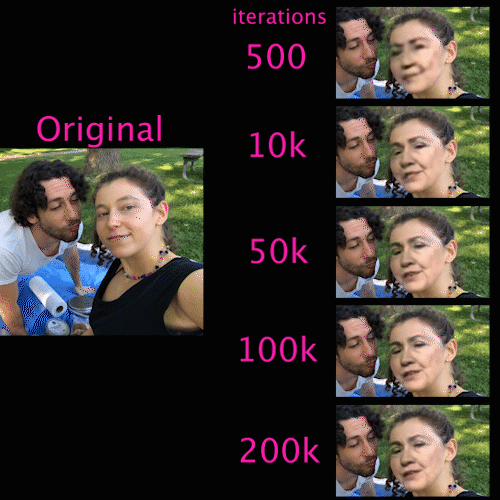
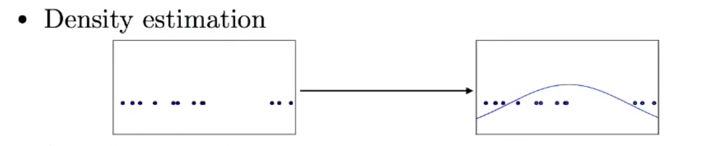

# Post #100DaysOfCode Log - Dashiell Bark-Huss

I completed my 365 days of code in 2019. But I'm going to continue to add to this log when I want to save notes.

<h3 id="update-10-7-20"></h3>

## Wednesday/Thursday, 10/7/20

## Daily [WishTender](#update-9-16-20) Update

**Today's Progress:**

- I moved today so limited progress, but I spent Wednesday to Thursday morning reviewing SOLID principles.

SOLID code principles help keep code maintainable and scalable. When I did smaller projects that wasn't important. But WishTender is a full production app. So I'm prioritizing it's maintainability.

## Code Notes On SOLID:

It's not necessary or ideal to learn them in SOLID order. Here's the order of my notes:

1. Dependency Inversion Principle
2. Interface Segregation Principle
   - Composition vs Inheritance
3. Liskov Substitution Principle
4. Open–closed Principle
5. Single Responsibility Principle

## Dependency Inversion Principle

High-level modules (modules, functions, classes closer to view layer) should not depend on low-level modules (modules like a 3rd party API like Stripe). Both should depend on abstractions (e.g. interfaces).

No!:

STORE---->STRIPE

YES!:

STORE---->PAYMENT PROCESSOR<----STRIPE

```javascript
const store = new Store(new StripePaymentProcessor("Dash"));
store.purchaseBike(2);

const store2 = new Store(new PayPalPaymentProcessor("Dash"));
store.purchaseBike(1);
```

This way if you change to paypal you just send in a different payment processor object- a `PayPalPaymentProcessor`. You don't have to change the (`Store`) to interact with paypal now, which would lead to way too much refactoring.

### [**Video**](https://www.youtube.com/watch?v=9oHY5TllWaU)

## Interface Segregation Principle

Interface means 'class' essentially. In other languages an interface is a class like object. But interfaces don't exist in javascript.

Break out your interfaces or large classes into smaller components or smaller interfaces so subclasses don't extend from classes that have methods that they don't use.

```javascript

class Entity {
  constructor(name, attackDamage, health) {
    this.name =name
    this.attackDamage = attackDamage;
  }
  move(){...//bla bla bla}
  attack(){...//bla bla bla}
}

class Rock extends Entity {
  ...//bla bla bla
  move(){return null} //rocks don't move
}
class Character extends Entity {} //characters do move
```

`Rock`s don't move, but they inherit from `Entity` with has the `move()` method.
Refactor this do use composition.

```javascript
class Entity {
  constructor(name) {
    this.name = name;
  }
  // no more move() or attack()
}

const mover = {
  move() {
    console.log(`${this.name} moved`);
  },
};

class Character extends Entity {
  constructor(name, attackDamage, health) {
    super(name);
    this.attackDamage = attackDamage;
  }
}

Object.assign(Character.prototype, mover);
```

Now we can add the `move()` function to only classes that move.

### [**Video**](https://www.youtube.com/watch?v=JVWZR23B_iE&t=380s)

## Composition vs Inheritance

When classes inherit you're describing 1. what objects are and 2. how they're related. But it doesn't always make sense.

```javascript
class Monster {
...
}
class FlyingMonster extends Monster{
...
  fly(){...
...
}
class SwimmingMonster extends Monster {
...
  swim(){...
...
}
class SwimmingFlyingMonster extends FlyingMonster or SwimmingMonster?????{
...

```

`SwimmingFlyingMonster` inherit from `SwimmingMonster` or `FlyingMonster`?

With composition you're describing what an object can do.

```javascript
function swimmer({ name }) {
  return {
    swim: () => console.log(`${name} swam`),
  };
}

function swimmingMonsterCreator(name) {
  const monster = { name: name };
  return {
    ...monster,
    ...swimmer(monster),
  };
}
```

Now you can compose a monster by adding the functionality it needs.

### [**Video**](https://www.youtube.com/watch?v=nnwD5Lwwqdo)

## Liskov Substitution Principle

> if S is a subtype of T, then objects of type T may be replaced with objects of type S

In other words, if you have a function that excepts an instance class like `Animal`, every single subclass of that class (`Dog`, `Turtle`) must be able to able to enter that function and work properly.

```javascript
function procreate(animal){...}

procreate(new Animal()) //...fine
procreate(new Dog()) //...fine
procreate(new NeuteredDog()) //...this wont work!
```

You might refactor this by making another subclass- `FertileAnimal`- and making the function-`procreate` accept an instance of that new subclass and it's subclasses:

```javascript
class FertileAnimal extends Animal{...}
class Dog extends FertileAnimal{...}

function procreate(FertileAnimal){...}

procreate(new FertileAnimal())
procreate(new Dog())
```

Or you might change this from inheritance to composition.

```javascript
const procreator = {
  procreate() {
    console.log(`${this.name} procreated`);
  },
};
class Dog extends Animal {
  constructor(name, barkSound) {
    super(name);
    this.barkSound = barkSound;
  }
}

Object.assign(Dog.prototype, procreator);
```

### [**Video**](https://www.youtube.com/watch?v=dJQMqNOC4Pc)

## Open–closed Principle

> "software entities (classes, modules, functions, etc.) should be open for extension, but closed for modification";

This means if you have an entity, meaning...like... a function, you shouldn't have to 'open' up and 'modify' the function to accommodate new circumstances. But you should be able to extend the function.. meaning...like... pass in new kinds of arguments.

### Print Quiz Example

```javascript
function printQuiz(questions){
  questions.forEach(question=>{

  if(question.type == 'multiply choice'){
    question.options.forEach(()=>{
      console.log(`${index+1}. ${option}`)
  }
  else if(question.type == 'shortAnswer'){
    console.log('Answer__________')
  }
  else if(question.type == 'shortAnswer'){
    console.log('Answer___')
  }
}

```

Switch statements or bunch of if statements are often a sign you are violating the open/closed principle.

Here we have a function that **_isn't_** closed for modification. Because if we have to accommodate a new type of question, let's say a true or false question, now we have to go in and add another else if statement.

```javascript
function printQuiz(questions){

  ... // all the other code from above

  else if(question.type == 'trueOrFalse'){
    console.log('True or False')
  }
}
```

Refactor this by breaking out the types of questions into classes or functions.

```javascript
class MultipleChoiceQuestion {
  constructor(description, option) {
    this.description = description;
    this.options = options;
  }
  printQuestionChoices() {
    this.options.forEach(() => {
      console.log(`${index + 1}. ${option}`);
    });
  }
}
class TrueOrFalseQuestion {...//more code}
class ShortAnswerQuestion {...//more code}

const questions = [
  new ShortAnswerQuestion("What does SOLID mean?"),
  new MultipleChoiceQuestion("Which SOLID principle is best?")
]

function printQuiz(questions) {
  questions.forEach((questions) => {
    console.log(questions.description);
    question.printQuestionChoices();
    console.log("");
  });
}
```

Now you can always extend `printQuiz()` by adding a new class of question without modifying the `printQuiz()` function itself.

The Open/Closed principle says you should add new code instead of modifying code. However, this isn't always true. Don't avoid modifying code all the time.

### [**Video**](https://www.youtube.com/watch?v=-ptMtJAdj40)

## Single Responsibility Principle

All of your classes, modules, function should have one single responsibility: One reason to be changed.

```javascript

class CalorieTracker {
  construct(...//bla bla bla){
    ...//bla bla bla
  }
  trackCalories(...//bla bla bla){
    ...//bla bla bla
  }
  logCalories(...//bla bla bla){
    ...//bla bla bla
  }
}

```

This `CalorieTracker` class has two reasons to be changed; 1. If you need to change the way calories are tracked or 2. If you need to change the way you log calories.

Logging calories isn't directly related to tracking calories. So it's better to move it out.

```javascript
function logCalories(someParameter){
    ...//bla bla bla
  }

class CalorieTracker {
  construct(...//bla bla bla){
    ...//bla bla bla
  }
  trackCalories(...//bla bla bla){
    ...//bla bla bla
    logCalories(this.blablabla){
  }
}

```

Now you only change `CalorieTracker` if you need to change how you track calories. If you need to change how you log calories you change `logCalories`.

### [**Video**](https://www.youtube.com/watch?v=UQqY3_6Epbg)

## Featured Teachers

- Web Dev Simplified [@DevSimplified](https://twitter.com/DevSimplified)

<h3 id="update-10-6-20"></h3>

## Tuesday, 10/6/20

## Daily [WishTender](#update-9-16-20) Update

**Today's Progress:**

- Implemented nodemailer
- reviewed SOLID

## Code Resources:

[NodeJs file Structure](https://stackoverflow.com/questions/5178334/folder-structure-for-a-node-js-project#answer-5193206)

<h3 id="update-10-5-20"></h3>

## Monday, 10/5/20

## Daily [WishTender](#update-9-16-20) Update

**Today's Progress:**

- Updated WishlistModel to have owner
- Added to wishlist routes
- Updated WishlistItemModel to have owner
- Added to wishlistItem routes
- Finished addingItemToUser integration test

**Total Tests Passed:** 118

<h3 id="update-10-4-20"></h3>

## Sunday, 10/4/20

## Daily [WishTender](#update-9-16-20) Update

**Today's Progress:**

- Added to wishlist routes
- Added to integration test

**Total Tests Passed:** 107

## Started a side project

Made a [Google Sheets API example](https://github.com/DashBarkHuss/googlesheetsnodejs) project. This sample project shows how to use Node.js to read and write to a google sheet.



This is for a project where I'll calculate the statistical effect of a singular vote on the 5% threshold vs. the presidential outcome.

What is the 5% threshold? If a third party gets 5% of the popular vote in the presidential election it becomes a major party. Meaning we would no longer have a two party system. Many people believe by increasing the number of parties, we increase competition among parties, which will encourage better ideas.

So my project will calculate if your vote has a greater effect on that %5 popular vote or a on the presidential outcome. This depends on your state. It will help you make an informed decision on how to use your vote.

## Code Resources:

[mongoose populate video](https://www.youtube.com/watch?v=3p0wmR973Fw)

<h3 id="update-10-3-20"></h3>

## Saturday, 10/3/20

## Daily [WishTender](#update-9-16-20) Update

**Today's Progress:**

- The team did market research and branch building on a forum.
- Finished alias routes and integration tests for adding an alias to a user

**Total Tests Passed:** 106

<h3 id="update-10-2-20"></h3>

## Friday, 10/2/20

## Daily [WishTender](#update-9-16-20) Update

**Today's Progress:**

- Learned about connecting the front and backend and reviewed some React
- User routes and tests for delete end point
- Integration test for creating a user and adding an alias
- Alias routes: post, started put, authorization

### **Next Day Reflection:**

**_I could have accomplished more._** But I got distracted with a thread on Facebook. **I'm embarrassed by that.**

It was on a topic that I censor from my Facebook wall -politics. I was at fault because I actively searched out a political topic in the search bar. Subsequently, I found a thread started by a friend. In a sub thread of the post, an argument became uncivil. That stuff really bothers me. So I replied that this was the meanest thread I'd seen all morning. We then talked about about whether it's ok to be uncivil and insult people in discourse. It went on for a bit.

**To end it, I "liked" the last comment even though I didn't agree with all of it. Then I stopped replying.**

I learned this from [5harath](https://twitter.com/5harath) who shared [@JamesClear](https://twitter.com/JamesClear)'s advice:

> “You’re probably right” is becoming one of my favorite phrases.
>
> Whenever someone disagrees with you on a small matter (read: most things), you can just shrug, say “you’re probably right” and move on.
>
> Not caring about winning trivial arguments saves so much time and energy.

## Featured Teachers:

- [5harath](https://twitter.com/5harath)
- [@JamesClear](https://twitter.com/JamesClear)

## Code Resources:

[How to implement server-side rendering in your React app in three simple steps](https://www.freecodecamp.org/news/server-side-rendering-your-react-app-in-three-simple-steps-7a82b95db82e/)

<h3 id="update-10-1-20"></h3>

## Thursday, 10/1/20

## Daily [WishTender](#update-9-16-20) Update

**Today:**

- Wrote an authorization/access control middleware and added it to some of the user routes.
- Now the debugger runs with nodemon.
- Connected the debugger to the test database instead of the development database.
- Added sessions to tests- [retain cookies with chai-http](https://www.chaijs.com/plugins/chai-http/#retaining-cookies-with-each-request).

### Daily Tracking --> Motivation

Tracking my daily progress is pushing me to get more done. Sometimes, I'll get distracted by _learning_. Instead, today I moved fast _doing_. Don't get me wrong, learning is important. But it's easy to get caught up in _excessive_ learning.

It's nice to see 4 accomplishments finished. It's motivating.

**Yesterday:**

- I reviewed our survey for the "tenders" aka the gifters
- The team sent out surveys for tenders
- I learned about access control, JSON Web Tokens, and sessions

## Express Security

Best Practices: [Express Security](https://expressjs.com/en/advanced/best-practice-security.html)

[Secure headers with helmet.js](https://www.veracode.com/blog/secure-development/fasten-your-helmetjs-part-1-securing-your-express-http-headers)

<hr>

<h3 id="update-9-30-20"></h3>

## Wednesday, 9/30/20

## September Progress

Last month I wrote where I was at the end of August.

Journal entry from 9/1/20:

> **9/1/20**
>
> Today WishTender has a front end with a home page, a menu that doesn’t have links, a profile page component, an add wish page component. None of it is linked to the backend except for a page that isn’t real that’s adds wishes and the scraper. The front end is not organized and isn’t SOLID. No tests.
>
> The backend is more organized and has tests. There are wish services and you can scrape a product for info. There’s authentication but not social. Users have no connection to the wishes. No way to add credit card info. No logger. No templates.
>
> We don’t know if we’re going with stripe or what. The survey said PayPal looks like a no go.
>
> I have to add logging to the back end. Learn best practices for react, unit tests, and state management and update. It’s not SOlID

### **Then vs Today**:

- **"There are wish services"**- Today, I have models _and_ services for users, wishlists, wishlist items, and aliases.

- **"We don’t know if we’re going with stripe"**- We decided to start with stripe.

- **"I have to add logging to the back end"**- I added winston logging.

- I also have a around **90 tests** and started adding to the **user routes.** Some are unit tests but some are more integration/functional.
- I set up **landing page** and collecting beta user emails on **mailerlite**. We have 10 subrscibers! (well, 2 of them are me...)

- My team launched **social media** and made a **_terms and conditions_** draft.

It doesn't seem like I got that much farther, even though I worked so much. I think I spent a lot of time learning about nodejs architecture and mongodb.

## **Tracking Progress**

I want to move faster.

So I'm going to keep track of what I get done every day to keep me accountable:

**Yesterday for WishTender:**

- I added a logout route.
- I fixed my debugger which wasn’t working with dotenv
- I watched the LinkedIn chapter of a tutorial on sessions
- I looked at my sessions on robo3t
- I posted a question and answer on stack Overflow
- Started trying to understand how to authorize users to change their resources: their wishlists, their profiles, etc. while keeping them from updating others' resources.

## **How to only allow a user to update _their own_ resources?**

I was wondering how to prevent users from updating other user's resources. I thought this was called authorization, vs authentication where a user logs in. But it looks like it's called _access control_.

I found this question: **[Allow users to only update and delete their own object](https://stackoverflow.com/questions/28042870/node-js-api-allow-users-to-only-update-and-delete-their-own-object)**

Which led me to these two articles:

- [Restful API's](http://scottksmith.com/blog/2014/05/29/beer-locker-building-a-restful-api-with-node-passport/)
- [Access Control in Node.JS](https://medium.com/teamzerolabs/rbac-vs-abac-in-node-js-backend-321a426faae2)

I also found a [Guide to node.js authentication](https://softwareontheroad.com/nodejs-jwt-authentication-oauth/) from Software On The Road, one of my favorite sites about Node.js architecture.

## Featured Teachers

- Sam Quinn [@SantyPK4](https://twitter.com/santypk4)

<h3 id="update-9-29-20"></h3>

<hr>

## Tuesday, 9/29/20

## Node.js VSCode Debugger Missing Env Variables

My debugger wasn't getting access to my `.env` environment variables. These hold my database uri's. So I would get this error when trying to run the debugger:

```bash
MongooseError: The `uri` parameter to `openUri()` must be a string, got "undefined". Make sure the first parameter to `mongoose.connect()` or `mongoose.createConnection()` is a string.
```

I fixed it by adding this to my `launch.json` file in my `.vscode` workspace folder. I added two values to the configurations object:

```json
"env": { "PORT": "4000" },
"envFile": "${workspaceFolder}/backend/.env"
```

<h3 id="update-9-26-20"></h3>

## Saturday, 9/26/20

### **Silly Logging vs Verbose**

> silly logging is typically used to log EVERYTHING (Each function call, action, variable, extra information, whatever), whereas verbose logging is closer to debug logging, providing a logged pseudo-trace through functions and logs of certain critical variables.

[-source: winston github](https://github.com/bithavoc/express-winston/issues/155)

<h3 id="update-9-23-20"></h3>

<hr>

## Wednesday, 9/23/20

Code next steps:

- UserService
  - Email confirmation
  - change password
- auth social login
- routes

Let's get the routes in order today.

## [**When to throw an exception?**](https://stackoverflow.com/questions/77127/when-to-throw-an-exception)

Now that I'm moving into the routes I'm still thinking about when to throw exceptions, now as it pertains to the routes. Like when user logs in and the password is incorrect. Is that exceptional?

There were a lot of different nuanced opinions. This was the top answer.

> My personal guideline is: an exception is thrown when a fundamental assumption of the current code block is found to be false.
>
> Example 1: say I have a function which is supposed to examine an arbitrary class and return true if that class inherits from List<>. This function asks the question, "Is this object a descendant of List?" This function should never throw an exception, because there are no gray areas in its operation - every single class either does or does not inherit from List<>, so the answer is always "yes" or "no".
>
> Example 2: say I have another function which examines a List<> and returns true if its length is more than 50, and false if the length is less. This function asks the question, "Does this list have more than 50 items?" But this question makes an assumption - it assumes that the object it is given is a list. If I hand it a NULL, then that assumption is false. In that case, if the function returns either true or false, then it is breaking its own rules. The function cannot return anything and claim that it answered the question correctly. So it doesn't return - it throws an exception.
>
> This is comparable to the "loaded question" logical fallacy. Every function asks a question. If the input it is given makes that question a fallacy, then throw an exception. This line is harder to draw with functions that return void, but the bottom line is: if the function's assumptions about its inputs are violated, it should throw an exception instead of returning normally.
>
> The other side of this equation is: if you find your functions throwing exceptions frequently, then you probably need to refine their assumptions.

Since logging is asks the question, _do you have the credentials?_ I believe this makes sense to abstain from throwing an error when the password is wrong. Because you can answer that question, "No". However you might throw an error if null was passed in as the password.

## **Should it error? Put the function in the form of a question to find out.**

But some functions don't ask clear questions. Like what about `updateUser`? This is a command.

For my `updateUser`, I return the updated user. I throw an error if the user can't be updated for some reason. What is the question here? _Can you update user?_ or _What does the user look like after we update it?_

Well in my case, it seems like the question is the latter. Because we return the updated user. Now, if we can't update the user, we can't answer that question. So I must throw an error.

So I suppose **to figure out the question your function asks, look at not just the name and usage of the function, but also what it returns.**

## Others were more exception-averse

> I think you should only throw an exception when there's nothing you can do to get out of your current state. For example if you are allocating memory and there isn't any to allocate.

> Because they're things that will happen normally. Exceptions are not control flow mechanisms.

But that doesn't seem to be a common principle. Many people disagreed in the comments. They thought exceptions are control flow mechanisms.

My intuition is that throwing exceptions to a central location will help with debugging. Especially, if you use a custom error. But it depends on what your question is asking.

With so many people disagreeing, it's almost like it doesn't really matter

Most important:

- Be consistent with some principle for the way your app handles exceptions
- Document it

## [**Better Express Routing for Node.js**](https://caffeinecoding.com/better-express-routing-for-nodejs/)

> **Route configs** are responsible for initializing and associating routes with controllers.

Huh? What are route configs?

> Controllers are responsible for taking the inputs from the route and invoking the appropriate actions to execute.

Huh? I though controllers _were_ routes?

Ah I [see](https://github.com/kelyvin/express-env-example):

**Routes/Route Configs:**

```javascript
let router = express.Router();

router.get("/", homeController.index);
router.get("/info", homeController.info);
```

**Controllers:**

```javascript
function index(req, res) {
  res.render("home/index", {
    title: "Home",
  });
}

function info(req, res) {
  res.render("home/info", {
    title: "More info",
  });
}
```

I lumped them together in my head.

## Service layer vs microservice?

> ...a service can holds two purposes:
>
> Operate as a micro-service - perform some CRUD (create, read, update, delete) against some data or database
>
> Orchestrate several micro-services - combine and interact with different micro-services to perform some sort of business logic or complex situation

-[source: caffeinecoding](https://caffeinecoding.com/better-express-routing-for-nodejs/)

Huh? I thought microservices and service layers had nothing to do with one another.

> Each service has its own unique and well-defined role, **runs in its own process**, and communicates via HTTP APIs or messaging. Each microservice **can be deployed, upgraded, scaled, and restarted independently** of all the sibling services in the application.

-[source: nodesource](https://nodesource.com/blog/microservices-in-nodejs)

So this^ is what I thought a microservice was: a mini app that **"runs in its own process"**.

It looks like this [caffeinecoding](https://caffeinecoding.com/better-express-routing-for-nodejs/) might be uses the term "mircro-service" to mean something else.

## Featured Teachers

- Kelvin Nguyen [@kelyvinN](https://twitter.com/kelyvinN)
- Liz Parody [@lizparody23](https://twitter.com/lizparody23)

<h3 id="update-9-22-20"></h3>

<hr>

## Tuesday, 9/22/20

## **Partnerships**

Shlo, my team member and best friend, saw an up-and-coming OnlyFans competitor called Poststar.

Shlo suggested:

> "Let’s contact them and offer a referral percentage if they promote our site!"

I thought: _hmm a partnership is a great idea. But I know nothing about partnerships. However, my cousin has experience with partnerships. Let’s contact him._

## Consultation about Partnerships

My cousin had a lot of experience with partnerships at his startup. He taught us a lot and pointed us in a better direction.

## **My Cousin's Advice On Partnerships**

> Good partnerships are hard to find, but when you do find them they are amazing for your business.

_-something my cousin sort of said_

## **1. Cast a wide net**

WishTender shouldn't only focus on Poststars. Reach out to many companies you can partner with: OnlyFans and all their competitors.

## **2. Start Small**

In addition to companies, reach out to potential users you can partner with. Partnering with users may mean getting them to be beta users or offering them a referral percentage for getting more users to sign on. If users pay for your software, it can mean giving them a free subscription.

These early users can help you make partnerships with big companies. It shows the big players that real people want this and use it.

As an example, my cousin said he and his team got beta users for their startup by first contacting people they knew. After some people they knew signed on, they went to everyone else and said, **_look so-and-so uses our product._**

## **3. Empathize with their motivations**

Send companies an email with **a few bullet points** on WishTender, how it can make them money, and a **30-60 second video** demo. Not longer than 60 seconds, or they'll lose attention.

Empathize with their motivation:

> • _When models share amazon wishlists, you're losing out on \$1,000,000 extra a year you could make by having a white label wishlist._

That's pretty motivating.

Put in some work to figure out how much money what you might be able to bring them.

We can do a similar email to the users, as well.

## **4. Think Bigger**

Instead of offering companies a percentage of what they make on their referrals to WishTender, offer them the ability to have a wishlist on their site using our tech. Charge them some amount to use it per month. Ex: 50k a month. Or combine some sort of referral with a charge.

I asked:

> "How would we do that? We are a web app with our own site. Now you're saying to make a software for other companies?"

He said it could be done even with just an iframe. But whatever you decide, you can tell them; if they want it built, it will cost \$X to make. Have them cover the expense of building it. You don't have to figure out how to build it first.

These companies have budgets put aside for stuff like this, and you can often charge more than you think. The idea isn't to take advantage of these budgets, but to give them something better for more. Think about big win/wins!

## **5. Cast a Net Early**

Partnerships take long. You could contact a company today. But if they have a huge project going on, they may not be ready to partner with you for three months.

You don't need a finished product to contact companies about partnerships. Just a video demo. So contact them early, even if your product isn't ready.

## **6. Don't Fear Getting Your Idea Stolen**

Don't be afraid that by emailing companies your idea, they will implement it behind your back. Good ideas are cheap. Execution is what counts. If these companies steal your idea, they were probably just going to implement it already.

This fear will stop you from being aggressive about partnerships. Cast your net early and wide. Don't let fear stop you.

<hr>

<h3 id="update-9-22-20"></h3>

## My Startup - Tuesday, 9/22/20

Last update, I [revealed](#wishtender-description) my startup: WishTender, a wishlist site for public personalities.


This week I continued to work on the backend. I learned a lot about error handling. And we started social media!

## WishTender Timeline

I was wondering how long I'd been working on WishTender. Here are some dates:

- **6-21-20:** My sister and I start talking about the idea
- **7-3-20:** I made a folder called "gift_registry_business_idea"
- **7-8-20:** Started [making a demo](#prototype) based off of blueprint registry
- **7-10-20:** Showed the demo to my sister and spouse. Which got them to want to participate.
- **7-13-20:** Started building the react frontend.
- **7-20-20:** Bought Wishtender.com domain.
- **7-21-20:** Started building the node.js backend
- **7-31-20:** Started sending out market research surveys
- **9-15-20:** Deployed a landing page to collect beta users
- **9-16-20:** Started promoting on social media

## Meeting with a Lawyer

This week a lawyer friend gave us some advice on protecting ourselves as an LLC and creating a _terms and agreements_. She suggested getting inspiration from different site's _terms and conditions_ that are similar to WishTender.

Resources warn that if you copy the terms and conditions too closely, it's copyright infringement. But my entrepreneur neighbor, Moishe, said not to worry until after you get a cease and assist.


_Telemeeting with lawyer and rebbetzin Laura E. in the conference bed_

## Social Media

We started doing social media last week. 52 followers on twitter. We tweeted and pinned my email up so people can ask me questions and make suggestions. One potential user responded. She's been emailing lots of great input. She was one of the people we surveyed last month.

## Code Notes And Non-Code

There are two more non-code related sections in this update:

- **[Doubting Myself](#doubts-9-22-20)**

- **[Talking to Entrepreneur Neighbor Moishie](#moishie-9-22-20)**

They are mixed in with code notes below.

## Error Handling

Why do we handle errors? Why not just fix the actual problem? I'm confused.

So if something goes wrong in my app, I have this error handler

```javascript
// error handling function
app.use((err, req, res, next) => {
  if (res.headersSent) {
    return next(err);
  }
  console.err(err);
  return res.status(500).render("500", {
    title: "500",
  });
});
```

But I'm confused, why should I be planning for errors to happen. Why not just fix the code before they happen? I think this has to do with errors vs bugs.

[Operational errors vs. programmer errors](https://www.joyent.com/node-js/production/design/errors):

> People use the term “errors” to talk about both operational and programmer errors, but they’re really quite different. Operational errors are error conditions that all correct programs must deal with, and as long as they’re dealt with, they don’t necessarily indicate a bug or even a serious problem.....
>
> By contrast, programmer errors are bugs. They’re cases where you made a mistake, maybe by forgetting to validate user input, mistyping a variable name, or something like that. By definition there’s no way to handle those. If there were, you would have just used the error handling code in place of the code that caused the error!
>
> This distinction is very important: operational errors are part of the normal operation of a program. Programmer errors are bugs.

Operational Errors:

- failed to connect to server
- failed to resolve hostname
- invalid user input
- request timeout
- server returned a 500 response
- socket hang-up
- system is out of memory
- out of memory or too many open files
- system’s configuration (e.g., no route to a remote host)
- remote service (e.g., a 500 error, failure to connect)

Programming Errors aka Bugs:

- forgetting to validate user input
- mistyping a variable name
- tried to read property of “undefined”
- called an asynchronous function without a callback
- passed a “string” where an object was expected
- passed an object where an IP address string was expected

Failure to handle an operational error is itself a programmer error.

## How do you change a database later?

I'm super nervous about making any decisions with the database. Because what happens if we want to change something? Like a add a new type of user?

## Database Schema Migration

I found out these are called [migrations](https://softwareontheroad.com/database-migration-node-mongo/#:~:text=Database%20Schema%20Migration%20is%20the,existing%20data%20for%20new%20requirements.).

> Database Schema Migration is the process of updating a Collection Schema and/or adapting the existing data for new requirements.

What if I start with one type of user that has `name`, `password`, and `email`. Regular user fields. But because all users are wishlist creators, the `user` schema also has `wishlists`. What happens 2 months from MVP, when I want to add users who are gifters? They would have `name`, `password`, and `email` but they wouldn't need `wishlist`. And they may need another field that wishers wouldn't need. Like `giftsPurchased`. I think I would want to change the schema. But could that be an issue?

I guess migrations can help with this.

## Error Handling Again

> I log EVERYTHING but not everything is printed in the output log 😉
>
> I strongly believe that you need to log when an action is about to be performed, when the action has been performed, the result and the error if happened.

[-source: softwareontheroad](https://softwareontheroad.com/error-handling-nodejs/)

Log:

- when as action is about to be performed
- when the action has been performed
- the result and the error if happened

What exactly is an action? What is one unit of action? Maybe like an api call.

> forward your errors all to the same central location in your server.

> Don’t obfuscate your errors, be honest, let your users know why the request fail, so they can perform another action, or try something different.
>
> A good error message will be like:
>
> _The user search engine doesn’t work for now but you can still view your profile._

[-source: smashingmagazine](https://www.smashingmagazine.com/2020/08/error-handling-nodejs-error-classes/)

> For example, a JavaScript developer may decide to throw in a number instead of an error object instance, like so:
>
> ```javascript
> // bad
> throw "Whoops :)";
>
> // good
> throw new Error("Whoops :)");
> ```
>
> You might not see the problem in throwing other data types, but doing so will result in a harder time debugging because you won’t get a **stack trace** and other properties that the Error object exposes which are needed for debugging.

[-source: smashingmagazine](https://www.smashingmagazine.com/2020/08/error-handling-nodejs-error-classes/)

### TRANSFORMING ERROR TO STRING- Dont!

> ```javascript
> reject("Template not found. Error: ", +err);
> ```
>
> This approach has a lot of downsides because when the concatenation was done, the developer implicitly runs toString on the error object returned. This way he loses any extra information returned by the error(say goodbye to stack trace). So what the developer has right now is just a string that is not useful when debugging.
>
> A better way is to keep the error as it is or wrap it in another error that you’ve created and attached the thrown error from the databaseGet call as a property to it.

[-source: smashingmagazine](https://www.smashingmagazine.com/2020/08/error-handling-nodejs-error-classes/)

> Errors are thrown by the engine, and exceptions are thrown by the developer.

[-source: rollbar](https://rollbar.com/guides/javascript-throwing-exceptions/)

> The important here is not to handle the errors from the underlying layers but to throw it to the controller layer.

[-source: softwareontheroad](https://softwareontheroad.com/error-handling-nodejs/)

> ```javascript
> import Logger from "../logger";
> import UserService from "../services/user";
>
> export default (app) => {
>   app.get("/user/search-location", (req, res, next) => {
>     try {
>       const { lat, lng } = req.query;
>       Logger.silly("Invoking user service to search by location");
>       const users = UserService.SearchUserByLocation(lat, lng);
>       return res.json(users).status(200);
>     } catch (e) {
>       Logger.warn("We fail!");
>       return next(e);
>     }
>   });
> };
> ```
>
> The controller layer just passes it to the next express >middleware, our centralized error handler.
>
> ```javascript
> import Logger from "../logger";
> export default (err, req, res, next) => {
>   Logger.error("Error %o", err);
>   return res.json(err).status(err.httpStatusCode || 500);
> };
> ```

[-source: softwareontheroad](https://softwareontheroad.com/error-handling-nodejs/)

How do we know what next passes the error too?

I'm assuming that this centralized error handler is used in an app.use() call in the server file?

OK, so I think I have a better picture now of how I need to handle these errors!

> In this pattern, we would start our application with an `ApplicationError` class this way we know all errors in our applications that we explicitly throw are going to inherit from it. So we would start off with the following error classes:

[-source: smashingmagazine](https://www.smashingmagazine.com/2020/08/error-handling-nodejs-error-classes/)

That's smart, so if you see an `applicationError`, you know it came from an error you coded and not from some other middleware... middleware? Sometimes I say words and I don't know if they're the right ones. I'm not really sure what else throws errors. I think mongoose throws errors for example when there's problems with database queries. And is mongoose a middleware? Oh if we pass req or res to it then yes. But...we don't pass req or res to it, but we do pass information we got from req or res to it. Hmm so I think it's not a middleware.

<h2 id="doubts-9-22-20">

## I think I **can't**... I think I **can**

Yesterday, I felt so lost with all this error handling stuff. I was like, _"what am I getting myself into?! I can't code this freaking app! I know nothing! Only a seasoned developer could build this app!"_

24 hours later and I feel like I can code the next step.

Let that be a lesson to me: When I'm looking out into a very intimidating pile of information, I've always been able to find my next steps. This feeling happens over and over again:

1. _Oh no, I can't do it!_
2. Study the subject 24 hours
3. _Oh wait, I know enough to take a step!_

No reason to catastrophize the situation when I haven't even put in a good 24 hours!

Even though I still experience this feeling, it has lessened in intensity. Overtime, I've learned to expect this pattern. So I don't freak out as much in the face of the unknown. However, with time I challenge myself more and more, so the unknown is more intimidating and challenging.

## Social

It is so exciting to see people interacting with the social media account!

## More Error Handling

I copied this from a tutorial.

```javascript
module.exports = (err, req, res, next) => {
  if (res.headersSent) {
    return next(err);
  }
  logger.log("Error:", err);
  return res.status(500).render("500", {
    title: "500",
  });
};
```

Where does `next(err)` go when this is the last middleware in my app.js file?

> If you pass an error to next() and you do not handle it in a custom error handler, it will be handled by the built-in error handler; the error will be written to the client with the stack trace. The stack trace is not included in the production environment.

[-source: expressjs](https://expressjs.com/en/guide/error-handling.html)

This is the default error handler in express. That page writes in more detail about why you need `if (res.headersSent) {return next(err);}` in your error handler.

## When to throw an exception?

**I posted this on [stackoverflow](https://stackoverflow.com/questions/63970242/node-js-when-updating-a-document-failed-is-best-to-throw-an-exception-or-return):**

I have an `updateDocument` method in a class for a service layer in a node.js, express, mongoose application. I'm wondering what is the best practice for handing cases where the update method didn't update a document, for example if the wrong id is passed in.

**Version 1: If the update wasn't successful, return an object with `success: false`:**

```javascript
  async updateDocument(id, updates) {
    const output = await this.DocumentModel.updateOne({ _id: id }, updates);

    let message = 'Something went wrong';
    let success = false;
    let updatedItem = null;
    if (output.nModified) {
      message = 'Successfully updated document.';
      success = true;
      updatedItem = await this.getDocument(id);
    }

    return { message, success, updatedItem};
  }
```

**Version 2: If the update wasn't successful, throw an error:**

```javascript
  async updateDocument(id, updates) {
    const output = await this.DocumentModel.updateOne({ _id: id }, updates);

    let updatedItem;

    if (output.nModified) {
      updatedItem = await this.getDocument(id);
    } else{
      throw new Error("The document wasn't updated")
    }

    return updatedItem;
  }
```

Do you always throw an exception when the input, such as a bad id, isn't correct? Or could you return information about the update being a success or not? As newbie node.js developer, I'm not sure I am grasping the full picture enough to recognize problems with either method.

I asked this on [stackoverflow](https://stackoverflow.com/questions/63970242/node-js-when-updating-a-document-failed-is-best-to-throw-an-exception-or-return).

## [**When to throw an exception?**](https://stackoverflow.com/questions/77127/when-to-throw-an-exception/77361#77361)

> Every function asks a question. If the input it is given makes that question a fallacy, then throw an exception. This line is harder to draw with functions that return void, but the bottom line is: if the function's assumptions about its inputs are violated, it should throw an exception instead of returning normally.

## [**Should a retrieval method return 'null' or throw an exception when it can't produce the return value?**](https://stackoverflow.com/questions/175532/should-a-retrieval-method-return-null-or-throw-an-exception-when-it-cant-prod#:~:text=Only%20throw%20an%20exception%20if,is%20a%20matter%20of%20preference.&text=As%20a%20general%20rule%2C%20if,then%20go%20with%20the%20exception.)

**Answer 1:**

> Whatever you do, make sure you document it. I think this point is more important than exactly which approach is "best".

**Answer 2:**

> If you are always expecting to find a value then throw the exception if it is missing. The exception would mean that there was a problem.
>
> If the value can be missing or present and both are valid for the application logic then return a null.
>
> More important: What do you do other places in the code? Consistency is important.

## **Where should exceptions be handled?**

**Answer 1: in the layer of code that can actually do something about the error**

> Exceptions should be handled in the layer of code that can actually do something about the error.
>
> The "log and rethrow" pattern is often considered an antipattern (for exactly the reason you mentioned, leads to a lot of duplicate code and doesn't really help you do anything practical.)
>
> The point of an exception is that it is "not expected". If the layer of code you are working in can't do something reasonable to continue successful processing when the error happens, just let it bubble up.
>
> If the layer of code you are working in can do something to continue when the error happens, that is the spot to handle the error. (And returning a "failed" http response code counts as a way to "continue processing". You are saving the program from crashing.)

[-source: softwareengineering.stackexchange](https://softwareengineering.stackexchange.com/questions/399883/node-js-error-handling-through-each-layer)

**Answer 2: Handle errors centrally, not within a middleware**

> Without one dedicated object for error handling, greater are the chances of important errors hiding under the radar due to improper handling. The error handler object is responsible for making the error visible, for example by writing to a well-formatted logger, sending events to some monitoring product like Sentry, Rollbar, or Raygun. Most web frameworks, like Express, provide an error handling middleware mechanism. A typical error handling flow might be: Some module throws an error -> API router catches the error -> it propagates the error to the middleware (e.g. Express, KOA) who is responsible for catching errors -> a centralized error handler is called -> the middleware is being told whether this error is an untrusted error (not operational) so it can restart the app gracefully. Note that it’s a common, yet wrong, practice to handle errors within Express middleware – doing so will not cover errors that are thrown in non-web interfaces.

[-source; Handle errors centrally, not within a middleware](https://github.com/goldbergyoni/nodebestpractices/blob/master/sections/errorhandling/centralizedhandling.md)

- More: [**Best Practice Node.js: Error Handling**](https://github.com/goldbergyoni/nodebestpractices#2-error-handling-practices)

**Answer 3: In the controllers**

> You can finally handle your errors in your controller classes.

[-an answer to my stack overflow question](https://stackoverflow.com/questions/63970242/node-js-when-updating-a-document-failed-is-best-to-throw-an-exception-or-return#answer-63990007)

So it seems like these #1 & #3 disagree with #2. #1 says to handle it right away if you can. So for me it would be in the service layer or in the controller. But the #2 says handle it centrally, like in the server file. I went with #2.

## My decision: throw the error in a custom error class

I combined a few methods people suggested. I am throwing the error, but I'm not "log and rethrow"-ing, as the answer above warned against. Instead, I put the error in a custom error with more information and throw that. It is logged and handled centrally.

So first in my service layer this is how an error is thrown:

```javascript
async addUser(user) {
   let newUser;
   try {
      newUser = await this.UserModel.create(user);
   } catch (err) {
      throw new ApplicationError( // custom error
         {
            user, // params that are useful
            err, //original error
         },
        `Unable to create user: ${err.name}: ${err.message}` // error message
      );
   }
   return newUser;
}
```

`ApplicationError` is a custom error class that takes an info object and a message. You could put other helpful information in your custom error class, even maybe what EJS template to use! So you could really handle the error creatively depending on how you structure your custom error class. I don't know if that's "normal", maybe it's not SOLID to include the EJS template, but I think it's an interesting concept to explore. You could think about other ways that might be more SOLID to dynamically react to errors.

This is the `handleError` file for now, but I will probably change it up to work with the custom error to create a more informative page. :

```javascript
const logger = require("./logger");

module.exports = (err, req, res, next) => {
  if (res.headersSent) {
    return next(err);
  }

  logger.log("Error:", err);
  return res.status(500).render("500", {
    title: "500",
  });
};
```

Then I add that function to my server file as the last middleware:

```javascript
app.use(handleError);
```

**In conclusion**, it seems like there's a bit of disagreement on how to handle errors though it seems more people think you should throw the error and probably handle it centrally. Find a way that works for you, be consistent, and document it.

### Loaders?

What is a [loader](https://github.com/santiq/bulletproof-nodejs/blob/9c1cd2af3ccd812fd36085d1f9aa8f8f9351bd4b/src/loaders/express.ts)?

> Loaders are transformations that are applied on a resource file of your app. They are functions (running in node. js) that take the source of a resource file as the parameter and return the new source.

[source](https://callmenick.com/dev/cooking-with-webpack-2-loaders/#:~:text=Loaders%20are%20transformations%20that%20are,and%20return%20the%20new%20source.)

Sounds unrelated to what I need to know right now.

<h2 id="moishie-9-22-20">

## I Ran Into My CBD Entrepreneur Neighbor, Moishe

Moishe said not to be afraid of failure. He said fail fast. It's better than failing slow. Go fast, and don't be afraid to fail. But also don't make terrible decisions! Like Elon Musk says, there are type 1 and type 2 decisions: decisions that are consequential and irreversible and decisions that can be made fast and are reversible.

### I posted another question: [**How to deal with Parent and Child mongoose schemas that have cyclic dependencies?**](https://stackoverflow.com/questions/64001899/how-to-deal-with-parent-and-child-mongoose-schemas-that-have-cyclic-dependencies)

## Featured Teachers

- Kelvin O. Omereshone [@Dominus_Kelvin](https://twitter.com/Dominus_Kelvin)
- Sam Quinn [@SantyPK4](https://twitter.com/santypk4)
- Yoni Goldberg [@goldbergyoni](https://twitter.com/goldbergyoni)
- Helge Drews [@helgedrews](https://twitter.com/helgedrews)

<h3 id="update-9-16-20"></h3>

## My Startup - Wednesday, 9/16/20

Up until this point, I've been updating you on my new startup in vague terms. But I've kept hidden the exact idea.

This week, we started posting on social. So I can finally talk about the startup.

Here it is:

<h2 id="wishtender-description">

## WishTender

WishTender is a safe and flexible wishlist app for public personalities.

Currently, there are gift registry apps for the average person. However, for public figures with doting fans, these wishlists miss the mark.

Most wishlist apps reveal the wisher's address- Not something an internet celebrity wants their fans to know! Even if the wishlist hides the address, there are workarounds to find the address.

We've done a lot of market research with OnlyFans models. If you don't know what OnlyFans is, it's like patreon but too sexy for work. (Is TSFW the new NSFW? )

Fans want to buy them gifts. But the models are underwhelmed with the current wishlists- unsafe wishlists, slow orders, lack of gift options.

We're addressing it all and making the premier wishlist app.

## What I'm up to with the business

<hr>

### Social Media

I have a Gen Z-er working on the social media content. She created some content that had me laughing. I want our brand to be really light and fun. After all, it's gifts!


Most of our customers are Gen Z and Millennial ladies. Mean Girls is my favorite movie, and I loved this reference. Nice job Gen Z content creator!

## Landing Page/Email Signup


I now have a landing page with a beta user sign up.

I used:

- Design:

  - Tech: **React**
  - Photos/Icons: **Freepik** \$11.99
  - Logo: **BrandCrowd** \$15
  - **Adobe Creative Cloud** \$56.30 (was already paying)

- Hosting: **Netlify** free
- Business Email: **Zoho** free
- Email Marketing: **MailerLite** free

  - For the beta signup I used [Cuppa's](https://www.getcuppa.io/) beta signup as a model. I liked what [KP](https://twitter.com/thisiskp_) did:
    

    WishTender:

    

## BackEnd Coding

I continued to code the backend in Node.js, mongoose, and express. I'm writing a lot of tests, which I never really did in the past.

## Build In Public?

**Would you like me to share my journey building WishTender?**

If so what topics are most valuable?

- Coding?
- Marketing?
- What do people want to know from me?

And what medium would people like?

- Twitter threads?
- This Blog?
- Youtube videos?
- etc

I'd love to hear your thoughts in the comments on [Twitter](https://twitter.com/DashBarkHuss/status/1306249575737495552) or [LinkedIn](https://www.linkedin.com/posts/dashbh_buildinpublic-activity-6712014835783135232-xz6b). Or feel free to dm me.

<hr>

## Messy Coding Notes/Resources

## The Data Access Layer- What is it in Node.js?

I kept reading about the _data access layer_ ([here](https://dev.to/santypk4/bulletproof-node-js-project-architecture-4epf#dont-put-your-business-logic-inside-the-controllers) and [here](https://github.com/evanbechtol/blog-posts/blob/master/NodeJS/Service-based%20Architecture.md#3-layer-architecture-sparkling_heart)) but didn't know what that meant. In one article it was called a "[MongooseService](https://github.com/evanbechtol/bare-express/blob/master/services/MongooseService.js)" which took a model as a parameter. I didn't understand the point of that. It seemed like a pointless shell around a model that does all the same things the model does. Later I found this:

> Models are the Data Access Layer

[source](https://stackoverflow.com/questions/41875617/building-enterprise-app-with-node-express#answer-42145421)

Hmmm... so the model itself is the data access layer. I don't know what that "MongooseService" was about...

The service layer should not _"Directly interact with the database"_([src](https://github.com/evanbechtol/blog-posts/blob/master/NodeJS/Service-based%20Architecture.md#service-layer-factory)) but what does that mean? Is using a model the same as directly interacting with the database? Or is the model an intermediary? I don't know.

I think the model is the intermediary, but I'm not sure. I'm just going to move on and assume it's fine to use the Model in the service layers since I see that all the time like [here](https://dev.to/santypk4/bulletproof-node-js-project-architecture-4epf#dont-put-your-business-logic-inside-the-controllers):

> ```javascript
> import UserModel from '../models/user';
> import CompanyModel from '../models/company';
>
>  export default class UserService {
>
>   async Signup(user) {
>      const userRecord = await UserModel.create(user);
> ...
> ```

## Featured Teachers

- KP [@thisiskp\_](https://twitter.com/burkeholland)
- Evan Bechtol [@evan_bechtol](https://twitter.com/evan_bechtol)
- Sam Quinn [@SantyPK4](https://twitter.com/SantyPK4)

<h3 id="update-9-8-20"></h3>

<hr>

## Startup Update - 9/8/20

9/8/20

### Business

We plan on launching beta in October. We're going to start doing social media this month. Once we do, I'll start talking about the nature of the startup, which I've kept secret until now.

### Code

Did a lot of database work and set up logging with the winston module.

### Can I Finish Beta By October?

I honestly don't know if I'll be able to finish by October.

- I have never built a complete app
- Less than 2 years ago I started 100DaysOfCode as a newbie.
- I'm building this whole thing myself!
- I'm learning as I build this.

But I'm going to do my best attempt.

### Messy Notes On

<hr>

- logging
- MongoDb relationships
- MongoDb embedded documents

The test file for my web scraper logs the data for each product scraped. That means the price, product name, currency, and images for a dress from amazon, a pot from etsy, a supplement from Kion, headphones from eBay, etc..

Those logs help me remember which products return an empty value- something I might want to address later. But it's not very important. The scraper isn't necessarily for the app to work, it just increases usability.

So having all those logs is distracting. Yet I don't want to delete them, since rewriting them in the future when I want them would be a pain.

How do I manage this? I remember some article talking about loggers. Would a logger be some program that helps you log more or less information?

> You might want to turn off logging if you're in a development environment vs a production environment. Or even if you're just testing locally on your machine or VM, if you've got a ton of logging for debug purposes or otherwise, that can really clutter up your console and you might want to just test with logging disabled for a bit...
>
> ...Popular Node logging frameworks like Winston and Bunyan allow for log levels, easy toggling logs on and off based on environment, and sometimes (in the case of Winston) support for custom log levels that you as a developer can define.

-Source: [Should you use a logging framework or console.log() in Node?](https://www.coreycleary.me/should-you-use-a-logging-framework-or-console-log-in-node/)

LinkedIn Learning [Why and what should I log?](https://www.linkedin.com/learning/node-js-debugging-and-performance-tuning/why-and-what-should-i-log)

[Operational errors vs. programmer errors](https://www.joyent.com/node-js/production/design/errors):

> People use the term “errors” to talk about both operational and programmer errors, but they’re really quite different. Operational errors are error conditions that all correct programs must deal with, and as long as they’re dealt with, they don’t necessarily indicate a bug or even a serious problem.....
>
> By contrast, programmer errors are bugs. They’re cases where you made a mistake, maybe by forgetting to validate user input, mistyping a variable name, or something like that. By definition there’s no way to handle those. If there were, you would have just used the error handling code in place of the code that caused the error!
>
> This distinction is very important: operational errors are part of the normal operation of a program. Programmer errors are bugs.

[pm2 starts node app correctly , but I am not able to access the app in browser:](https://github.com/Unitech/pm2/issues/2555)

> To run npm start with pm2:
>
> ```bash
> $ pm2 start npm -- start
> ```

[MongoDB One-to-Many Relationship tutorial with Mongoose examples](https://bezkoder.com/mongoose-one-to-many-relationship/)

[nodejs-mongoose-one-to-many-relationship](https://github.com/bezkoder/nodejs-mongoose-one-to-many-relationship/blob/master/src/server.js):

```javascript
const createTutorial = function (tutorial) {
  return db.Tutorial.create(tutorial).then((docTutorial) => {
    console.log("\n>> Created Tutorial:\n", docTutorial);
    return docTutorial;
  });
};

const createImage = function (tutorialId, image) {
  return db.Image.create(image).then((docImage) => {
    console.log("\n>> Created Image:\n", docImage);
    return db.Tutorial.findByIdAndUpdate(
      tutorialId,
      {
        $push: {
          images: {
            _id: docImage._id,
            url: docImage.url,
            caption: docImage.caption,
          },
        },
      },
      { new: true, useFindAndModify: false }
    );
  });
};
```

[Embedded sub documents vs Document references ](https://stackoverflow.com/questions/37537493/how-to-create-an-embedded-document-that-follows-a-model-with-mongoose#answer-37538971):

> Your usage implies an embedded sub document inside the model which only requires a schema definition for the sub document. This will store both schema's in a single document in a single collection in MongoDB...
> If you want to keep the two models then you would need to use a reference in your Post schema instead.

[Unique Deeply Embedded Mongoose Documents](https://github.com/DashBarkHuss/unique-deeply-embedded-mongoose)

[Add a deeply embedded document conditionally if unique field value](https://stackoverflow.com/questions/63797613/add-a-deeply-embedded-document-conditionally-if-unique-field-value)

## Featured Teachers:

- Corey Cleary [@ccleary00](https://twitter.com/ccleary00)
- Jon Peck [@FluxSauce](https://twitter.com/FluxSauce)
- An unnamed author at [@joyent](https://twitter.com/joyent)

Not featured in this log, but helped me this week:

- [@burkeholland](https://twitter.com/burkeholland)
- [@thisiskp\_](https://twitter.com/burkeholland)

<h3 id="update-8-29-20"></h3>

## Startup Update - 8/29/20

8/29/20

I continued working on my startup.

This past week (or so) my spouse and I:

- Business:

  - Spoke with accountants for tax advice
  - Spoke with a payment processing company
  - Researched payment processing
  - continued market research by sending out surveys on Twitter DM
  - Opened a business bank account

Our LLC was approved on Monday! This will help us proceed with some of our business tasks.

- Code:

  - implemented unit tests
  - cleaned up a bunch of my code
  - learned about SOLID principles and node architecture
  - Worked on part of the app that scrapes online stores for product info. I used Test Driven Development for the first time.

_Testing the web scraper:_


## Learning vs Doing

<hr>

From the beginning, I've been telling myself to build. Don't worry about the "right way" to code. But as the code base gets bigger, it necessitates more organization. Otherwise, the messy, large code base becomes unmanageable.

To help; I've been implementing unit tests. Thinking about good code architecture. Learning about SOLID principles. AKA doing things the "right" way.

Coding with some structure, really helps my brain from exploding.

## What's the Correct Balance?

However, I struggle with knowing the right amount of the "right" way. _(Oh wow, that's like "right"-ception.)_ Basically, I can try to learn the correct way to code. But, there's always more to learn. More to perfect. Thus, this prevents me from doing. I get sucked into a learning purgatory. So when is learning about the "right" way no longer beneficial?

On the other hand, if I just code without learning the right way, I run into issues later.

I'm playing it intuitively for now. I will go on streaks of doing. Then streaks of learning. Each one feeds the next. When I coded something incorrectly it gives me context. So when I go off and learn the right way, I understand the consequences from experience.

## Principles

**When to _learn_ and when to _do_**, _unfinished_ principles:

- Play it by ear. Go with the flow.
- If you have enough information to make, make.
- If it's clear the way you're making something is causing issues, go learn the right way.
- When you're making and you understand the context of what you are doing and continuing the wrong way will cause issues, go learn the right way. You've got enough context.
- When you've learned enough to correct your mistake, make.
- When you've learned for a while, if you're trying to get more details but it becomes **increasingly difficult to find solid answers** or **there isn't an agreed upon "right" way**- make! Pick one way or make something up. Later, you will have more context that will lead you to the "right" answer.
- Let your _doing_ guide your learning needs. Don't stick to someone elses recommended learning path. They aren't building what you're building.

I just brain stormed these. What do you think are some good principles for balancing _learning_ with _doing_?? Or how would you better articulate what I'm trying to say? Let me know [@DashBarkHuss](https://twitter.com/DashBarkHuss)

## Revealing The Business

<hr>

Last week I spoke about how I'm unsure when I should reveal the business. Thank you to those who reached out to me and to give me your thoughts. I still, am not sure. (As I said, I will tell anyone the idea in DM)

As I said before, what's my business moat? What's to keep someone with more money from seeing my market research and copying my idea?

But as someone who loves the idea of building in public, I really really want to share everything. I think it helps others. And I think it benefits me and my business. I'd be building reputations, trust, and networking.

I think once I get closer to a working product I will start talking about it. Then my moat is a little bigger. But I'm still curious what people think about this. Share with me [@DashBarkHuss](https://twitter.com/DashBarkHuss)

## Code Notes & Resources

Resources:

- [Node.js: Testing and Code Quality](https://www.linkedin.com/learning/node-js-testing-and-code-quality/)

- [Node Service-oriented Architecture](https://www.codementor.io/@evanbechtol/node-service-oriented-architecture-12vjt9zs9i)

- [Bulletproof node.js project architecture](https://dev.to/santypk4/bulletproof-node-js-project-architecture-4epf)

## 3-Layer Architecture

1. Controllers receive incoming client requests, and they leverage services
2. Services contain all business logic, and can also make calls to the data access layer
3. The data access layer interacts with the database by performing queries
4. Results are passed back up to the service layer.
5. The service layer can then hand everything back to the controller
6. 6.The controller can then respond to the client!

```javascript
// services/PostService.js

const MongooseService = require("./MongooseService"); // Data Access Layer
const PostModel = require("../models/post"); // Database Model

class PostService {
  /**
   * @description Create an instance of PostService
   */
  constructor() {
    // Create instance of Data Access layer using our desired model
    this.MongooseServiceInstance = new MongooseService(PostModel);
  }
  /**
   * @description Attempt to create a post with the provided object
   * @param postToCreate {object} Object containing all required fields to
   * create post
   * @returns {Promise<{success: boolean, error: *}|{success: boolean, body: *}>}
   */
  async create(postToCreate) {
    try {
      const result = await this.MongooseServiceInstance.create(postToCreate);
      return { success: true, body: result };
    } catch (err) {
      return { success: false, error: err };
    }
  }
}

module.exports = PostService;
```

[Bare Express](https://github.com/evanbechtol/bare-express/)

Featured Teachers:

- Evan Bechtol [@evan_bechtol](https://twitter.com/evan_bechtol)
- Sam Quinn [@SantyPK4](https://twitter.com/SantyPK4)
- Jon Peck [@FluxSauce](https://twitter.com/FluxSauce)

<h3 id="update-8-25-20"></h3>

### Startup Update

8/25/20

I'm reading about SOLID code principles and good code architecture.

## Routes vs Services

When coding the backend on Node and Express, I wanted to know what should be in the **services code** vs what should be in the **routes code**.

"Business logic" should be in services- but what constitutes _business logic_?

Do mongoose calls to the database constitute business logic? Or should those be in the routes?

This tutorial made it more clear how code should be separated among routes and services: [Node.js Service Layer vs Routes vs Controller](https://softwareontheroad.com/ideal-nodejs-project-structure/#architecture)

## SOLID

This article brought me to the concept of SOLID code principles.

Steven Lott recommends learning in this order instead of mnemonically (ILODS vs SOLID):

1. [Interface Segregation Principle](#Interface-Segregation-Principle)
2. [Liskov Substitution Principle](#Liskov-Substitution-Principle)
3. [Open/Closed Principle](#Open-Closed-Principle)
4. [Dependency Inversion Principle](#Dependency-Inversion-Principle)
5. [Single Responsibility Principle](#Single-Responsibility-Principle)

I didn't watch all of these because I found it at the end of my research but heres a [video series on SOLID.](https://www.youtube.com/playlist?list=PLZlA0Gpn_vH9kocFX7R7BAe_CvvOCO_p9)

**Interface segregation principle**

<h2 id="Interface-Segregation-Principle"></h2>

I kept seeing the word "client." But not how I'm used to the word being used- the client vs the server. What did they mean when they said client?

> A client is something that is asking/requesting something from another class.

-Source: [Interface segregation principle](https://codepen.io/allanpope/post/interface-segregation-principle)

By the way, this-> [Interface segregation principle](https://codepen.io/allanpope/post/interface-segregation-principle)- was the best explananation of **Interface segregation principle**. Thanks [@allanpweb](https://twitter.com/allanpweb). Interface segregation principle is one of the SOLID coding principles.

Still not sure what a client is in this context. It's a class that uses information from another class? Oh- is it just any part of a code that uses a class? Or is it an object that uses another class? What were the clients in the example they gave?

> No client should be forced to depend on methods it does not use.

I think `electricCar` and `motorCar` were the clients of the `Car` in [this](https://codepen.io/allanpope/post/interface-segregation-principle) example. They were forced to depend on methods they both didn't need.

`electricCar` didn't need

- `combustionEngine`
- `fuelTank`

`motorCar` didn't need

- `rechargableBattery`
- `electricMotor`
- `kilowatts`

So these two instances were the clients of `Car`.

Ok got it.

<h2 id="Liskov-Substitution-Principle"></h2>

**The Liskov Substitution Principle:** Subtypes must be substitutable for their base types.

> Objects created from our FastVehicle aren’t completely substitutable for objects created from our base Vehicle constructor. Our FastVehicle violates the Liskov Substitution Principle!

-Source: [SOLID JavaScript: The Liskov Substitution Principle](http://aspiringcraftsman.com/2011/12/31/solid-javascript-the-liskov-substitution-principle/)

Mitigating LSP Violations

- Contracts
  - Executable specifications
    - The contract for how a particular library is intended to be used is contained in a suite of automated tests.
  - Error checking
    - Error checking directly in the code itself in the form of preconditions, post conditions and invariant checks. Known as **Design By Contract**.

> Always use Test-Driven Development to guide the design of your own code
>
> Optionally use Design By Contract techniques when designing reusable libraries

- Favor object composition over class inheritance
  - Composition
  - Inheritance

[Video on Composition vs Ineritance](https://www.youtube.com/watch?v=fbpXQ0e8Mp8&)

[Inheritance vs. Composition in JavaScript](https://medium.com/javascript-in-plain-english/inheritance-is-a-vs-composition-has-a-in-javascript-98fb96dfa0e6#:~:text=Using%20the%20Composition%20pattern%2C%20you,that%20they%20don't%20use.)

> The polymorphism is a core concept of an object-oriented paradigm that provides a way to perform a single action in different forms. It provides an ability to call the same method on different JavaScript objects. As JavaScript is not a type-safe language, we can pass any type of data members with the methods.

-Source: [JavaScript Polymorphism](https://www.javatpoint.com/javascript-oops-polymorphism#:~:text=The%20polymorphism%20is%20a%20core,data%20members%20with%20the%20methods.)

<h2 id="#Open-Closed-Principle"></h2>

**Open/Closed Principle:**

> Open-Closed Principle means our JavaScript modules should be open to extension, but closed to modification.
>
> Meaning that if someone wants to extend our module’s behavior, they won’t need to modify existing code if they don’t want to.
>
> There’s a very easy rule of thumb you can follow here. If I have to open the JS file your module and make a modification in order to extend it, you’ve failed the open closed principle.

-Source: [The 5 SOLID JavaScript](https://thefullstack.xyz/solid-javascript)

<h2 id="#Dependency-Inversion-Principle"></h2>

**Dependency Inversion Principle**

1. High-level modules should not depend on low-level modules. Both should depend on abstractions (e.g. interfaces).
2. Abstractions should not depend on details. Details (concrete implementations) should depend on abstractions.

Good example in this video: [Video Dependency Inversion Principle](https://www.youtube.com/watch?v=9oHY5TllWaU)

<h2 id="#Single-Responsibility-Principle"></h2>

**Single Responsibility Principle**
Good video on [Single Responsibility Principle](https://www.youtube.com/watch?v=UQqY3_6Epbg)

<h3 id="update-8-21-20"></h3>

### Startup Update

8/21/20

The last few days I had family visit. I let myself enjoy time with family. Family is a priority. I found time to code throughout the day. But my focus was being present with family. It was the right thing to do, for me and my family.

### Market Research

<hr>

We redid our survey. We took the questions we were going to ask in the phone call follow ups, and put them in the survey instead. Many people didn't want to talk on the phone.

The survey focuses on two things:

1. Customer satisfaction with their current product.
2. Presenting our unique solution and seeing if they would like it.

We continued to cold Twitter DM the survey to people who fit our customer profile. Our response rate is above average. At least according to my mom! But for real, my MIL says that 8% is the average response rate. I think we're right around there.

### I Haven't Said What The Business Is

<hr>

Not publicly- but if you DM me I might tell you.

I really want to reveal what the startup is, publicly on my blog here. I think it would be helpful to readers.

But at the same time, there are benefits to keeping it quite.

1. I don't want to get a false sense of accomplishment from talking about my endeavor before it's done.
2. Business defensibility

### **Business Defensibility / Competitive Moat**:

My friend [Joseph Prosnitz](https://www.linkedin.com/in/josephprosnitz/) told me about this idea.

> The term “competitive moat” (popularized by Warren Buffett as an “economic moat”), refers to a business' ability to maintain competitive advantages in order to protect its long-term profits and market share from competing firms.

-[Kristin Luck](https://www.linkedin.com/pulse/defensibility-how-determine-your-competitive-moat-kristin-luck/)

So when Mr. Wonderful on Shark Tank asks:

**_"What's going to stop some other company from copying your idea and putting you out of business?"_**

Mr. Wonderful is asking: _What is your business defensibility?_

Business defensibility can come from patents or a good brand for example.

I believe our business defensibility will be our brand (TBD). But right now we have no brand. So I worry about talking about the idea publicly with no business defensibility.

I'm curious what you guys and gals think. Would you like for me to finally talk about the business idea on here? And do you think my concern is warranted?

### No-Code

No-code is starting to peak my interest. No-code means building code without writing code. No-code solutions use graphical interfaces instead.

I wonder if it's really powerful and flexible, or if it would just slow me down. I will continue to code my app but I think this is an interesting topic. If no code, really works, it would be great for rapid prototyping.

### Code Notes:

<hr>

As my code gets bigger I keep needing to organize it more.

I started adding testing units.

I added ESLint. Here's some resources I used for Eslint.

- [Setting up ESLint on VS Code with Airbnb JavaScript Style Guide](https://travishorn.com/setting-up-eslint-on-vs-code-with-airbnb-javascript-style-guide-6eb78a535ba6)

- [Integrating Prettier + ESLint + Airbnb Style Guide in VSCode](https://blog.echobind.com/integrating-prettier-eslint-airbnb-style-guide-in-vscode-47f07b5d7d6a)

- [Configuration File](https://prettier.io/docs/en/configuration.html)

More notes on Eslint. It's always been a pain for me to add!

<hr>

To get rid of **_'File is a CommonJS module; it may be converted to an ES6 module'_** warning:

CONTROL SHIFT P -> Open Settings (JSON)

Add:

```json
  "javascript.suggestionActions.enabled": false,
  "typescript.suggestionActions.enabled": false
```

<hr>

Keep getting this error: **"ESLint: Failed to load config "airbnb" to extend from."**

Tried this
[ESLint not working in VS CODE?](https://dev.to/pixari/eslint-not-working-in-vs-code-5g4d):

CONTROL SHIFT P -> Open Settings (JSON)

> Add:
>
> ```json
> "eslint.validate":[
>    {
>        "language":"vue",
>        "autoFix":true
>    },
>    {
>        "language":"html",
>        "autoFix":true
>    },
>    {
>        "language":"javascript",
>        "autoFix":true
>    },
>    {
>        "language":"typescript",
>        "autoFix":true
>    }
> ]
> ```
>
> Restart VSCode and enjoy.

I don't think this worked ^

I moved the eslint stuff to the folders in backend, but I don't think it made a difference.

<h3>**FIXED!**</h3>

I finally fixed the error: **"ESLint: Failed to load config "airbnb" to extend from."**

I didn't have `eslint-config-airbnb`, I had `eslint-config-airbnb-base`. So I change my `eslintrc.json` package to have `"extends": ["airbnb-base", "prettier"]` instead of `"extends": ["airbnb", "prettier"]`

<h3 id="update-8-10-20"></h3>

### Startup Update

8-10-20

<hr>

I have been working on my startup, which I'm calling **Project WT**. It's still a secret. A clue for context- it's sort of like a marketplace.

### Code

I'm coding the app in Mongo, Express, React, and Node. This week I brushed up on Express skills and cleaned up some of my messy Express code. As my code gets bigger, it becomes more important to keep it organized.

I watch some of these two LinkedIn Learning tutorials:

- [Building A Website with Node and Express](https://www.linkedin.com/learning/building-a-website-with-node-js-and-express-js-3/)
- [Advanced Express](https://www.linkedin.com/learning/advanced-express)

### Marketing

We (my spouse, sister, and I) did some market research in the form of a survey last week. This week we are doing follow ups by phone. The goal was to find out if our potential customers thought our solution would be helpful, and find out what blind spots we are missing.

I really struggled with the mock call we did. I'm supposed to lead the calls since I know the most about the project. My sister and spouse gave me a lot of feedback during the mock call. It was just _way_ too much feedback.

I couldn't juggle all of their advice- _be super friendly so they leave thinking "what a nice person!", don't say it that way, do it this way, have a script but don't sound like your reading from it_ etc. It was extra hard since it was a mock call and it was like acting- not real!

It all made me so nervous for the real calls.

So to ease my nerves, I decided they should not be on the call with me- I originally planned they would be silent but listening in. After the stressful mock call, this would make me way too self conscious.

And the second thing I did was I decided to discount a lot of their feedback. Too many pointers, and I'm going to freeze trying to achieve everything; And ultimately achieve nothing.

### The Real Call

I was still pretty nervous. But when I did the first real call, of course it was just fine! No, I didn't woo them with my charisma- but I also didn't insult them either. I got the information I needed. It was polite. And everyone left with their day not any worse.

### How I Managed My Feedback Overwhelm

So while the feedback had a negative effect on me, I still think it's always important for your team to give you feedback.

It's NOT your teams' job to censor their feedback.
Instead, it's _your_ responsibility to manage yourself when that feed back is overwhelming.

The ways I managed my feedback-overwhelm were:

- Disregard the least important feedback
- Recognized that not all the feedback you got is correct or important
- Only focus on the most important feedback
- Be ok with doing a _medium_ job, you don't have to do a perfect job
- Set boundaries- I decided to do the call alone to reduce my nerves

<h3 id="update-8-1-20"></h3>

### Startup Update

8-1-20

<hr>

My spouse and sister are both helping out with the startup (secret **Project WT**). It's really nice to not be doing all the work.

We each found our places naturally:

- I'm tech
- my spouse is finance and credit card processing
- my sister is marketing/market research


_It's blurry because it's still a secret!_

### Market Research

<hr>

Whether or not the **Project WT** is successful, it's a great learning experience for any developer or entrepreneur to build a usable product.

But, if I want a _successful_ product, I can't just build something _usable_. That's not going to cut it.

Will people actually use **Project WT**? Will **Project WT** help someone? Market research is so important.

The idea for **Project WT** came about from some accidental market research- My sister was perusing a subreddit for a certain occupation. Many of these professionals had the same problem. My sister told me about the problem. We came up with a solution.

### Market Research Surveys

As I build the app, we're continuing more market research. We're contacting individuals of this profession to take a survey.

Asking strangers to help you with you're business is uncomfortable. These people are busy and I'm asking them to take a 5-minute survey. I tried to frame it in two ways: By taking the survey they are being 1. altruistic and 2. benefitting themselves. They are helping me out, but also, with their input, I can make a better product that can help them too.

I was excited even only after getting back 2 responses to the survey. We learned two things:

1. Our intuitions about the needs of our customer were correct.
2. We learned other needs that we can address with additional features in our product.

### Leading A Team

<hr>

So far my style as a team leader has been to make suggestions but not micromanage. I like to bring up my concerns or ideas, but ultimately let the group decide.

I'm not an expert anyways- this is all new to me. The only reason I'm the leader is because I'm the one who can actually make the product and I'm spending the most time by far on it. But I'm new to business. So I'm open to what my spouse and sister suggest. We are all learning along the way.

I also like to make sure the group stays focused. Sometimes we can get caught up in the details, me included. But I think the details will come to us as we learn. Very few decisions are so important that they need to be completely fleshed out right away. So sometimes I have to say let's make a decision and move on.

I'm still learning how to communicate in a team setting. But I'm prioritizing learning about leadership just as much as coding.


_Team Meeting!_

As the leader, I don't hold my spouse and sister to any obligation to continue. My sister's semester starts up in fall and I know she'll be really busy. But for now it's really nice to have the help. I'm appreciative of what they've done so far.

We haven't fleshed out payment/equity yet, though I did bring it up before we started to work together. I'm not sure the right way to go about paying them back for their help.

Working with them has given me added pressure to finish the app. I like having them rely on me. It's not too much pressure, but a good amount- like a nice massage.

### Side Projects?

<hr>

I'm putting all my time into the site. I keep wondering if I should make time for other interests like continuing my lucid dreaming project or learning about AI and deep fakes.

But I think it's ok to put them on the back burner for now. My focus is drawn to the startup project, anyways. When my focus starts to wane, I'll then go make time for my other projects.

<h3 id="update-7-20"></h3>

### Update

7-20-20

### Deepfakes

Since I last wrote in here, I made another deepfake model. I trained it to about 200k iterations but it started to get worse at one point. So I need to learn a bit more.

### Secret Project WT


I've put deepfakes aside to work on a business idea. The business idea is somewhat adjecent to my interest in deepfakes. I don't want to talk about the idea yet. So we'll call it **Project WT**.

I made a lot of the frontend of **Project WT** already. Today, I started the backend. I'm using a MERN stack to develop the app.

It kind of feels like I don't know what I'm doing, but I'm going do it anyways.

### I Don't Know What I'm Doing

I don't know the "right" way to do things.

**_Did I structure my app the way I'm supposed to? Did I use this one library the way it's meant to be used?_**

Not sure. But I can't spend all my time trying to figure out the _accepted_ way of making an app.

I'm just going to make an app- scrappily. For now, 'scrappy' suffices. **Scrappy > right.**

Also, I'm not entirely alone. My spouse is helping out with the idea where he can:

- setting up social media accounts
- researching logistics and payment processing
- discussing ideas on long walks
- kisses. sometimes you just need them to get through the day.

_My notes/resources to save:_

[Backend Mern tutorial](https://medium.com/codingthesmartway-com-blog/the-mern-stack-tutorial-building-a-react-crud-application-from-start-to-finish-part-2-637f337e5d61)

Installing Mongo and Starting the new way **_because the one in the tutorial didn't work_**:

```bash
$ brew tap mongodb/brew
$ brew install mongodb-community
$ sudo mkdir -p /System/Volumes/Data/data/db
$ sudo chown dashiellbarkhuss /usr/local/var/mongodb
$ sudo chown dashiellbarkhuss /usr/local/var/log/mongodb
$ sudo mongod --dbpath /System/Volumes/Data/data/db
```

[Catalina OS update- “mkdir: /data/db: Read-only file system” error](https://medium.com/@semmons245/arghhhh-thanks-to-the-catalina-os-update-this-now-needs-changing-987f416ebcbe)

<h3 id="deeplearning-10"></h3>

### Deepfakes

7/7/20

<hr>

[An Introduction to DeepFakes and Face-Swap Technology](https://www.alanzucconi.com/2018/03/14/introduction-to-deepfakes/)

[How To Create The Perfect DeepFakes](https://www.alanzucconi.com/?p=8331v)

I kept training my deepfake. I'm surprised it got better even only on 38 source images for Hillary's face.


<h3 id="deeplearning-9"></h3>

### My First DeepFaceLab Deepfake

6/30/20-7/6/20

<hr>

## Making A (Bad) Deepfake

I made a (very undertrained) deepfake using DeepFaceLabs.


This is my first deepfake using an _autoencoder_ model, the kind of model that [DeepFaceLab](https://github.com/iperov/DeepFaceLab) uses. Other deepfakes I've made with [Avatarify](https://github.com/alievk/avatarify) used First Order Motion Model.

#### Why is this deepfake so bad?

I trained this model on a small amount of data and iterations: 38 source images for 500 iterations. That's not enough to produce a quality deepfake.

It's common to train for 100k or more iterations. And use hundreds or thousands of source images.

But my goal with this first deepfake was to get through the DeepFaceLab workflow, not make a great deepfake. Hopefully, this repo can help you get through it as well.


_The preview image for my model at 400 iterations._

Please consider [donating](https://github.com/iperov/DeepFaceLab#how-i-can-help-the-project) to DeepFaceLab. This project is open source and a lot of hard work went into it.

### **Getting Started**

I made a repo to help you get started: [DFL-Colab-Newbs](https://github.com/DashBarkHuss/DFL-Colab-Newbs)

### **Deepfake Readings:**

- **Tech Behind Deepfakes #1:** [link](https://www.alanzucconi.com/2018/03/14/an-introduction-to-autoencoders/)
- **Tech Behind Deepfakes #2:** [link](https://www.alanzucconi.com/2018/03/14/understanding-the-technology-behind-deepfakes/)

### **DeepFaceLab Guides:**

- **DeepFaceLab 2.0 Guide:** [link](https://mrdeepfakes.com/forums/thread-guide-deepfacelab-2-0-explained-and-tutorials-recommended)
- **Google Colab Guide:** [link](https://mrdeepfakes.com/forums/thread-guide-deepfacelab-google-colab-tutorial)

<h3 id="deeplearning-8"></h3>

### Deep Learning

6/27/20 - 6/29/20

<hr>

This was on the [MrDeepFakes](https://mrdeepfakes.com/forums/thread-guide-deepfacelab-google-colab-tutorial) tutorial for DeepFaceLab with google colab.


I was like what is "the workspace we have setup"? When did we set one up?

> The workspace folder is the most important one to note. This is the folder where all the magic will happen. It contains three folders and two video files:
>
> 1.  “data_dst”
>
> - dst = destination: the folder where the original video files will live. When the project is complete, it will include two sub-folders: “aligned” and “merged”. We will talk about these later on.
>
> 2.  “data_src”
>
> - src = source: the folder where the face of the ‘fake’ will live. When the project is complete, it will include one sub-folder: “aligned”.
>
> 3.  “model”
>
> - model: this folder will contain the training model files used for the neural network.
>
> 4.  “data_dst.mp4”
>
> - This file is the destination video where we will swap the fake face with.
>
> 5.  “data_src.mp4”
>
> - This is the source video file where we will collect and gather the face image assets from to train our neural network.

[source](https://mc.ai/creating-your-own-deepfake-using-iperovs-deepfacelab/)

> DeepFaceLab 2.0 consists of selection of .bat files used to extract, train and merge (previously called convert) which are 3 main steps of creating a deepfake, they are located in the main folder along with two subfolders:
>
> - \_internal (that's where all the files necessary for DFLs to work are)
> - workspace (this is where your models, videos, facesets (datasets) and final video outputs are

- [MrDeepFakes DeepFaceLab tutorial](https://mrdeepfakes.com/forums/thread-guide-deepfacelab-2-0-explained-and-tutorials-recommended)

Looks like I should read this [MrDeepFakes DeepFaceLab](https://mrdeepfakes.com/forums/thread-guide-deepfacelab-2-0-explained-and-tutorials-recommended) tutorial as well as the [colab](https://mrdeepfakes.com/forums/thread-guide-deepfacelab-google-colab-tutorial) one. A lot is left out in the colab tutorial.

I continued to explore deep face lab without posting all of the links I've been looking at.

<h3 id="deeplearning-7"></h3>

### Deep Learning

6/24/20 - 6/26/20

<hr>
I thought deepfakes used gans. But the seem to really use autoencoders.

It depends on what it meant by deep fake. [thispersondoesnotexist](https://thispersondoesnotexist.com/) uses gans. But Deepfacelab uses autoencoders.

[How to create a deepfake using GANs ?](https://www.reddit.com/r/SFWdeepfakes/comments/f9rojg/how_to_create_a_deepfake_using_gans/)

[The Sparse Autoencoder (SAE) for Dummies](https://mc.ai/the-sparse-autoencoder-sae-for-dummies/)

**Iteration**-

> Like any neural network, the autoencoders in Faceswap are trained using backpropagation. The training algorithm feeds a particular image into the neural network and figures out which pixels in the output don't match the input. It then calculates which neurons in the final layer were most responsible for the mistakes and slightly adjusts each neuron's parameters in a way that would have produced better results.
>
> Errors are then propagated backwards to the next-to-last layer, where each neuron's parameters are tweaked once again. Errors are propagated backwards in this fashion until every parameter of the neural network—in both the encoder and the decoder—has been adjusted.
>
> The training algorithm then feeds another image to the network and the whole process repeats once again. It can take hundreds of thousands of **iterations** of this process to produce an autoencoder that does a good job of reproducing its own input.
> [source](https://arstechnica.com/science/2019/12/how-i-created-a-deepfake-of-mark-zuckerberg-and-star-treks-data/)

So an iteration must be when a network forward propagates and backpropagates through one input.

[I created my own deepfake—it took two weeks and cost \$552](https://arstechnica.com/science/2019/12/how-i-created-a-deepfake-of-mark-zuckerberg-and-star-treks-data/)

What are convolutional neural networks?

[Introducing convolutional neural networks (ML Zero to Hero - Part 3)](https://www.youtube.com/watch?v=x_VrgWTKkiM&vl)

[Convolutional Neural Networks - The Math of Intelligence (Week 4)](https://www.youtube.com/watch?v=FTr3n7uBIuE)

[Convolutional Neural Networks (CNNs) explained](https://www.youtube.com/watch?v=YRhxdVk_sIs)

Dot Product?

> The Dot Product gives a scalar (ordinary number) answer, and is sometimes called the scalar product.

[source](https://www.mathsisfun.com/algebra/vectors-dot-product.html)

[Vector dot product and vector length](https://www.khanacademy.org/math/linear-algebra/vectors-and-spaces/dot-cross-products/v/vector-dot-product-and-vector-length)

[Cross product introduction](https://www.khanacademy.org/math/linear-algebra/vectors-and-spaces/dot-cross-products/v/linear-algebra-cross-product-introduction)

[Intro to matrix multiplication](https://www.khanacademy.org/math/precalculus/x9e81a4f98389efdf:matrices/x9e81a4f98389efdf:multiplying-matrices-by-matrices/v/matrix-multiplication-intro)

Whats the matr

> ### Epochs
>
> One Epoch is when an ENTIRE dataset is passed forward and backward through the neural network only ONCE.
> [source](https://towardsdatascience.com/epoch-vs-iterations-vs-batch-size-4dfb9c7ce9c9)

> ### Batch Size
>
> Total number of training examples present in a single batch. [source](https://towardsdatascience.com/epoch-vs-iterations-vs-batch-size-4dfb9c7ce9c9)

> ### Iterations
>
> To get the iterations you just need to know multiplication tables or have a calculator. 😃
>
> Iterations is the number of batches needed to complete one epoch.
>
> Note: The number of batches is equal to number of iterations for one epoch.
>
> Let’s say we have 2000 training examples that we are going to use .
>
> We can divide the dataset of 2000 examples into batches of 500 then it will take 4 iterations to complete 1 epoch.[source](https://towardsdatascience.com/epoch-vs-iterations-vs-batch-size-4dfb9c7ce9c9)

[Epoch vs Batch Size vs Iterations](https://towardsdatascience.com/epoch-vs-iterations-vs-batch-size-4dfb9c7ce9c9)

<h3 id="deeplearning-6"></h3>

### Deep Learning

6/22/20 - 6/24/20

<hr>

[DeepLearning series Ep 1 : DeepFaceLab](https://www.youtube.com/watch?v=nboXZlXGFWM)

[DeepFake with DeepFaceLab and Python by Radoslav Nedyalkov (Eng)](https://www.youtube.com/watch?v=fFDbTH7f67A) -not that great, not actually a tutorial

src - a person who will be use for replacement

dst - a person who will be replaced


[Autoencoders Tutorial | Autoencoders In Deep Learning | Tensorflow Training | Edureka](https://www.youtube.com/watch?v=nTt_ajul8NY) _-too complicated in the beginning but parts were helpful_

[An Introduction to Neural Networks and Autoencoders](https://www.alanzucconi.com/2018/03/14/an-introduction-to-autoencoders/) -_good article!_

> The most effective architecture for image-based applications so far is convolutional neural network (CNN), and this is exactly what Deep Fakes is using.

[Understanding the Technology Behind DeepFakes](https://www.alanzucconi.com/2018/03/14/understanding-the-technology-behind-deepfakes/) -_also good article!_

> The diagram above shows an image (in this specific case, a face) being fed to an encoder. Its result is a lower dimensional representation of that very same face, which is sometimes referred to as base vector or latent face

Lower dimensional representation? What does that mean? The image is still 2-D. So what di they mean lower dimension? What are examples of the dimensions? Does it have todo with the size of the vector?

<h3 id="deeplearning-5"></h3>

### Deep Learning

6/18/20 - 6/21/20

Messy notes and resources:

<hr>

[Ian Goodfellow: Generative Adversarial Networks (NIPS 2016 tutorial)](https://www.youtube.com/watch?v=HGYYEUSm-0Q)

Words

- Density Estimation
  
  In probability and statistics, density estimation is the construction of an estimate, based on observed data, of an unobservable underlying [probabilty density function](https://www.khanacademy.org/math/statistics-probability/random-variables-stats-library/random-variables-continuous/v/probability-density-functions_). ([source](https://en.wikipedia.org/wiki/Density_estimation))
  - [Another video on pdf](https://www.youtube.com/watch?v=8QFpZ3FndBc)
- agent
  > A deep learning agent is any autonomous or semi-autonomous AI-driven system that uses deep learning to perform and improve at its tasks. ([source](https://www.google.com/search?q=what+us+an+agent+in+machine+learning&oq=what+us+an+agent+in+machine+learning&aqs=chrome..69i57j0.5366j1j9&sourceid=chrome&ie=UTF-8))

[Artificial Intelligence Foundations: Machine Learning](https://www.linkedin.com/learning/artificial-intelligence-foundations-machine-learning)

What's the difference between transductive learning and inductive learning?

Q-learning has been used for Go. But what about backgammon?

[Artificial Intelligence Foundations: Neural Networks](https://www.linkedin.com/learning/artificial-intelligence-foundations-neural-networks)

What is the code function in a GAN?

Stochastic Gradient Descent.

<h3 id="deeplearning-4"></h3>

### Deep Learning

6/15/20-6/17/20

<hr>

I pranked my sister by zooming her with a deepfake of herself. Watch the video:

[](https://www.youtube.com/watch?v=d4rE30rFwEk)

### Notes 6/15/20-6/17/20

I've spent a lot of time on the nitty gritty calculus of backpropagation. I think it's time to zoom out and do something more broad like run something on google colabs.

### Multiple Versions of Python

> Mac OS needs python
>
> **DO NOT** remove any versions of Python found in the following folders:
>
> - /usr/bin
> - system/Library
>
> These versions of Python—which should be Python 2.7—are installed by Apple and used by Mac OS and other software to perform some functions. Deleting Python from these directories will break Mac OS and force you to reinstall it on your computer.
>
> ### Other projects may need specific versions of python
>
> You may have a python project or you may use python packages that require particular versions of Python. Uninstalling those versions would prevent those projects or packages from working until that version of python is reinstalled. For example, Python 3 is a dependency of Numpy; if you uninstalled Python 3, then Numpy wouldn’t work until you reinstalled Python 3.

[source](https://www.ianmaddaus.com/post/manage-multiple-versions-python-mac/#mac-os-needs-python)

### `source`

> [`source`](https://ss64.com/bash/source.html) is a bash shell built-in command that executes the content of the file passed as argument, in the current shell. It has a synonym in `.` (period).
>
> Syntax
>
> ```bash
> . filename [arguments]
>
> source filename [arguments]
> ```

```bash
Dashiells-MacBook-Pro:~ dashiellbarkhuss$ pip install pyyaml
Requirement already satisfied: pyyaml in /opt/miniconda3/lib/python3.7/site-packages (5.1)
```

[source](https://superuser.com/questions/46139/what-does-source-do)

## Yaml and different versions of python on my computer

I had a problem with yaml saying it wasn't installed when I trying to run

```bash
./run_mac.sh --is-client --in-addr tcp://0.tcp.ngrok.io:19547 --out-addr tcp://0.tcp.ngrok.io:15694
```

I'd get an error

```bash
Traceback (most recent call last):
  File "afy/cam_fomm.py", line 4, in <module>
    import yaml
ModuleNotFoundError: No module named 'yaml'
```

`No module named 'yaml'` But if I installed

```bash
pip install pyyaml
```

I'd get

```bash
Requirement already satisfied: pyyaml in /opt/miniconda3/lib/python3.7/site-packages (5.1)
```

`which python` in the terminal gave me

```bash
/opt/miniconda3/bin/python
```

But in the `run_mac.sh` file I ran `which python` and I got:

```bash
/opt/miniconda3/envs/avatarify/bin/python
```

So I realize it's the same python environment. So I added yaml to this `avatariy` environment by add `pip install pyyaml` to the `run_mac.sh` file after the environment is set and running it once.

Now it's added but I also need to do the same thing for other packages

<h3 id="deeplearning-3"></h3>

### Deep Learning

6/9/20 - 6/15/20

**[Jump To Summary](#sum-deeplearning-3)** to see main resources used

<hr>

I still have so much to learn about deep learning. But I think today I will jump out of theory land and do some hands on learning through code.

#### Reddits For Machine Learning Newbies

- [r/learningmachinglearning](https://www.reddit.com/r/learnmachinelearning/) I found this reddit helpful yesterday when I had a question.
- [r/MLQuestions](https://www.reddit.com/r/MLQuestions/) This reddit looks good too for newbies.
- [r/deeplearning](https://www.reddit.com/r/deeplearning/) Haven't checked out the newb scene here yet.
- For **deepfakes**:
  - [r/deepdream](https://www.reddit.com/r/deepdream/) _dedicated to art produced via machine learning algorithms_
  - [r/MediaSynthesis](https://www.reddit.com/r/MediaSynthesis/) _Synthetic media describes the use of artificial intelligence to generate and manipulate data, most often to automate the creation of entertainment._

I really want to get on the [MrDeepFakes](https://mrdeepfakes.com/forums/#) forum but the forum hasn't been working. Yes MrDeepFakes is a porn site, nonetheless the people on this site are active with deepfakes and know a lot. But the fact that the forum login hasn't worked for about 2 weeks makes me think it's not the best place to learn.

#### Other Chats/Forums

- [Artificial Intellegence Discord Server](https://discord.com/invite/BRSscg) _Not specifically deepfakees, but responsive_
- [AdultDeepFakes](https://adultdeepfakes.com/forums/) _Not alot of content in the forum_
- [Oneduality Fakes](https://onedualityfakes.com/) _did not receive verification email, will contact if I don't receive soon. Creator is active on reddit and responsive_
- [MrDeepFakes](https://mrdeepfakes.com/forums/#) _Can't create an account. Contacted customer service._

Do I want to take this [udacity course on deep learning](https://www.udacity.com/course/deep-learning-nanodegree--nd101)? It's 12 hours for 4 months.

Today, I'm going to get into some more hands on stuff: I'm doing the follow along for this tutorial

- [A Friendly Introduction to Generative Adversarial Networks (GANs)](https://www.youtube.com/watch?v=8L11aMN5KY8)
- [Repo for tutorial above](https://github.com/luisguiserrano/gans)

I'm copy coding this, going through each section and trying to understand what's going on. I'm using google colab to run Jupyter notebook file. _(Update: later I switch to Jupyterlab)_

[W3Schools NumPy](https://www.w3schools.com/python/numpy_intro.asp)

### [Neural Networks Demystified](https://www.youtube.com/playlist?list=PLiaHhY2iBX9hdHaRr6b7XevZtgZRa1PoU)

I didn't understand what the `forward()` function was in the [GANs tutorial](https://www.youtube.com/watch?v=8L11aMN5KY8). I found [this video about forward propagation](https://www.youtube.com/watch?v=UJwK6jAStmg). I started watching the whole series it's from called [Neural Networks Demystified](https://www.youtube.com/playlist?list=PLiaHhY2iBX9hdHaRr6b7XevZtgZRa1PoU)

> **Activation functions** are mathematical equations that determine the output of a neural network. The function is attached to each neuron in the network, and determines whether it should be activated (“fired”) or not, based on whether each neuron’s input is relevant for the model’s prediction. Activation functions also help normalize the output of each neuron to a range between 1 and 0 or between -1 and 1.
> [source](https://missinglink.ai/guides/neural-network-concepts/7-types-neural-network-activation-functions-right/)

Sigmoid and ReLU are examples of activation functions.

### The Very Scary Calculus-y [Part 4](https://www.youtube.com/watch?v=GlcnxUlrtek) Video

There's so much calculus in [part 4](https://www.youtube.com/watch?v=GlcnxUlrtek) of [Neural Networks Demystified](https://www.youtube.com/playlist?list=PLiaHhY2iBX9hdHaRr6b7XevZtgZRa1PoU). I need to refresh my calculus. Last year, I started taking calculus on Khan Academy to prepare for machine learning, so I'm glad I'm not totally foreign to these concepts. But I need to brush up.

<h3 id="calculus-for-backprop"></h3>

### Calculus concepts I reviewed to understand backpropagation:

1. [Derivative as a concept](https://www.khanacademy.org/math/ap-calculus-ab/ab-differentiation-1-new/ab-2-1/v/derivative-as-a-concept)
2. [The derivative & tangent line equations](https://www.khanacademy.org/math/ap-calculus-ab/ab-differentiation-1-new/ab-2-1/v/derivative-as-slope-of-tangent-line) - watched half
3. [Formal definition of the derivative as a limit](https://www.khanacademy.org/math/ap-calculus-ab/ab-differentiation-1-new/ab-2-2/v/calculus-derivatives-1-new-hd-version)
4. [Formal and alternate form of the derivative](https://www.khanacademy.org/math/ap-calculus-ab/ab-differentiation-1-new/ab-2-2/v/alternate-form-of-the-derivative)
5. [Partial derivatives, introduction](https://www.khanacademy.org/math/multivariable-calculus/multivariable-derivatives/partial-derivatives/v/partial-derivatives-introduction)
6. [Differentiability and continuity](https://www.khanacademy.org/math/ap-calculus-ab/ab-differentiation-1-new/ab-2-4/v/differentiability)
7. [Derivative notation review](https://www.khanacademy.org/math/ap-calculus-ab/ab-differentiation-1-new/ab-2-1/a/derivative-notation-review)
8. [Chain rule](https://www.khanacademy.org/math/ap-calculus-ab/ab-differentiation-2-new/ab-3-1a/v/chain-rule-introduction)
9. [Power rule](https://www.khanacademy.org/math/ap-calculus-ab/ab-differentiation-1-new/ab-2-5/v/power-rule)
10. [The Chain Rule](http://faculty.wlc.edu/buelow/calc/nt3-5.html) _from wlc.edu I mostly just looked at the first image_
11. [Intro to matrix multiplication](https://www.khanacademy.org/math/precalculus/x9e81a4f98389efdf:matrices/x9e81a4f98389efdf:multiplying-matrices-by-matrices/v/matrix-multiplication-intro)

I figured out which calculus concepts to review because either the [Neural Networks Demystified](https://www.youtube.com/playlist?list=PLiaHhY2iBX9hdHaRr6b7XevZtgZRa1PoU) mentioned them. Or the Khan Academy videos themselves mentioned a concept I was unfamiliar with.

It helped to watch [part 4](https://www.youtube.com/watch?v=GlcnxUlrtek) of [Neural Networks Demystified](https://www.youtube.com/playlist?list=PLiaHhY2iBX9hdHaRr6b7XevZtgZRa1PoU) on the companion Jupyter notebook file, because it had a chart of all the variable symbols and what they mean.

I've spent several days trying to understand the math of the [8 minute](https://www.youtube.com/watch?v=GlcnxUlrtek) video on backpropagation. It's sunday and I started on Thursday.

Rewatched [Backpropagation calculus](https://www.youtube.com/watch?v=tIeHLnjs5U8&list=PLZHQObOWTQDNU6R1_67000Dx_ZCJB-3pi&index=4)

I finished watching the 7 part series [Neural Networks Demystified](https://www.youtube.com/playlist?list=PLiaHhY2iBX9hdHaRr6b7XevZtgZRa1PoU).

<h3 id="sum-deeplearning-3"></h3>

### Summary of 6/9/20 - 6/15/20

<hr>

1. I followed this [GANs tutorial](https://www.youtube.com/watch?v=8L11aMN5KY8). But I stopped coding along when the tutorial got to the part about the `forward()` function.

2. I didn't understand `forward()`. So I watched [Neural Networks Demystified](https://www.youtube.com/playlist?list=PLiaHhY2iBX9hdHaRr6b7XevZtgZRa1PoU) which covers forward propagation in depth.

3. [Part 4](https://www.youtube.com/watch?v=GlcnxUlrtek) of [Neural Networks Demystified](https://www.youtube.com/playlist?list=PLiaHhY2iBX9hdHaRr6b7XevZtgZRa1PoU) has a lot of calculus. I had to review [these calculus concepts](#calculus-for-backprop) before moving on.
4. I rewatched [Backpropagation calculus](https://www.youtube.com/watch?v=tIeHLnjs5U8&list=PLZHQObOWTQDNU6R1_67000Dx_ZCJB-3pi&index=4) from a [3Brown1Brown](https://www.youtube.com/channel/UCYO_jab_esuFRV4b17AJtAw).

5. I finished watching the [Neural Networks Demystified](https://www.youtube.com/playlist?list=PLiaHhY2iBX9hdHaRr6b7XevZtgZRa1PoU) series but didn't finishing coding along.

<h3 id="deeplearning-2"></h3>

### Deep Learning

6/6/20 - 6/8/20

[3Brown1Brown](https://www.youtube.com/channel/UCYO_jab_esuFRV4b17AJtAw) deep learning series - [Neural networks](https://www.youtube.com/playlist?list=PLZHQObOWTQDNU6R1_67000Dx_ZCJB-3pi). Superb visuals. He had great content for when I was learning about (brainwave) signal processing as well.

#### [Neural networks](https://www.youtube.com/playlist?list=PLZHQObOWTQDNU6R1_67000Dx_ZCJB-3pi) by [3Brown1Brown](https://www.youtube.com/channel/UCYO_jab_esuFRV4b17AJtAw):

1. [But what is a Neural Network? | Deep learning, chapter 1](https://www.youtube.com/watch?v=aircAruvnKk&list=PLZHQObOWTQDNU6R1_67000Dx_ZCJB-3pi&index=1)
2. [Gradient descent, how neural networks learn | Deep learning, chapter 2](https://www.youtube.com/watch?v=IHZwWFHWa-w&list=PLZHQObOWTQDNU6R1_67000Dx_ZCJB-3pi&index=2)
3. [What is backpropagation really doing? | Deep learning, chapter 3](https://www.youtube.com/watch?v=Ilg3gGewQ5U&list=PLZHQObOWTQDNU6R1_67000Dx_ZCJB-3pi&index=3)
4. [Backpropagation calculus | Deep learning, chapter 4](https://www.youtube.com/watch?v=tIeHLnjs5U8&list=PLZHQObOWTQDNU6R1_67000Dx_ZCJB-3pi&index=4)

Video: [A Friendly Introduction to Generative Adversarial Networks (GANs)](https://www.youtube.com/watch?v=8L11aMN5KY8)
_Tutorial with python follow along on GANs, the machine learning framework used in deepfakes._

[Repo for tutorial above](https://github.com/luisguiserrano/gans)

Article: [GANs from Scratch 1: A deep introduction. With code in PyTorch and TensorFlow](https://medium.com/ai-society/gans-from-scratch-1-a-deep-introduction-with-code-in-pytorch-and-tensorflow-cb03cdcdba0f)

ML vs AI

> For those new to the field of Artificial Intelligence (AI), we can briefly describe Machine Learning (ML) as the sub-field of AI that uses data to “teach” a machine/program how to perform a new task. [_source_](https://medium.com/ai-society/gans-from-scratch-1-a-deep-introduction-with-code-in-pytorch-and-tensorflow-cb03cdcdba0f)

[How Machines Learn](https://www.youtube.com/watch?v=R9OHn5ZF4Uo)

[The Rise of the Machines – Why Automation is Different this Time](https://www.youtube.com/watch?v=WSKi8HfcxEk)

[Lecture 13 | Generative Models](https://www.youtube.com/watch?v=5WoItGTWV54) - _only watched a little_

#### Question:

Are there libraries that help machines learn faster by feeding it what another machine already learned?

_For example,_ let's say I have a collection of text messages. I wrote half of them and Shlomo, my bff/lover, wrote the other half. I want a machine to learn to detect which texts I wrote and which Shlomo wrote. In this situation, are there libraries of neural networks that have already taught a machine about the english language? Otherwise my machine with have to learn to recognize so much from scratch.

Is a library like this a thing? Or do you always have to train a machine from scratch?

I posted this question on [reddit](https://www.reddit.com/r/learnmachinelearning/comments/gzc1wp/does_machine_learning_always_start_from_scratch/). I wanted to find a slack or discord to post it on. But I haven't found a good slack or discord for beginners learning ML.

I got an answer

> For NLP, your best best is probably scapy, as it comes with three English models ready to deploy. You will still need labels in your training data for who wrote what note, but tokenization, stemming, word vector generation, etc should be ready to go for preprocessing!
>
> Hint: in other **prebuilt models**, you can also add on to them using **transfer learning**

Prebuilt models & [transfer learning](<https://en.wikipedia.org/wiki/Transfer_learning#:~:text=Transfer%20learning%20(TL)%20is%20a,when%20trying%20to%20recognize%20trucks.>) is what I'm talking about I guess!

Not related to deep learing: **Tim Ferris/ Noah Kagan Article on business**- [How to Create a Million-Dollar Business This Weekend (Examples: AppSumo, Mint, Chihuahuas)](https://tim.blog/2011/09/24/how-to-create-a-million-dollar-business-this-weekend-examples-appsumo-mint-chihuahuas/)

<h3 id="deeplearning-1"></h3>

### Deep Learning

6/4/20 - 6/6/20

Watching this series- this is the first video- [How to Make a Prediction - Intro to Deep Learning #1](https://www.youtube.com/watch?v=vOppzHpvTiQ&list=PL2-dafEMk2A7YdKv4XfKpfbTH5z6rEEj3)

- Machine learning vs Neural Network vs Deep Learning are all different things
- **Machine Learning:** Traditionally, programming is defining every step for a ccomputer to take to get to an outcome. Machine learning is backwards. You Show the computer the outcome and the computer learns how to get there.
- **Neural Networks:** There are a lot of mahcine learning models. One of them is called a Neural Network.
- **Deep Learning:** When we use a Neural Network that's not just one or two but many layers deep to make a prediction.

Machine Learning 3 Styles:

- Supervised
- Unsupervised
- Reinforcement

Regression: a machine learning task.

Pandas let's you read your data set.
sklearn- machine learning librayr
matplot lib- lets you visualize your model and data.

Neural Network- a biologically inspired algorithm that learns to identify patterns in data.

Backpropagation is a technique to train a Neural Net by updating weights via gradient descent.

Deep learning= many layer neural net + big data + big compute

<h3 id="avatarify-2"></h3>

### More Deepfakes & Avatarify

6/3/20 - 6/4/20

Avatarify keeps [freezing](#avatarify-freezing). It's hard for me to figure out why. Maybe it has something to do with Google Colab? I will try to understand mroe about Colab.

From [Welcome To Colaboratory](https://colab.research.google.com/notebooks/intro.ipynb):

> Colaboratory, or "Colab" for short, allows you to write and execute Python in your browser, with
>
> - Zero configuration required
> - Free access to GPUs
> - Easy sharing
>
> Whether you're a student, a data scientist or an AI researcher, Colab can make your work easier.

It reminds me of a Jupyter Notebooks. Oh I guess it is a Jupyter Notebook?

> **What is the difference between Jupyter and Colab?**
>
> Jupyter is the open source project on which Colab is based. Colab allows you to use and share Jupyter notebooks with others without having to download, install, or run anything.

_-from [Colaboratory FAQ](https://research.google.com/colaboratory/faq.html)_

From [Welcome To Colaboratory](https://colab.research.google.com/notebooks/intro.ipynb):

> Colab notebooks execute code on Google's cloud servers, meaning you can leverage the power of Google hardware, including GPUs and TPUs, regardless of the power of your machine. All you need is a browser.

Could the problem be with Ngrok? What is Ngrok?

> **What is ngrok?**
>
> ngrok exposes local servers behind NATs and firewalls to the public internet over secure tunnels.

_-from [ngrok](https://ngrok.com/product)_

[Network address translation (NAT)](https://en.wikipedia.org/wiki/Network_address_translation)

Video: [NAT Explained - Network Address Translation](https://www.youtube.com/watch?v=FTUV0t6JaDA)

Video: [What is ngrok?](https://www.youtube.com/watch?v=UaxqJUXqvro)

- It lets anyone access your local website.

### Ali Replied On Slack

I had posted on the avatarify slack:

> My terminal was showing all this around the time it froze. Seemed to go from sending and receiving data to predict returned None and recv_queue is empty
>
> ```bash
> [1591061619.742012] PACK 1.651 (1.518)		UNPACK 0.888 (1.153)
> [1591061620.019460] SEND 0.111 (0.116)
> [1591061620.803449] RECV 107.846 (44.370)
> [1591061620.805253] PACK 1.613 (1.520)		UNPACK 1.687 (1.158)
> [1591061621.087406] SEND 0.107 (0.116)
> [1591061621.356967] recv_queue is empty
> [1591061621.357040] predict returned None
> [1591061621.836266] RECV 99.935 (44.233)
> [1591061621.837547] PACK 1.561 (1.521)		UNPACK 1.189 (1.159)
> [1591061622.072949] recv_queue is empty
> [1591061622.073058] predict returned None
> [1591061622.088352] SEND 0.133 (0.116)
> [1591061622.188220] recv_queue is empty
> [1591061622.188299] predict returned None
> [1591061622.301631] recv_queue is empty
> [1591061622.301709] predict returned None
> [1591061622.414096] recv_queue is empty
> [1591061622.414171] predict returned None
> [1591061622.526833] recv_queue is empty
> [1591061622.526892] predict returned None
> [1591061622.638287] recv_queue is empty
> [1591061622.638335] predict returned None
> [1591061622.748865] recv_queue is empty
> ```

I just checked the Avatarify Slack and Ali answered:

> Looks like the server stopped, did you check that?

Wait a minute, when did I run a server? I mean I knew I did. But I didn't really think about it.

> ## Technical details
>
> The client on your computer connects to the server via ngrok TCP tunnel or a reverse ssh tunnel.

_-from the avatarify Colab file_

[What is TCP/IP?](https://www.youtube.com/watch?v=PpsEaqJV_A0)

Well I ran the preview again and I haven't had a problem again with freezing. I think it might just be that the internet over here sucks balls. I've had a lot of lagging but no freezing. My Google Colabs rendered avatar will sometimes lag a whole minute behind my computer preview.

### Client Not Starting Again

I'm getting the problem where the client isn't starting again. Maybe it's the internet at the house I'm at.

I ran `./run_mac.sh --is-client --in-addr tcp://0.tcp.ngrok.io:<some #> --out-addr tcp://0.tcp.ngrok.io:<some #>` in my client.

It got stuck again:

```bash
[1591295183.195187] Loading Predictor
[1591295183.249625] Sending to tcp://0.tcp.ngrok.io:19494
[1591295183.249688] Receiving from tcp://0.tcp.ngrok.io:18279
[1591295183.251305] SEND 0.289 (0.289)
```

So I opened a new terminal so I could keep the tcp tunnel open and cd'd into my avatarify directory and got the info from the logs:

#### Client Logs

```bash
# cam_fomm.log
$ cat ./var/log/cam_fomm.log | head -100

[1591295183.195119] Loading Predictor

# recv_worker.log
$ cat ./var/log/recv_worker.log | tail -100

[1591295183.249530] Receiving from tcp://0.tcp.ngrok.io:18279

# predictor_remote.log
$ cat ./var/log/predictor_remote.log | tail -100

# send_worker.log
$ cat ./var/log/send_worker.log | tail -100

[1591295183.249461] Sending to tcp://0.tcp.ngrok.io:19494
[1591295183.250705] SEND 0.289 (0.289)
```

#### Logs from the **server(Google Colab)**

```bash
# cam_fomm.log
!cat ./var/log/cam_fomm.log | head -100

[1591295131.469881] Loading Predictor

# recv_worker.log
!cat ./var/log/recv_worker.log | tail -100

[1591295136.497368] Receiving on port 5557
[1591295137.498841] recv timeout
[1591295138.500048] recv timeout
[1591295139.501354] recv timeout
[1591295140.502621] recv timeout
[1591295141.503973] recv timeout
[1591295142.505343] recv timeout
[1591295143.506708] recv timeout
[1591295144.508054] recv timeout
[1591295145.509405] recv timeout
[1591295146.510674] recv timeout
[1591295147.512001] recv timeout
[1591295148.513307] recv timeout
[1591295149.514569] recv timeout
[1591295150.515866] recv timeout
[1591295151.517149] recv timeout
[1591295152.518417] recv timeout
[1591295153.519695] recv timeout
[1591295154.520933] recv timeout
[1591295155.521329] recv timeout
[1591295156.522362] recv timeout
[1591295157.523621] recv timeout
[1591295158.524339] recv timeout
[1591295159.525671] recv timeout
[1591295160.526322] recv timeout
[1591295161.527560] recv timeout
[1591295162.528859] recv timeout
[1591295163.530099] recv timeout
[1591295164.531374] recv timeout
[1591295165.532618] recv timeout
[1591295166.533880] recv timeout
[1591295167.535235] recv timeout
[1591295168.536511] recv timeout
[1591295169.537745] recv timeout
[1591295170.538969] recv timeout
[1591295171.540282] recv timeout
[1591295172.541613] recv timeout
[1591295173.542851] recv timeout
[1591295174.543134] recv timeout
[1591295175.544391] recv timeout
[1591295176.545623] recv timeout
[1591295177.546854] recv timeout
[1591295178.548073] recv timeout
[1591295179.549387] recv timeout
[1591295180.550594] recv timeout
[1591295181.551827] recv timeout
[1591295182.553060] recv timeout
[1591295183.553402] recv timeout
[1591295184.037698] RECV 483.494 (483.494)
[1591295185.040406] recv timeout
[1591295186.041745] recv timeout
[1591295187.043012] recv timeout
[1591295188.044255] recv timeout
[1591295189.045485] recv timeout
[1591295190.046714] recv timeout
[1591295191.047975] recv timeout
[1591295192.049220] recv timeout
[1591295193.050551] recv timeout
[1591295194.051841] recv timeout
[1591295194.051943] recv_worker exit

# predictor_worker.log
!cat ./var/log/predictor_worker.log | tail -100

[1591295184.038878] working on {'name': '__init__', 'critical': True, 'id': 0}
[1591295193.297287] predictor_worker error
[1591295193.300892] predictor_worker exit

# send_worker.log
!cat ./var/log/send_worker.log | tail -100

[1591295136.503218] Sending on port 5558
[1591295137.504635] send queue empty
[1591295138.505828] send queue empty
[1591295139.507043] send queue empty
[1591295140.508257] send queue empty
[1591295141.509450] send queue empty
[1591295142.510346] send queue empty
[1591295143.511650] send queue empty
[1591295144.512894] send queue empty
[1591295145.514138] send queue empty
[1591295146.515354] send queue empty
[1591295147.516279] send queue empty
[1591295148.517272] send queue empty
[1591295149.517987] send queue empty
[1591295150.519198] send queue empty
[1591295151.520380] send queue empty
[1591295152.521587] send queue empty
[1591295153.522778] send queue empty
[1591295154.523971] send queue empty
[1591295155.524925] send queue empty
[1591295156.526128] send queue empty
[1591295157.527365] send queue empty
[1591295158.528545] send queue empty
[1591295159.529786] send queue empty
[1591295160.530956] send queue empty
[1591295161.532146] send queue empty
[1591295162.533465] send queue empty
[1591295163.534664] send queue empty
[1591295164.535904] send queue empty
[1591295165.537098] send queue empty
[1591295166.538343] send queue empty
[1591295167.539559] send queue empty
[1591295168.540751] send queue empty
[1591295169.541870] send queue empty
[1591295170.543054] send queue empty
[1591295171.543232] send queue empty
[1591295172.544419] send queue empty
[1591295173.545583] send queue empty
[1591295174.546774] send queue empty
[1591295175.547964] send queue empty
[1591295176.549147] send queue empty
[1591295177.550433] send queue empty
[1591295178.551604] send queue empty
[1591295179.552792] send queue empty
[1591295180.553991] send queue empty
[1591295181.555143] send queue empty
[1591295182.556268] send queue empty
[1591295183.557460] send queue empty
[1591295184.558509] send queue empty
[1591295185.559216] send queue empty
[1591295186.560523] send queue empty
[1591295187.561821] send queue empty
[1591295188.563108] send queue empty
[1591295189.564446] send queue empty
[1591295190.565701] send queue empty
[1591295191.566970] send queue empty
[1591295192.567348] send queue empty
[1591295193.568681] send queue empty
[1591295193.568788] send_worker exit

```

I think Google Colab is interesting, and might help me learn how to help other people use a remote GPU. However, I couldn't skip all of this hassle by getting an Nvidia GPU. I thought you could not use them with Apple products, but I think that's not entirely true if you have some coding skills. I also wonder how close Ali is to creating a non-Nvidia version of this project? How many other projects use only Nvidia?

```bash

!ps

    PID TTY          TIME CMD
      1 ?        00:00:00 run.sh
      9 ?        00:00:02 node
     24 ?        00:00:03 jupyter-noteboo
    116 ?        00:00:00 tail
    124 ?        00:00:02 python3
    256 ?        00:00:00 bash
    261 ?        00:00:03 ngrok
    337 ?        00:00:00 bash <defunct>
    426 ?        00:00:00 ps
```

<h3 id="avatarify-1"></h3>

### Avatarify

6/1/20 - 6/2/20

[avatarify](https://github.com/alievk/avatarify) is an open source "deepfake" program that you can use live on Zoom. For example, you can Zoom into your meeting as Einstein so people will take you seriously.

I followed the instructions for installing avatarify on my mac and then I followed the instructions to run the Google Colab.

#### Notes on following the [readme](https://github.com/alievk/avatarify) and Google Colab instructions:

- Make sure you're doing the Colab in your own copy. I'm not sure how the Colab works, but I think it's sort of like Google docs- if you make changes to the document, you changed it for everyone. So before you even start playing with the Colab you should _copy to drive_ and run your copy of the Colab.
  

- Remember to restart the terminal after installing miniconda before running `bash scripts/install_mac.sh`. Otherwise you could get an error: `-bash: conda: command not found`.

### Freezing Up

When I run avatarify in Google Colab, sometimes nothing happens when I try to start the client.

I'll run the script in my terminal:

`./run_mac.sh --is-client --in-addr tcp://0.tcp.ngrok.io:<# collab it gives you> --out-addr tcp://0.tcp.ngrok.io:< # collab gives you >`

And I get back something like this:

```bash
[1590494901.630968] Loading Predictor
[1590494901.735869] Receiving from tcp://0.tcp.ngrok.io:15702
[1590494901.735815] Sending to tcp://0.tcp.ngrok.io:16110
[1590494901.747087] SEND 3.435 (3.435)
```

And nothing happens. A lot of things seem to cause this problem: another process might still be running from last time or you might have accidentally changed some code. To stop this from happening, I start all over. Sort of like refreshing everything.

#### Here's how I refresh everything.

1. **BEFORE YOU START:** First, make sure you're doing everything in your own version of the avatarify Colab. I'm not sure how Colab works, but I think it's sort of like Google docs- if you make changes to the document, you changed it for everyone. So before you even start playing with the Colab you should _copy to drive_ and run the Colab on your copy.
   

1. When you run into a problem (like I did with the client not starting), revert to the original state:

   1. 
   2. 
   3. 
   4. 
   5. 
   6. 

1. And terminate any running sessions

   1. 
   2. 
   3. 

1. On your computer, start a new terminal just in case.

<h3 id="avatarify-freezing"></h3>

### Preview Freezing

When I do get the preview to appear after running
`./run_mac.sh --is-client....` it will start working and then freeze. As seen here:

  

This is where I am stuck.

Looking at this, I realize Einstein and I both have ample flyaways. Does this mean I'm a genius too?

#### Next Steps

The next steps are

1.  Getting the preview to stop freezing.
2.  Connecting the preview to Zoom.

### Some More Avatars

#### Nat Sharpe

Friend and fellow coder and bad ass [Nat Sharpe](https://www.linkedin.com/in/nat-sharpe/):

- 

#### Adam Stillman

[Adam Stillman](https://www.linkedin.com/in/adamjstillman/), Cousin. With my swagger and his punim, we have the potential to be the next American heart throb:

- 

#### Einstein

My hairstyle twin!

- 

### Deep Learning

5/29/20 - 6/1/20

#### Messy Notes on Deep Learning

[CUDA Explained - Why Deep Learning uses GPUs](https://www.youtube.com/watch?v=6stDhEA0wFQ)

What I learned from this^ video:

- GPU's are different that CPU's because they have thousands of cores which means they can compute a lot in parallel.

> The main difference between CPU and GPU architecture is that a CPU is designed to handle a wide-range of tasks quickly (as measured by CPU clock speed), but are limited in the concurrency of tasks that can be running. A GPU is designed to quickly render high-resolution images and video concurrently.

_-from [CPU vs GPU | Definition and FAQs | OmniSci](https://www.omnisci.com/technical-glossary/cpu-vs-gpu)_

This makes GPU's ideal for deep learning because neural networks are embarrassingly parallel. I'm not being dramatic. [Embarrassingly parallel](https://en.wikipedia.org/wiki/Embarrassingly_parallel) is the actual term, and it means what it sounds like:

> Parallel computing, a paradigm in computing which has multiple tasks running simultaneously, might contain what is known as an embarrassingly parallel workload or problem (also called perfectly parallel, delightfully parallel or pleasingly parallel). An embarrassingly parallel task can be considered a trivial case - little or no manipulation is needed to separate the problem into a number of parallel tasks.

Apple Vs. Nvidia
[Why Apple Ditched Nvidia Graphics Cards](https://www.youtube.com/watch?v=hbk782qET5U)

[Nvidia and Apple’s feud continues as macOS chopped from GPU toolkit](https://www.pcgamesn.com/nvidia/apple-cuda-toolkit-support)

Since content creators use Macs(this is my assumption), and Nvidia doesn't work with Mac, what is the future of these hardwares? Who will win?

> It's like Apple launching the original Macintosh without support for DOS software, or iPod without any way to playback Windows Media Player files, an iPhone without Java, or iPad without Adobe Flash. It's boldly insane to pundits, but it's also exactly the kind of high stakes gamble that has regularly worked out well for Apple and its customer base.

_-from [Editorial: Mac Pro puts the pedal to Metal in Apple's race with Nvidia](https://appleinsider.com/articles/19/10/18/editorial-mac-pro-puts-the-pedal-to-metal-in-apples-race-with-nvidia)_

**GPGPU:**

> General-purpose computing on graphics processing units (GPGPU, rarely GPGP) is the use of a graphics processing unit (GPU), which typically handles computation only for computer graphics, to perform computation in applications traditionally handled by the central processing unit (CPU).

_-from [General-purpose computing on graphics processing units](https://en.wikipedia.org/wiki/General-purpose_computing_on_graphics_processing_units)_

> There isn't a clear answer if the issue is Nvidia refusing to support Apple's Metal, or Apple refusing to officially approve Nvidia's drivers. It appears to be both. Apple pretty clearly has a vested interest in expanding industry support for its Metal API, the same as Nvidia with its CUDA platform.

_-from [Editorial: Mac Pro puts the pedal to Metal in Apple's race with Nvidia](https://appleinsider.com/articles/19/10/18/editorial-mac-pro-puts-the-pedal-to-metal-in-apples-race-with-nvidia)_

CUDA vs OpenCl vs Metal?

> Nvidia GPU’s have built in hardware accelerated ray tracing and AND[sic AMD] does not.

_-My dad_

> AMD has detailed the next generation of Radeon graphics processing units codenamed "Navi 2X," with the RDNA 2 family anticipated to **include hardware ray tracing**

_-from [AMD Radeon 'Navi 2X' cards will offer ray tracing to future Macs](https://appleinsider.com/articles/20/03/09/amd-radeon-navi-2x-cards-will-offer-ray-tracing-to-future-macs)_

Although for deep learning and other general-purpose GPU stuff I don’t know if ray tracing matters. It just a [graphics rendering technique](https://www.youtube.com/watch?v=0FMlPUEAZfs).

[First Order Motion Model for Image Animation](https://www.youtube.com/watch?v=lE-4w8q_5GU)

[avatarify](https://github.com/alievk/avatarify)
-remember to restart the terminal after installing miniconda before running `bash scripts/install_mac.sh`

<h2 id = "prototype">

### Making A Demo Page for A Digital Business Idea

5/27/20-5/29/20

<hr>
Demos of your business idea can help get investors and collaborators on board. With a little bit of css, html, and Photoshop knowledge, you can make a professional looking visual demo MPV in a short time.

### 1. Pick A Template SIte

I created a demo application of my business idea from an already existing site, which I used as a template.

Find a website that is similar in structure to your idea. For example, if you were creating a site for renting out your pets to play with, you might use AirBnb's website as your template. You can easily replace the rental spaces with pets, so it's a good match.

### 2. Save The Page(s) as An HTML

Use the chrome extension [Save Page WE](https://chrome.google.com/webstore/detail/save-page-we/dhhpefjklgkmgeafimnjhojgjamoafof) to save a complete web page (as currently displayed) as a single HTML file that can be opened in any browser.

### 3. Edit The Page

Once you have the page(s) saved, open in VSC code and edit the css and html. Use DevTools to help figure out what to change.

Your site will be unusable. But it will create a visual prototype.

Where applicable, replace the images on the site with images you saved from Google or Instagram. You don't have to pay for images because you're not publishing this website.

You can customize images further on Photoshop or another image editor.

### My Demo

For my site, I used Fiverr as the template. Fiverr was a great template for my idea which will be a market place for a type of product.


As you can see, I copied some of Fiverr's design elements directly. But that's ok. The purpose of making this mock-up is to demonstrate my business idea to collaborators. The mock-up is not a template for the exact design and branding.

I blurred the text for this post, but collaborators will understand the business from the text and visuals.

### Machine Learning

05/22/20

<hr>

### Getting Started

[Your First Machine Learning Project in Python Step-By-Step](https://machinelearningmastery.com/machine-learning-in-python-step-by-step/)

### Install Python

> **Don’t Update** Python 2.x to Python 3.x, Just **Install** Python 3.x on the Mac

-from [How to Install Updated Python 3 on Mac](https://osxdaily.com/2018/06/13/how-install-update-python-3x-mac/)

Use the macOS 64-bit installer which you can [download here](https://www.python.org/downloads/release/python-383/)

> If you're using macOS go to Macintosh HD > Applications > Python3.6 folder (or whatever version of python you're using) > double click on "Install Certificates.command" file.

-from [Stackoverflow](https://stackoverflow.com/questions/50236117/scraping-ssl-certificate-verify-failed-error-for-http-en-wikipedia-org)

### Install pip

[Installating Pip](https://pip.pypa.io/en/stable/installing/):

Run:

```bash
curl https://bootstrap.pypa.io/get-pip.py -o get-pip.py
python3 get-pip.py
```

Then `pip install`:

- scipy
- numpy
- matplotlib
- pandas
- sklearn

### Optimizing WordPress Speed With GoDaddy cPanel Shared Hosting

05/10/20 - 05/20/20

<hr>

Jump to my [**Conclusion**](#wp-optimization-conclusion) to see what I did.

<hr>

#### Wordpress Speed Optimization resources

- [GTmetrix](https://gtmetrix.com/)- Gives you speed metrics on your site
- [Speed Up WordPress in 2019: How To Optimize Your Website & Make It Load Fast](https://www.youtube.com/watch?v=ATXACFtcyKs)
- [Optimizing MP4 Video for Fast Streaming](https://rigor.com/blog/optimizing-mp4-video-for-fast-streaming)
  - [HandBrake](https://handbrake.fr/) _Free software for optimizing mp4 videos_
- [How to Read a Waterfall Chart for Beginners](https://gtmetrix.com/blog/how-to-read-a-waterfall-chart-for-beginners/)
- [How To Fix GoDaddy’s Slow WordPress Hosting Using An Array Of Tools + Plugins (And How To Check If Your GoDaddy Server Is Slow)](https://onlinemediamasters.com/slow-wordpress-hosting-godaddy/)- Text companion of below
- [How To Fix Slow WordPress Site On Godaddy](https://www.youtube.com/watch?v=vXgIVbcvGiw)- Video companion of above
  - [Steps 3-5: Configure WP Fastest Cache or W3 Total Cache Plugin](https://www.youtube.com/watch?v=vXgIVbcvGiw&t=560s)
  - [Step 6: Clean Up Database With WP-Optimize](https://www.youtube.com/watch?v=vXgIVbcvGiw&t=1099s)
  - [Step 7: Defer Parsing Of JavaScript](https://www.youtube.com/watch?v=vXgIVbcvGiw&t=1142s)
    - This step didn't change anything. I still have a .js file parsing during initial page load: _wp-content/cache/wpfc-minified/a0uy3y/47yt4.js_
- [Why is my page slow?](https://gtmetrix.com/why-is-my-page-slow.html)
  - [Page Caching](https://gtmetrix.com/why-is-my-page-slow.html#page-caching)
- [Static site generators vs. caching](https://stitcher.io/blog/static_sites_vs_caching)
- [PageSpeed and YSlow are Half the Battle](https://gtmetrix.com/blog/pagespeed-and-yslow-are-half-the-battle/)- Frontend vs. Backend
- [WordPress Speed Optimization - How I Got 100% GTmetrix Scores](https://www.youtube.com/watch?v=JZVaeJwp7Zs)
  - [Optimize External Resources](https://www.youtube.com/watch?v=JZVaeJwp7Zs&t=1687s)

<h3 id="minimize-redirects"></h3>

### Minimize Redirects

If you're using GoDaddy cPanel hosting, you may have a weird redirect- "`https://img.secureserver.net......`" This is from the monitoring script that GoDaddy puts into your webpage. It helps GoDaddy collect data on how your site is working. But that data is just for them. You don't need it. The redirect slows down your site. So this is how to delete it.

- while logged in to GoDaddy, go to [your hosting](https://myh.godaddy.com/#/hosting/all)
- click on your **site name**
- At the top click **GoDaddy Analytics** _or_ add `/godaddyAnalytics` to your current URL address
- Click "`No, I don't want to participate in the program.`" and **Confirm**.

Keep in mind, GoDaddy is always changing their site. So you may have to navigate the site differently to find the opt-out.

<h3 id="wpfc-settings"></h3>

### Wp-Fastest Cache Settings:

> If you plan on using neither _[Cloudflare nor StackPath]_, use the settings below. The only thing you would change is in the Preload tab (pages per minute). If you’re on shared hosting use 4-6, VPS should use 10-12.

_from [Online Media Masters](https://onlinemediamasters.com/wp-fastest-cache-settings/)_


### Clear Cookies

Remember to clear your site data if you're getting a different waterfall in DevTools than GTmetrix. I was still getting an old css file on Chrome, not the cached minified version.

#### Clear Cookies in Chrome:

1. **Menu Bar** -> **Chrome** -> **Preferences**
2. scroll to **Privacy and security** -> **Site Settings** -> **View permissions and data stored across sites**
3. In **Sort by** search your site name.
4. Click on the three **vertical dots** across from your site name
5. **Clear data**

## Stuck on Defer Parsing Javascript

[How to Defer Parsing of JavaScript Properly](https://technumero.com/defer-parsing-of-javascript/)

[My forum post about Defer Parsing Javascript](https://wordpress.org/support/topic/defer-javascript-parsing/)

I can't figure out how to defer parsing of javascript with the Primer theme. I'm able to defer parsing of javascript with other themes.

I tried several methods:

1. I’ve tried a few plugins
2. I tried adding this to header.php:

   ```php
   <?php //php tag added only for github markdown.
   if (!(is_admin() )) {
   function defer_parsing_of_js ( $url ) {
   if ( FALSE === strpos( $url, '.js' ) ) return $url;
   if ( strpos( $url, 'jquery.js' ) ) return $url;
   // return "$url' defer ";
   return "$url' defer onload='";
   }
   add_filter( 'clean_url', 'defer_parsing_of_js', 11, 1 );
   }
   ?>
   ```

3. I tried adding this to functions.php and replacing with the correct URL.
   ````html
   <script type="text/javascript">
     function parseJSAtOnload() {
       var element = document.createElement("script");
       element.src = "somejavascriptfiles.js";
       document.body.appendChild(element);
     }
     if (window.addEventListener)
       window.addEventListener("load", parseJSAtOnload, false);
     else if (window.attachEvent) window.attachEvent("onload", parseJSAtOnload);
     else window.onload = parseJSAtOnload;
   </script>
   ``` I’m using Stout, a Primer child theme. But even with just Primer I get
   this issue. Though I did not try the plugin method with just Primer. The
   issue goes away when I change to the Twenty Twenty theme.
   ````

**Solution:** The theme wasn't the issue. WP Fastest Cache was the issue. See my [conclusion](#wp-optimization-conclusion) for solution.

<h3 id= "wp-optimization-conclusion"></h3>

## Conclusion: Steps To Speed Optimize My WordPress on GoDaddy

<hr>

[_GTmetrix Scores_](https://gtmetrix.com/reports/dashiellbarkhuss.com/LQNxP4WT) **Before**:


[_GTmetrix Scores_](https://gtmetrix.com/reports/dashiellbarkhuss.com/Cnasj9u9) **After**:


_No money spent._

### 1. Add These Free Plugins

<hr>

1. [Self-Hosted Google Fonts](https://wordpress.org/plugins/selfhost-google-fonts/)
   - Video: [WordPress Speed Optimization: Optimize External Resources: Google Fonts section](https://youtu.be/JZVaeJwp7Zs?t=1727)
2. [WP-Optimize](https://wordpress.org/plugins/wp-optimize/)
   - Video: [Step 6: Clean Up Database With WP-Optimize](https://www.youtube.com/watch?v=vXgIVbcvGiw&t=1099s)
3. [WP Fastest Cache](https://wordpress.org/plugins/wp-fastest-cache/)
   - Article: [Online Media Masters: WP Fastest Cache Settings](https://onlinemediamasters.com/wp-fastest-cache-settings/)
   - Video: [Steps 3-5: Configure WP Fastest Cache or W3 Total Cache Plugin](https://www.youtube.com/watch?v=vXgIVbcvGiw&t=560s)-Online Media Masters
4. [Asset CleanUp](https://wordpress.org/plugins/wp-asset-clean-up/)
   - Video: [Speed Up WordPress in 2019: Asset CleanUp section](https://youtu.be/ATXACFtcyKs?t=778)

### 2. Defer Parsing of Javascript

<hr>

_Article on **why** & **how**:_ [How to Defer Parsing of JavaScript Properly](https://technumero.com/defer-parsing-of-javascript/)

_Video on **how**:_ [Step 7: Defer Parsing Of JavaScript](https://www.youtube.com/watch?v=vXgIVbcvGiw&t=1142s)

**How:**

Add this to the end of `functions.php`. I added it to my parent theme. But maybe it would also work if you add it to a child theme.

```php
<?php //php tag added only for github markdown.
function defer_parsing_of_js( $url ) {

     if ( is_user_logged_in() ) return $url; //don't break WP Admin
     if ( FALSE === strpos( $url, '.js' ) ) return $url;
     if ( strpos( $url, 'jquery.js' ) ) return $url;
     return str_replace( ' src', ' defer src', $url );
}
add_filter( 'script_loader_tag', 'defer_parsing_of_js', 10 );
?>
```

If you have users on your site outside of admins, you might want to change the `is_user_logged_in()` code to one of the wordpress functions that tells if an admin is logged in.

#### \*\*A note on WP Fastest Cache\*\*

<h3 id= "wpfc-defer"></h3>

Using WP Fastest Cache with [these settings](#wpfc-settings), WP Fastest Cache creates a _combined js_ file. To defer this file, you'll need to do **_extra coding_**.

WP Fastest Cache bypasses the core WordPress hooks. So WP Fastest Cache ignores the above php code[(_source_)](https://wordpress.org/support/topic/how-to-defer-javascript-when-the-tag-of-enqueued-script-has-two-src-urls/#post-12857234).

<h3 id ="wpfc-defer-update"></h3>

**\*UPDATE/WARNING**: While the solution below worked to defer the file, it broke my site. After the first load, my site looked fine. But upon refreshing with browser-caching enable, my hero image and video looked strange. I deleted this tweak in my code. Still, the code might help you, so here it is.\*

**Defer the WP Fastest Cache combined js script:** Add "`defer`" to the code that generates the script tag. Remember to change this whenever you update the plugin.

_Line 240, wp-content/plugins/wp-fastest-cache/inc/js-ulilities.php_:

```php
<?php //php tag added only for github markdown.
$newLink = "<script defer src='".$jsLink."/".$jsFiles[0]."' type=\"text/javascript\"></script>";
?>
```

#### Premium Cache Plugin \\\\\\\\\\\\\\\\\\\\\\\\\\\\\\\\\\\\\\\\\\\\\\\\\\\\\\\\\\\\\\\\\\\\\\\\\\\\\\\\\\\\\\\\\\\\\\\\\\\\\\\\\\\\\\\\\\\\\\\\\\\\\\\\\\\\\\\\\\\\\\\\\\\\\\\\\\\\\\\\\\\\\\\\\\\\\\\\\\\\\\\\\\\\\\\\\\\\\\\\\\\\\\\\\\\\\\\\\\\\\\\\\\\\\\\\\\\\\\\\\\\\\\\\\\\\\\\\\\\\\\\\\\\\\\\\\\\\\\\\\\\\\\\\\\\\\\\\\\\\\\\\\\\\\\\\\\\\\\\\\\\\\\\\\\\\\\\\\\\\\\\\\\\\\\\\\\\\\\\\\\\\\\\\\\\\\\\\\\\\\\\\\\\\\\\\\\\\\\\\\\\\\\\\\\\\\\\\\\\\\\\\\\\\\\\\\\\\\\\\\\\\\\\\\\\\\\\\\\\\\\\\\\\\\\\\\\\\\\\\\\\\\\\\\\\\\\\\\\\\\\\\\\\\\\\\\\\\\\\\\\\\\\\\\\\\\\\\\\\\\\\\\\\\\\\\\\\\\\\\\\\\\\\\\\\\\\\\\\\\\\\\\\\\\\\\\\\\\\\\\\\\\\\\\\\\\\\\\\\\\\\\\\\\\\\\\\\\\\\\\\\\\\\\\\\\\\\\\\\\\\\\\\\\\\\\\\\\\\\\\\\\\\\\\\\\\\\\\\\\\\\\\\\\\\\\\\\\\\\\\\\\\\\\\\\\\\\\\\\\\\\\$\\\\\\\\\\\\\\\\\\\\\\\\\\\\\\\\\\\\\\\\\\\\\\\\\\\\\\\\\\\\\\\\\\\\\\\\\\\\\\\\\\\\\\\\\\\\\\\\\\\\\\\\\\\\\\\\\\\\\\\\\\\\\\\\\\\\\\\\\\\\\\\\\\\\\\\\\\\\\\\\\\\\\\\\\\\\\\\\\\\\\\\\\\\\\\\\\\\\\\\\\\\\\\\\\\\\\\\\\\\\\\\\\\\\\\\\\\\\\\\\\\\\\\\\\\\\\\\\\\\\\\\\\\\\\\\\\\\\\\\\\\\\\\\\\\\\\\\\\\\\\\\\\\\\\\\\\\\\\\\\\\\\\\\\\\\\\\\\\\\\\\\\\\\\\\\\\\\\\\\\\\\\\\\\\\\\\\\\\\\\\\\\\\\\\\\\\\\\\\\\\\\\\\\\\\\\\\\\\\\\\\\\\\\\\\\\\\\\\\\\\\\\\\\\\\\\\\\\\\\\\\\\\\\\\\\\\\\\\\\\\\\\\\\\\\\\\\\\\\\\\\\\\\\\\\\\\\\\\\\\\\\\\\\\\\\\\\\\\\\\\\\\\\\\\\\\\\\\\\\\\\\\\\\\\\\\\\\\\\\\\\\\\\\\\\\\\\\\\\\\\\\\\\\\\\\\\\\\\\\\\\\\\\\\\\\\\\\\\\\\\\\\\\\\\\\\\\\\\\\\\\\\\\\\\\\\\\\\\\\\\\\\\\\\\\\\\\\\\\\\\\\\\\\\\\\\\\\\\\\\\\\\\\\\\\\\\\\\\\\\\\\\$\$

If this workaround doesn't suite you, WP Fastest Cache _Premium_ can do this at the click of a button. However, [Online Media Masters recommends](https://onlinemediamasters.com/wp-fastest-cache-settings/) WP Rocket if you are going to pay for premium.

> Is WP Fastest Cache Premium worth it?
>
> If you're going to spend money on a premium cache plugin, most people use WP Rocket since it comes with more features than WP Fastest Cache Premium and will typically yield better results.

Of course, if you love quality, saving money, and have questionable morals you can try to get the torrent for the plugin. I don't judge! Especially because I tried to do that myself but had trouble getting the torrent to work.

WP Fastest Cache Premium costs a one time payment of \$49.99. The pricing for WP Rocket is more confusing- it seems like it would come out more expensive.

### 3. Optimize Images & Videos

<hr>

To **optimize images**:

- Video: [Speed Up WordPress in 2019: Optimizing & Compressing Images](https://www.youtube.com/watch?v=ATXACFtcyKs&t=1207s)

**Another resource** I haven't watched. It covers- Serve Scaled images, Specify Image Dimensions, and Lossless Compression:

- Video: [WordPress Speed Optimization: Optimize Images](https://youtu.be/JZVaeJwp7Zs?t=1336)

I **optimized my video** by using [HandBrake](https://handbrake.fr/)- _free software for optimizing mp4 videos._ More info:

- Article: [Optimizing MP4 Video for Fast Streaming](https://rigor.com/blog/optimizing-mp4-video-for-fast-streaming)

### 4. Remove GoDaddy Redirect

<hr>

If you're using GoDaddy cPanel hosting, you may have a weird redirect- "`https://img.secureserver.net......`" in your waterfall.

[Here's](#minimize-redirects) how to fix it.

### 5. What's left

<hr>

#### GTmetrix Recommendations:

At the end, I had 3 recommendations on GTmetrix lower than 99%:

1. Defer parsing of JavaScript **93%**
2. Use a Content Delivery Network (CDN) **0%**
3. Make fewer HTTP requests **84%**

#### 1. Defer parsing of JavaScript

This was addressed [here](#wpfc-defer-update).

#### 2. Use a Content Delivery Network (CDN)

This costs money so I'm skipping it.

#### 3. Make fewer HTTP requests

The free WP Fastest Cache [doesn't combine footer js files.](https://wordpress.org/support/topic/wp-fastest-cache-dont-combine-javascript-after-install-clearfry-and-deleting-it#post-11295205) That's left me with 7 external Javascript scripts.

##### Possible solutions

1. Try other plugins
2. WP Fastest Cache Premium
3. Edit WP Fastest Cache free

If I were to edit WP Fastest Cache free, I would look at the code below. This code deals with javascript scripts in the header _(head? whats the difference?)_. But it could be modified to include the scripts in the footer.

_Line 736, wp-content/plugins/wp-fastest-cache/inc/cache.php_:

```php
<?php //php tag added only for github markdown.
if(isset($this->options->wpFastestCacheCombineJs)){

$head_new = $this->get_header($content);

if($head_new){
if(isset($this->options->wpFastestCacheMinifyJs) && $this->options->wpFastestCacheMinifyJs){
$js = new JsUtilities($this, $head_new, true);
}else{
$js = new JsUtilities($this, $head_new);
}

$tmp_head = $js->combine_js();

$content = str_replace($head_new, $tmp_head, $content);

unset($r);
unset($js);
unset($tmp_head);
unset($head_new);
 }
}
?>
```

I'm no WordPress/php expert. So it doesn't seem worth my time atm. Paying for premium is starting to sound good.

#### Hosting:

I'm using GoDaddy's cPanel shared hosting. Apparently, it's not known for speed. So I might switching to a different host. I've heard SiteGround is a good option.

### More Steps For You

<hr>

There may be more steps you need to take depending on your GTmetrix recommendations that are different than mine. Here are some good resources on optimizing your WordPress.

- **Video**: [Speed Up WordPress in 2019: How To Optimize Your Website & Make It Load Fast](https://www.youtube.com/watch?v=ATXACFtcyKs)
- **Text**: [How To Fix GoDaddy’s Slow WordPress Hosting Using An Array Of Tools + Plugins (And How To Check If Your GoDaddy Server Is Slow)](https://onlinemediamasters.com/slow-wordpress-hosting-godaddy/)
- **Video**: [How To Fix Slow WordPress Site On Godaddy](https://www.youtube.com/watch?v=vXgIVbcvGiw)
- **Video**: [WordPress Speed Optimization - How I Got 100% GTmetrix Scores](https://www.youtube.com/watch?v=JZVaeJwp7Zs)

- [More resources I used.](#wordpress-optimization-resources)

### 05/10/20

#### LED Resource

- [Ultimate Guide to Connecting LED Light Strips to Arduino](https://www.makeuseof.com/tag/connect-led-light-strips-arduino/)

### 05/04/20

## Lucid Dream Home Lab Update

I've been working on the [lab](#lab-explanation) and I have made a lot of progress. Today, I'm going to share just one part of the lab: **sending a text message with your eyes in morse code**.

## Texting With Eye Movements

  

  

### Hardware:

- [Heart and Brain SpikerShield Bundle](https://backyardbrains.com/products/heartandbrainspikershieldbundle)

  - _discontinued._ An alternative option might be a [Ganglion from OpenBCI](https://shop.openbci.com/collections/frontpage/products/ganglion-board?variant=13461804483)

Since the [Heart and Brain SpikerShield Bundle](https://backyardbrains.com/products/heartandbrainspikershieldbundle) is discontinued I would like to redo this with [OpenBCI](https://www.openbci.com/) in the near future. But, if you are up for it, you can try to adapt this project using an OpenBCI product on your own.

### How It Works

1. The subject wears electrodes connected to the hardware and signals in morse code.
   - Looking left is akin to pressing down the telegraph button. Looking right is akin to releasing the button.
   - Holding your eyes left for 4 or more seconds and then looking right, means "send the message"
   - Holding your eyes right for 4 or more seconds and then looking left, means "I f\*\*ked up! Delete the message so far."
2. The electrodes send data to the arduino program
3. The arduino program interprets the data.
   1. It figures out which data means the eye moved left or right.
   2. It converts the eye movements to morse code.
   3. It converts morse code to English.
   4. It serial prints the message with the delimiter 'SND'.
4. The node program watches the serial port for data from the arduino. Once it sees the delimeter 'SND' it recieves the message. It then executes a bash file with the message.
5. The bash file takes the message and sends it to whomever is named "Mom" in your contacts. This only works if you have Messages app and a Mac I believe.

### EOG

The hardware uses [EOG](https://en.wikipedia.org/wiki/Electrooculography). EOG records eye movement. Electrodes are placed on the outer edges of the eyes. The back of your eye has more electrical activity than the front (Don't quote me). So when you look left, the backs of your eyes are closer to the right electrode. And further from the left electrode. So the electrodes can sense a change occurred.

You get a bunch of data from the electrodes in the form of numbers from 1-1024 when you **analogRead()** the input stream in Arduino.

This is what the data looks like when mapped out visually over time.


Clenching also affects the data. So in the code we detect jaw clenching but ignore it.

_One thing isn't clear from the graph:_

You might think that if you hold your eye to the left, the peak will stay up and span a wider distance in the graph. But no. It will drop back down to the middle range immediately, regardless of how long you look left. If we want to know how long the eye stayed looking left, we look for a dip downward. That means the eye has move right, away from the left position it just occupied.

## Heart and Brain SpikerShield Setup

The alligator clip with the pink wire goes on the left side of your eyes. The red wire goes on the right side of your eyes. The black wire goes on your mastoid process. More info [here](https://backyardbrains.com/experiments/EOG)

### Arduino Code

```arduino

#define EOG A0

//Eye movement Variables

const int bufferSize = 20;
const int highThreshold = 600;
const int lowThreshold = 422;
int readingsBuffer[bufferSize]; //last readings

bool lastSignalWasLeft; //We must store that the last signal was left.
                        //multiple "lefts" will get processed unless we tell
                        //the sketch to ignore the signal once we know what it is
bool lastSignalWasRight; //^same for right


//Morse code Variables

unsigned long morseBitBase = 800 ; //morse bit length, you can change this to be longer or shorter depending on your morse code speed
unsigned long wiggleRoom = 0; //aka tolerance- you can add some extra milliseconds to account for accodentally going slower.

unsigned long morseBit = morseBitBase + wiggleRoom;
unsigned long morse3Bit = (morseBit *3) +wiggleRoom;


bool subjectStartedSignaling = false;

String subjectsMorseCode = "";

enum morseState {
  NEW_INTRA_CHARACTER,
  NEW_CHARACTER,
  NEW_WORD,
  NEW_MESSAGE //message variable
};

enum morseState currentMorseState = NEW_INTRA_CHARACTER;


unsigned long lastSignalChangeAt;
bool lastSignal;
unsigned long clearGapLength = morseBit*5 +wiggleRoom; //message variable
unsigned long sendBeepLength = morseBit*5 +wiggleRoom; //message variable


//message variables
String delimeter = "SND";

String message = "";


void setup() {
  Serial.begin(115200);
}

void loop() {
   int reading = analogRead(EOG);
   unsigned long now = millis();
   updateReadingsBuffer(reading);

    //---------------determine if the last analogRead signals was an eye movement---------------------

   String eog = determineEOGSignal(); //returns string "Left", "Right", "Jaw", "Normal"
   bool eyeMovementDetected = eog == "Right" || eog == "Left";

  //------------------------------Morse Code------------------------------
    if (eyeMovementDetected){

                if (!subjectStartedSignaling) {

                    subjectStartedSignaling = true;

                } else {

                  unsigned long signalLength = now-lastSignalChangeAt;
                  char morseIntraChar = signalToMorse(signalLength, lastSignal);

/////////////////////////////////////////////////////////////
//         All of the Serial.print's need to be commented out
//         when you are actually sending this to node
//         except for 'Serial.println(message +"SND");'
//         However, they can be helpful for depugging.
//         So I am leaving them in, commented out.
//////////////////////////////////////////////////////////////

//                Serial.print("subjectsMorseCode: '");Serial.print(subjectsMorseCode);Serial.println("'");

                  if (morseIntraChar != 'g' && morseIntraChar != '*' && morseIntraChar != 'S'){
                    subjectsMorseCode.concat(morseIntraChar);
                  } else if (morseIntraChar == 'S'){
                    Serial.println(message +"SND");
                    message = "";
                    subjectsMorseCode ="";
                  } else if (morseIntraChar != '*' && morseIntraChar != 'S'){
                      if (currentMorseState == NEW_CHARACTER || currentMorseState == NEW_WORD){

                          char engChar = morseToEnglishChar(subjectsMorseCode);
//                          if (engChar=='*')Serial.print("error, wrong input: "+subjectsMorseCode);
//                          Serial.print(" char: ");
//                          Serial.println(engChar);

                          if (engChar!='*'){
                            if(currentMorseState == NEW_WORD) message.concat(" ");
                            message.concat(engChar);
//
//                            Serial.print("message pending: ");
//                            Serial.println(message);
                          }
                          subjectsMorseCode ="";
                      } else if (currentMorseState == NEW_MESSAGE){
                        message = "";
                        subjectsMorseCode ="";
//                         Serial.print("cleared message pending: ");
//                          Serial.println(message);
                      }
                  }
                }

          lastSignalChangeAt = now;
          lastSignal = eog == "Right" ? 0 : 1;
        }


} //==========end void loop========

//===============================Eye Movement Interpretation functions=========================
void updateReadingsBuffer(int reading){
  for(int i = 0; i < bufferSize-1; i++)
    {
      readingsBuffer[i] = readingsBuffer[i+1];
    }
  readingsBuffer[bufferSize-1] = reading;

}

String determineEOGSignal(){
    int reading = readingsBuffer[bufferSize-1];

    String determinedSignal;

        if(!isNormal(reading)){

        // what is the signal?
           if(signalIsJawClench(readingsBuffer)){
              determinedSignal = "Jaw"; //your jaw clenched

            } else if(signalIsEyeLeft(readingsBuffer) && !lastSignalWasLeft){
              lastSignalWasLeft = true;
              lastSignalWasRight = false;
              determinedSignal = "Left";

            } else if(signalIsEyeRight(readingsBuffer) && !lastSignalWasRight){
              lastSignalWasRight = true;
              lastSignalWasLeft = false;
              determinedSignal = "Right";

            } else {
              determinedSignal = "Normal";
            }

        } else {
              determinedSignal = "Normal";
        }
    return determinedSignal;
}

bool isNormal(int reading){ if (reading > lowThreshold && reading < highThreshold) {return true;}else{return false;}; };

bool isHigh(int reading){ if (reading > highThreshold) {return true;}else{return false;}; };
bool isLow(int reading){ if (reading < lowThreshold) {return true;}else{return false;}; };

bool signalIsJawClench(int readings[bufferSize]){
    for(int i = 0; i < bufferSize; i++)
    {
      if(isHigh(readings[i])){ //if any reading is high
          for(int i2 = i; i2 < bufferSize-i; i2++){
            if(isLow(readings[i2])){ // and any proceeding reading is low
                return true;
              }
          }
        }
      if(isLow(readings[i])){ //if any reading is Low
        for(int i2 = i; i2 < bufferSize-i; i2++){
          if(isHigh(readings[i2])){ // and any proceeding reading is HIgh
              return true;
            }
        }
      }
    }
      return false;
}

bool signalIsEyeRight(int readings[bufferSize]){
    for(int i = 0; i < bufferSize; i++){
        if(!isHigh(readings[i])){
          return false;
        }
    }
    return true;
}

bool signalIsEyeLeft(int readings[bufferSize]){
    for(int i = 0; i < bufferSize; i++){
        if(!isLow(readings[i])){
          return false;
        }
    }
    return true;

}

//=============================Morse Code Interpretation functions===================================

char signalToMorse(unsigned long signalLength, bool signalType ){
  char morse;
    if(signalType){
      morse = interpretBeep(signalLength);
    } else {
      manageMorseState (signalLength);
      morse = 'g'; //gap
    }

    return morse;
}

char interpretBeep (unsigned long millisBeep){
  char meaningOfBeep;
  if ( millisBeep >= 100 && millisBeep <= morseBit){
    meaningOfBeep = '.';
  }  else if ( millisBeep > morseBit && millisBeep < sendBeepLength){
    meaningOfBeep = '-';
  }else if ( millisBeep >= sendBeepLength){
    meaningOfBeep = 'S'; //means "SEND"
  } else {
    meaningOfBeep = '*'; //means noise- ignore
  }

  return meaningOfBeep;
}

void manageMorseState (unsigned long millisGap){
  if ( millisGap < 100 ){
      return; //noise
  } else if ( millisGap >= 100 && millisGap <= morseBit){
    currentMorseState = NEW_INTRA_CHARACTER;
  }  else if ( millisGap >= morseBit && millisGap < morse3Bit){
    currentMorseState = NEW_CHARACTER;
  } else if ( millisGap > morse3Bit && millisGap < clearGapLength ){
      currentMorseState = NEW_WORD;
  }  else if ( millisGap > clearGapLength ){
      currentMorseState = NEW_MESSAGE; //aka clear last message
  }
}

char morseToEnglishChar(String morse)
{
//Serial.print("morse code: ");
//Serial.println(morse);

  static String letters[] = {".-", "-...", "-.-.", "-..", ".", "..-.", "--.", "....", "..", ".---", "-.-", ".-..", "--", "-.", "---", ".--.", "--.-",
                             ".-.", "...", "-", "..-", "...-", ".--", "-..-", "-.--", "--..", "E"
                            };
  int i = 0;
  char englishChar;

    if (morse == ".-.-.-")
    {
      englishChar = '.';        //for break
    }
    else if (morse == ".-.-.--")
    {
      englishChar = '!';        //for !
    } else if (morse == "..--..")
    {
      englishChar = '?';        //for ?
    }
    else
    {
      while (letters[i] != "E")  //loop for comparing input code with letters array
      {
        if (letters[i] == morse)
        {
          englishChar = (char('A' + i));
          break;
        }
        i++;
      }
      if (letters[i] == "E")
      {
        englishChar = '*';  //if input code doesn't match any letter, error
      }
    }

  return englishChar;
}
```

### Node.js Code

More info [here](https://medium.com/@machadogj/arduino-and-node-js-via-serial-port-bcf9691fab6a)

```node
const SerialPort = require("serialport");
const Readline = require("@serialport/parser-readline");
const shell = require("shelljs");

const port = new SerialPort("/dev/cu.usbmodem14101", { baudRate: 115200 });
const parser = port.pipe(new Readline({ delimiter: "SND" }));
// Read the port data
port.on("open", () => {
  console.log("serial port open");
});
parser.on("data", (data) => {
  console.log("got word from arduino:", data);

  shell.exec(
    './message "' +
      data +
      '-this message was sent to you by eye movements" "Mom"'
  );
});
```

You need to `npm install shelljs` and `npm install serialport`.

## Bash File

```bash
!#/bin/bash

MSG=${1?Error:no message}
CONTACT=${2?Error:no contact provided}

osascript -e 'tell application "Messages" to send "'"${MSG/\"/\\\"}"'" to buddy "'"${CONTACT//\"/\\\"}"'"'
```

You need change the permissions to allow the script to be executable for the user with `chmod +x filename` and you need use the correct bash interpreter location after the shebang (`!#`). More info [here](https://www.taniarascia.com/how-to-create-and-use-bash-scripts/).

## Wrap Up

So that's a quick overview. I hope to do a more thorough tutorial in the future. But I wanted to push this out soon for those who are curious.

### 04/05/20

I haven't been logging much. I'm trying to take a different approach. That being- _Don't talk about a project until it's complete._ It helps motivate me to finish the project. Also, logging slows me down.

But I wanted to post some updates here.

<h3 id="lab-explanation"></h3>

## Lucid Dream Home Lab

I'm currently building a lucid dream lab the will induce lucid dreams and enable a user to communicate from a lucid dream to the outside world. I started this project in 2012. But it's been an on and off adventure.

After participating in a lucid dream study at Northwestern, I was inspired to revisit the project and add some features that Northwestern had.

## Alpha Detection

Yesterday, I finished creating an alpha brain wave detector. This will be involved in detecting when a person is in REM from EEG data.

  

I did a lot of research on brain waves and signal filtering. I won't post all of that here. The info I got was mostly on Youtube. But here is the paramount video that helped me signal process the alpha waves:

[My Weekend Project: Audio Frequency Detector Using An Arduino](https://www.youtube.com/watch?v=wbeV0J30LGQ)

The only relevant part is the section on the code. For hardware, I'm going a different route- using the [Backyard Brains Heart and Brain SpikerShield](https://backyardbrains.com/products/heartandbrainspikershieldbundle). I followed their tutorial [Experiment: EEG-Record from the Human Brain](https://backyardbrains.com/experiments/EEG). I combined this Backyard Brains tutorial with the Youtube [Audio Frequency Detector](https://www.youtube.com/watch?v=wbeV0J30LGQ) tutorial in order to programmatically detect alpha waves.

## The Code

Though the project in the Youtube video detects audio frequency, it's pretty much the same for brain waves but the sampling frequency is different.

```arduino
#include "arduinoFFT.h"
#define SAMPLES 128
#define SAMPLING_FREQUENCY 300

arduinoFFT FFT = arduinoFFT();
unsigned int samplingPeriod;
unsigned long microSeconds;

double vReal[SAMPLES];
double vImag[SAMPLES];


void setup() {
  // put your setup code here, to run once:
  Serial.begin(115200);
  samplingPeriod = round(1000000*(1.0/SAMPLING_FREQUENCY)); //PERIOD in microseconds


}

void loop() {
  for(int i=0; i<SAMPLES; i++){
    microSeconds= micros();

    vReal[i] = analogRead(0);
    vImag[i] = 0;

    while(micros()< (microSeconds + samplingPeriod)){

    }
  }

  FFT.Windowing(vReal, SAMPLES, FFT_WIN_TYP_HAMMING, FFT_FORWARD);
  FFT.Compute(vReal, vImag, SAMPLES, FFT_FORWARD);
  FFT.ComplexToMagnitude(vReal, vImag, SAMPLES);

  double peak = FFT.MajorPeak(vReal, SAMPLES, SAMPLING_FREQUENCY);

  if(peak<12 && peak >8){
    Serial.println("You have alpha waves of "+String(peak)+"hz. Your eyes must be closed.");
  } else {
    Serial.println(String(peak)+"hz");
  }
}
```

Watch the tutorial to get an explanation of the code.

This project uses the library ardiunoFFT, which is a **_fast fourier transform_** library. Fourier transform is an algorithm that identifies frequencies from raw data. [Here's a great video explaining fourier transorm](https://www.youtube.com/watch?v=spUNpyF58BY).

Raw data will look like a bunch of numbers that, when mapped over time, will represent the waves.

In my case, the electrodes glued to my head will _detect voltages from my brain_(don't quote me on this). Those numbers will look like this:

**Example data:**
535
549
555
563
565
568
576
583
572
569
575
569
554
546
548
552
551
551
553
542 etc....

Each of these points of data occurred every 1 milliseconds. So you can map these numbers over time to get a visual idea of the waves:

  

**Fourier transform** takes these numbers, and figures out the frequencies.

Let me know if you have any questions on Twitter [@DashBarkHuss](https://twitter.com/DashBarkHuss).

### 01/24/20

- ## Nutrition Project

  Yesterday we looked at daily values. Today I want to go through [my RDA's](https://health.gov/dietaryguidelines/2015/guidelines/appendix-7/) for my gender and age.

  Female 19-30 RDA's:

  **General:**

  - Energy: 1800 kcal
  - Water: 1500 g ---no RDA information

  **Vitamins**

  - B1 (Thiamine): 1.1 mg
  - B12 (Cobalamin): 2.4 μg
  - B2 (Riboflavin): 1.1 mg
  - B3 (Niacin): 14 mg
  - B5 (Pantothenic Acid): 10 mg ---no RDA information, cronometer put 5mg
  - B6 (Pyridoxine): 1.3 mg
  - Biotin: 300 μg ---no RDA information
  - Choline: 425 mg
  - Folate: 400 μg
  - Vitamin A: 700 mcg RAE ---cronometer put 2333 IU
  - Vitamin C: 75 mg
  - Vitamin D: 600 UI
  - Vitamin E: 15 mg
  - Vitamin K: 90 μg

  **Minerals**

  - Calcium: 1000 mg
  - Chromium: 120 μg ---no RDA information
  - Copper: 900 mcg
  - Iodine: 150 μg ---no RDA information
  - Iron: 18 mg
  - Magnesium: 310 mg
  - Manganese: 1.8 mg
  - Molybdenum: 75 μg ---no RDA information, cronometer put 45
  - Phosphorus: 700 mg
  - Potassium: 4700 mg --cronometer put 2600
  - Selenium: 55 μg
  - Sodium: 2300 mg cronometer put 1500
  - Zinc: 8 mg

  **Carbohydrates**

  - Carbs: 130 g
  - Added Sugars: 10% of kcal
  - Fiber: 25.2 g

  **Lipids**

  - Fat: 20-35
  - Saturated Fat: 10% of kcal
  - Cholesterol: 300 mg ---no RDA information

  **Protein**

  - Protein: 46 g

  ---no RDA information = number listed is cronometers DV's from yesterdays screenshots

  The macronutrients are of no importance to me. So let's disregard those.

  For my app, I'll just use what cronometer gave me for my micros.

### 01/23/20

- ## Nutrition Project

  I want to make something that has to do with nutrition density optimization. Nutrition density refers to the amount of micro nutrients per calorie.

  **Micronutrients**/**Calories**

  It's a not a specific measure, but it's used to describe foods. Organ meats are nutrient dense. Vegetables are generally more nutrient dense than fruits. Coconut oil is very low in nutrient density.

  Nutrient density isn't the "end all be all" to determining the best foods to eat, but it's a factor often over looked.

  **Macronutrients** include nutrients that provide calories: _fats_, _carbs_, and _protein_. **Micronutrients** are the vitamins and minerals.

  ## Daily Values

  I'll want to take note of the Daily Values for the USDA.

  Here are the **Daily Values** for a 2000 calorie diet according to the USDA, taken from Cronometer:

  **General:**

  - Energy: 2000 kcal
  - Water: 1500 g

  **Vitamins**

  - B1 (Thiamine): 1.5 mg
  - B12 (Cobalamin): 6 μg\*
  - B2 (Riboflavin): 1.7 mg
  - B3 (Niacin): 20 mg
  - B5 (Pantothenic Acid): 10 mg
  - B6 (Pyridoxine): 2 mg
  - Biotin: 300 μg
  - Choline: 550 mg
  - Folate: 400 μg
  - Vitamin A: 5000 IU\*
  - Vitamin C: 60 mg
  - Vitamin D: 400 UI
  - Vitamin E: 20.13 mg
  - Vitamin K: 80 μg

  **Minerals**

  - Calcium: 1000 mg
  - Chromium: 120 μg
  - Copper: 2 mg
  - Iodine: 150 μg
  - Iron: 18 mg
  - Magnesium: 400 mg
  - Manganese: 2 mg
  - Molybdenum: 75 μg
  - Phosphorus: 1000 mg
  - Potassium: 3500 mg
  - Selenium: 70 μg
  - Sodium: 2400 mg
  - Zinc: 15 mg

  **Carbohydrates**

  - Carbs: 300 g
  - Added Sugars: 50 g
  - Fiber: 25 g

  **Lipids**

  - Fat: 65
  - Saturated Fat: 20 g
  - Cholesterol: 300 mg

  **Protein**

  - Protein: 50 g

\* μ means micro, μg = micrograms

\* IU means [International Unit](https://en.wikipedia.org/wiki/International_unit)

To cross reference for accuracy, here's screenshots of Cronometer

  
  
  
  

## Daily Values vs Recommended Dietary Allotment

**Daily Values** are on USDA labels. For example, we see above that the DV for **Vitamin C is 60 mg**. So if a food has 30 mg of vitamin C, you'll see _"Vitamin C 50%"_ on the label.

But Daily Values on labels are not the recommendations for everyone. The USDA has different Recommended Dietary Allowances (RDA) _"for your age, gender and life stage. These recommendations don't change based on your size."_[-Cronometer forum](https://forums.cronometer.com/discussion/1829/what-are-chronometers-daily-mirco-nutrient-targets-based-on)

[More info on RDA's](https://www.ncbi.nlm.nih.gov/books/NBK114332/)

### 01/22/20

- ## React Native

  Two days ago I got my app onto a phone. But I noticed that it wasn't user friendly.

  The key pad that popped up was for letters. Mine should be for numbers. Adding `keyboardType="numeric"` or `keyboardType="phone-pad"` to the input tag fixed this.

  But then there was no return button. The return button is nice because it moved the cursor to the next input.

  
  

  Another issue was that on some phones, the keyboard cuts the bottom buttons off.

### 01/13/20

- ## React Native

  My mom and sister went on weight watchers. I made a weight watchers calculator so they can figure out the points without paying for the app.

  I still need to style it nicely, and learn how to um _deploy_? _compile_? I don't know the correct term. But I need to put the app on their phones.

  

  Here's the app.js code:

  ```javascript
  /**
   * Sample React Native App
   * https://github.com/facebook/react-native
   *
   * @format
   * @flow
   */

  import React, { Component } from "react";

  import {
    SafeAreaView,
    StyleSheet,
    TextInput,
    ScrollView,
    View,
    Text,
    StatusBar,
    Button,
  } from "react-native";

  class App extends Component {
    constructor() {
      super();
      this.state = {
        cal: "",
        satFat: "",
        sugar: "",
        protein: "",
        points: "",
      };
    }

    save(text, stateKey) {
      this.state[stateKey] = text;
    }

    calculate() {
      let error = false;

      Object.keys(this.state).forEach((key) => {
        if (this.state[key] == "" && key != "points") error = true;
        console.log(error, this.state[key]);
      });

      if (error) return;
      const points =
        this.state.cal * 0.0305 +
        this.state.satFat * 0.275 +
        this.state.sugar * 0.12 -
        this.state.protein * 0.098;

      this.setState({
        points,
      });
    }
    clear() {
      this.setState({
        cal: "",
        satFat: "",
        sugar: "",
        protein: "",
        points: "",
      });
    }

    render() {
      console.log("render", this);
      return (
        <View>
          <Text style={[styles.title]}>
            Weight Watchers Smart Points Calculator
          </Text>
          <Text style={[styles.label, styles.push]}>Calories:</Text>
          <TextInput
            style={styles.input}
            onChangeText={(text) => this.save(text, "cal")}
          >
            {this.state.cal}
          </TextInput>
          <Text style={styles.label}>Saturated Fat:</Text>
          <TextInput
            style={styles.input}
            onChangeText={(text) => this.save(text, "satFat")}
          >
            {this.state.satFat}
          </TextInput>
          <Text style={styles.label}>Sugar:</Text>
          <TextInput
            style={styles.input}
            onChangeText={(text) => this.save(text, "sugar")}
          >
            {this.state.sugar}
          </TextInput>
          <Text style={styles.label}>Protein:</Text>
          <TextInput
            style={styles.input}
            onChangeText={(text) => this.save(text, "protein")}
          >
            {this.state.protein}
          </TextInput>
          <Button
            style={styles.button}
            onPress={this.calculate.bind(this)}
            title="calc"
          ></Button>
          <Button
            style={styles.button}
            onPress={this.clear.bind(this)}
            title="clear"
          ></Button>
          <Text style={[styles.label, styles.push]}>Points:</Text>
          <Text style={styles.points}>{this.state.points}</Text>
        </View>
      );
    }
  }

  const styles = StyleSheet.create({
    title: {
      marginTop: 110,
      marginHorizontal: 20,
      fontSize: 21,
      color: "blue",
    },
    push: {
      marginTop: 30,
    },
    label: {
      color: "red",
      borderColor: "blue",
      marginHorizontal: 90,
    },
    input: {
      color: "red",
      borderColor: "blue",
      borderWidth: 1,
      marginHorizontal: 90,
    },
    points: {
      color: "red",

      marginHorizontal: 90,
    },
    button: {
      marginTop: 90,
      color: "red",
      borderColor: "blue",
      borderWidth: 1,
    },
  });

  export default App;
  ```

### 01/12/20

- ## Bot

  My bots been up and it's used no dyno hours. I'm not sure how this is possible. It might be becaus eI have it up as a worker now. But I thought I had it up that way before and the hours were still going down.

### 01/11/20

- ## Shell Scripting

  Yesterday, I wanted to get a boolean.

  I tried

  ```bash
  echo [ u == u ]
  >> [ u == u ]
  ```

  It just returned the statement back to me. What's going on?

### 01/09/20

- ## Shell Scripting

  To set an env variable in the terminal:

  ```bash
  export var=value
  echo $var
  >> value
  ```

  -_from [UNIX: Set Environment Variable](https://www.cyberciti.biz/faq/set-environment-variable-unix/)_

  Get A Substring:

  ```bash
  STRING="this is a string"
  POS=1
  LEN=3
  echo ${STRING:$POS:$LEN}   # his
  ```

  -_from [Basic String Operations](https://www.learnshell.org/en/Basic_String_Operations)_

### 01/08/20

I'm on Siesta Key on Vacation, so I've been taking a break from my regular coding, and learning some shell scripting! Let's learn some more!

- ## Shell Scripting

  [Heroku CLI Commands](https://devcenter.heroku.com/articles/heroku-cli-commands)

  I'm got these commands from [CLI commands for dyno management](https://devcenter.heroku.com/articles/dynos#cli-commands-for-dyno-management):

  ```bash
  //turn on a dyno
  heroku ps:scale worker=1 -a helpmecodebot

  //stop a dyno
  heroku ps:stop worker.1 -a helpmecodebot

  //see if your dyno is on
  heroku ps -a helpmecodebot
  ```

  I want to make a script that turns the dyno on and off depending on if computer is on or not.

### 01/07/20

- ## Shell Scripting

  ## 1st Tutorial

  I wanted to write a bash script in unix so I followed this tutorial: [How to make a simple bash script (Mac)](https://www.hastac.org/blogs/joe-cutajar/2015/04/21/how-make-simple-bash-script-mac)

  ## Terms

  I googled the difference between the terms: _terminal_, _bash_, _command line_, _console_, and _shell_. I use these terms interchangeably, which is probably incorrect.

  ## 2nd Tutorial

  Next, I looked at this tutorial: [Quick guide to writing a bash script on the Mac/Linux command-line](http://omgenomics.com/writing-bash-script/). This one showed how to add variables to your script. The shebang line didn't work for me. I changed it to the shebang in the other tutorial above.

  This second tutorial left out steps. Like that you have to exit out of nano or add the variable in to the script. So, if you're new to command line, this second tutorial might be confusing.

  ## Open A File in VSC From Terminal

  First, make sure you set up VSC to work with the coomand line:

  > Correct way is to open Visual Studio Code and press `Ctrl+Shift+P` then type `install shell command`. At some point you should see an option come up that lets you install shell command, click it. Then open a new terminal window and type `code`.

  -_From [How To Open Visual Studio Code Using Terminal](https://askubuntu.com/questions/852076/how-to-open-visual-studio-code-using-terminal)_

  Then type in Terminal:

  ```bash
  code myscript
  ```

  ## You Are Dreaming Script

  In my [lucid dream club meetups](https://www.meetup.com/Active-Dreaming-Group/), I like to make my computer tallk to people after I leave the room and make it tell them they are dreaming. I was doing this manually in the command line. Now, I wrote a script that I can use.

  ```bash
  #!/bin/bash

  FIRSTNAME=${1?Error:no first name given}
  LASTNAME=${2?Error:no last name given}

  sleep 17; say "Hello?";
  sleep 6; say "Hello";
  sleep 2; say "Hello, $FIRSTNAME.";
  sleep 2; say "I have a message for you.";
  sleep 1; say "Yes, You. $FIRSTNAME $LASTNAME";
  sleep 1; say "The message is this: You are dreaming, $FIRSTNAME. WAKE UP!"
  ```

  To call the function, you run this is the command line from the directory the script is in:

  ```bash
  code Shlomo Karbal
  ```

### 01/04/20

- ## React Native

  I'm trying to figure out how to change the black underlay to another color.

  

  Link to sample code: [Link](https://facebook.github.io/react-native/docs/touchablehighlight#onhideunderlay)

  [@adescode](https://twitter.com/adescode) on twitter helped me. Together we found this to be the answer:

  ```html
  <TouchableHighlight underlayColor="blue"></TouchableHighlight>
  ```

  Add `underlayColor='<somecolor>'` to the `TouchableHighlight` tag.

### 01/03/20

- ## React Native

  I followed the instructions under the "**_React Native CLI Quickstart_**" tab on the page [Getting Started](https://facebook.github.io/react-native/docs/getting-started). This way, I can use modules that have native code. You can't with Expo.

  ## Linear Gradient

  Now I followed the instructions from the docs for [react-native-linear-gradient](https://www.npmjs.com/package/react-native-linear-gradient):

  > Add it to your project
  >
  > First, install it with `npm install react-native-linear-gradient --save`
  >
  > Then you can try to link the project automatically:
  >
  > `$ react-native link react-native-linear-gradient`

  I had to add `npx` to the second command: `npx react-native link react-native-linear-gradient`

  This still gave me an error: something about `BVLinearGradient`. So I had to cd into `ios` and run `pod install`. That got rid of the error.

  

  Added to my project:

  

### 1/2/20

- ## React Native

  I'm having trouble. When I run `npm run ios` I got this:

  ```
  Invariant Violation: `<appName>` has not been registered. This can happen if: * Metro (the local dev server) is run from the wrong folder. Check if Metro is running, strop and restart it in the current project. A module failed to load due to an error and 'AppRegistry.registerComponent' wasn't called.
  ```

  I found that I had a terminal running so I closed it and tried again.

  But then I go this:

  ```
  No bundle URL present.

  Make sure you're running a packager server or have included a .jsbundle file in your application bundle.
  ```

  From [No Bundle URL Present](https://forums.raywenderlich.com/t/no-bundle-url-present/63018/9):

  > Before the step you’re asking about, you should have this code in the file:
  >
  > export default class App extends >`Component<{}> { // A bunch of stuff }`
  >
  > Change the first line, so essentially you have:
  >
  > `class SearchPage extends Component<{}> { // A bunch of stuff }`

  So I changed

  ```javascript
  export default class App extends Component
  ```

  To

  ```javascript
  class SearchPage extends Component
  ```

  Which gave me another error but then when I changed it back it somehow worked now. I don't know how that happened.

  ## Linking

  From the docs for [react-native-linear-gradient](https://www.npmjs.com/package/react-native-linear-gradient):

  > Add it to your project
  >
  > First, install it with `npm install react-native-linear-gradient --save`
  >
  > Then you can try to link the project automatically:
  >
  > `$ react-native link react-native-linear-gradient`

  This doesn't work for me. I get:

  ```bash
  bash: react-native: command not found
  ```

  Is this because I'm using Expo and I never installed the React Native CLI?

  How can you link with Expo?

  > You can't. It states this very clearly in [the docs](https://docs.expo.io/versions/latest/introduction/faq#what-is-the-difference-between-expo-and):
  >
  > > But no native modules…
  > >
  > > The most limiting thing about Expo is that you can’t add in your own native modules without detaching and using ExpoKit. Continue reading the next question for a full explanation.
  >
  > If you want to use anything that requires `react-native link`, then you need to [detach](https://docs.expo.io/versions/latest/expokit/detach) your project and then develop it [with or without ExpoKit](https://docs.expo.io/versions/latest/guides/expokit.html). You will lose certain features and integrations (off the top of my head, I think Push Notifications via Expo is one of them) when doing so, but that is the trade-off Expo provides as an all-in-one package. When detaching, you lose those features.

  _-from [react native link using expo?](https://stackoverflow.com/questions/44977693/react-native-link-using-expo)_

  So I guess I have to look into that!
